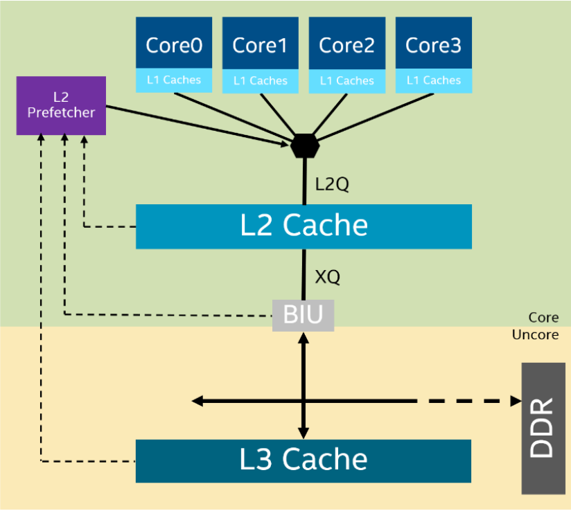

# Whitepaper: Hardware Prefetch Controls for Intel® E-Cores

July 2026

## Notices & Disclaimers

Performance varies by use, configuration, and other factors. Learn more at [www.Intel.com/PerformanceIndex](https://www.Intel.com/PerformanceIndex)

Performance results are based on testing as of dates shown in configurations and may not reflect all publicly available updates. See backup for configuration details. No product or component can be absolutely secure.

Intel technologies may require enabled hardware, software, or service activation.

Intel is a trademark of Intel Corporation or in the US and other countries. \* Other brands and names may be claimed as the property of others.

Copyright © 2026 Intel Corporation. All rights reserved.

## Revision History

|   Revision         |      Description       |     Date      |
| :----------:       | :--------------------: | :-----------: |
| 357930-001US       |    Initial Release     | November 2023 |
| Opt.Zone-July 2026 | CMT, SKT and DKT added |  July 2026   |

# Contents

1. [Introduction](#1-introduction)  
   1.1. [Hardware Prefetch Overview](#11-hardware-prefetch-overview)  
   1.2. [L1 Prefetchers](#12-l1-prefetchers)  
    1.2.1. [Instruction Point Prefetcher (L1 IPP)](#121-instruction-point-prefetcher-l1-ipp)  
    1.2.2. [Next Line Prefetcher (L1 NLP)](#122-next-line-prefetcher-l1-nlp)  
    1.2.3. [Next Page Prefetcher (L1 NPP)](#123-next-page-prefetcher-l1-npp)  
    1.2.4. [Array of Pointers Prefetcher (L1 AOPP)](#124-array-of-pointers-prefetcher-l1-aopp)  
    1.2.5. [Last Level Cache Page Prefetcher (LLCPP)](#125-last-level-cache-page-prefetcher-llcpp)  
   1.3. [L2 Prefetchers](#13-l2-prefetchers)  
    1.3.1. [MLC Streamer](#131-mlc-streamer)  
    1.3.2. [LLC Streamer](#132-llc-streamer)  
    1.3.3. [Adaptive Multi-Path (AMP)](#133-adaptive-multi-path-amp)  
    1.3.4. [L2 Next Line Prefetch (L2 NLP)](#134-l2-next-line-prefetch-l2-nlp)  
   1.4. [Prefetch Throttlers](#14-prefetch-throttlers)  
    1.4.1. [Demand Throttling of Prefetches (DTP)](#141-demand-throttling-of-prefetches-dtp)  
    1.4.2. [Dynamic Performance Throttling (DPT)](#142-dynamic-performance-throttling-dpt)  
    1.4.3. [Dead Block Predictor (DBP)](#143-dead-block-predictor-dbp)  
    1.4.4. [Dynamic Prefetch Control (DPC)](#144-dynamic-prefetch-control-dpc)

2. [Tunable parameters](#2-tunable-parameters)  
   2.1. [Enable / Disable](#21-enable--disable)  
   2.2. [AMP and MLC/LLC Streamer Source Selection](#22-amp-and-mlcllc-streamer-source-selection)  
   2.3. [Streamer Configuration](#23-streamer-configuration)  
   2.4. [AMP Configuration](#24-amp-configuration)  
   2.5. [Dynamic prefetch logic](#25-dynamic-prefetch-logic)

3. [Performance Monitors](#3-performance-monitors)  
   3.1. [Core Load/Store events](#31-core-loadstore-events)  
   [MEM\*UOPS_RETIRED.ALL_LOADS ](#mem_uops_retiredall_loads)  
   [MEM_LOAD_UOPS_RETIRED.L2_HIT ](#mem_load_uops_retiredl2_hit)  
   [MEM_LOAD_UOPS_RETIRED.L3_HIT ](#mem_load_uops_retiredl3_hit)  
   [MEM_LOAD_UOPS_L3_MISS_RETIRED.\* ](#mem_load_uops_l3_miss_retired)  
   [LONGEST\*LAT_CACHE.MISS ](#longest_lat_cachemiss)  
   3.2. [Hardware prefetch events](#32-hardware-prefetch-events)  
   [XQ_PROMOTION.ALL](#xq_promotionall)  
   [LOAD_HIT_PREFETCH.HWPF](#load_hit_prefetchhwpf)  
   [L2_REQUEST.HWPF](#l2_requesthwpf)  
   [L2_LINES_OUT.USELESS_HWPF ](#l2_lines_outuseless_hwpf)  
   [OCR.hwpf\*](#ocrhwpf)  
   3.3. [Prefetch Throttling Events](#33-prefetch-throttling-events)  
    [MLC Streamer and AMP Throttling Events](#mlc-streamer-and-amp-throttling-events)  
    [LLC Streamer Throttling](#llc-streamer-throttling)  
   3.4. [Platform event](#34-platform-event)  
    [DPT Throttling Events](#dpt-throttling-events)  
    [IMC RD/WR CAS](#imc-rdwr-cas)

4. [Prefetch MSR](#4-prefetch-msr)  
   4.1. [MSR 0x1A4 ](#41-msr-0x1a4)  
   4.2. [MSR 0x1320](#42-msr-0x1320)  
   4.3. [MSR 0x1321](#43-msr-0x1321)  
   4.4. [MSR 0x1322](#44-msr-0x1322)  
   4.5. [MSR 0x1323](#45-msr-0x1323)  
   4.6. [MSR 0x1324](#46-msr-0x1324)  
   4.7. [MSR 0x1325](#47-msr-0x1325)  
   4.8. [MSR 0x1326](#48-msr-0x1326)  
   4.9. [MSR 0x1327](#49-msr-0x1327)

5. [References](#5-references)

# 1 INTRODUCTION

Hardware prefetchers are an excellent way of improving performance by fetching information ahead of time. The most basic prefetchers that only fetched the next cache line were introduced in the early days of processors. Today, prefetchers can track complex patterns to get the most relevant data into the caches ahead of usage. However, prefetching in multicore systems is a complex task; it can improve performance significantly, but driving more data into the caches can also evict more relevant data. Furthermore, prefetchers drive up the DDR bandwidth, which can become a bottleneck and lower overall system performance. By tuning the prefetchers, one can ensure optimal performance at any given time.

This document describes how the hardware prefetchers are used in the Intel® Efficient-cores (E-Cores) and how they can be tuned to improve the core and memory-related performance. It is relevant for the Intel E-cores, starting with the Gracemont microarchitectures, and server CPUs based on those Intel E-cores, such as those with Grand Ridge and Sierra Forest microarchitectures.

## 1.1 HARDWARE PREFETCH OVERVIEW

The Intel® E-cores are placed in a group of four per module with private L1 caches for each core. The banked L2 mid-level cache (MLC) is shared, see [Figure 1](#figure-1). Each module is then attached to the CPU interconnect, where the centrally shared L3 last-level cache (LLC) is located. The interface between the cores and the L2 cache is called the L2 Queue (L2Q). Any L2 cache misses continue through the External Queue (XQ) into the Bus Interface Unit (BIU) and onto the Uncore interconnect towards the L3 cache. Transactions that miss in the L3 will continue to the DDR.

Each core has a set of L1 hardware prefetchers that can be individually enabled/disabled. The normal load/store requests along with the L1 prefetches feed into the L2Q.

The L2 prefetch block is shared for all cores in the module and contains several trackers. Each tracker searches for and then locks on to a flow of either instruction or data. These trackers are shared between the cores but only serve one core at a time. Multiple prefetch functions within the block work together to form a unity. All prefetch requests are based on one or multiple cache lines, with one cache line being 64 bytes of data. The requests generated are injected into the L2Q, similarly to the core requests. Data is then fetched to either the L2 or the L3 cache. The L2 prefetcher monitors cacheable requests, for example demand reads, read for ownership, code reads; through the queues in the module's L2 pipeline. This is to identify access patterns as a basis for onward predictions. These predictions are combined with data such as queue depth, throttling indications, etc., to generate prefetches and ensure they work optimally.

Prefetches can be scrubbed by throttlers prior to being accepted. These throttlers are designed to reduce a combined high prefetch level within the module as well as reducing the prefetch requests when the Uncore memory subsystem is at a high load.

<figure>
	
	<figcaption>Figure 1: Intel® E-Core Module and Interface to Uncore</figcaption>
</figure>

The overall target is to prefetch data that will be used relatively soon, decreasing the latency to access the data. Fetching data as close to the core as possible is preferred to minimize latency, i.e., L1, then L2, and L3. In the worst case, one must wait for the DDR, which has the longest latency and a more limited bandwidth. However, prefetching data too soon risks evicting data from the cache still in use, which is counterproductive. The prefetcher will lock on access patterns that are only repeated for some time, typically a loop in the software or a block of loaded new data. Hence, the access pattern will stop sooner or later, and the prefetchers will have requested data that won’t be used. Some wasteful data fetches are generally an acceptable tradeoff to reduce latency. However, the degree of wasteful fetches is highly application-dependent, for example, many small loops with random data accesses vs. a few lengthy loops of highly repetitive fetches. The tolerance for such waste is also very system dependent. A system with bottlenecks in DDR bandwidth has nothing to gain from prefetches that add further load on DDR. However, the latency to DDR is a function of the DDR bandwidth used with a knee towards the end. Systems that operate with a low or medium level of DDR load can benefit significantly from more aggressive prefetching if the amount of DDR bandwidth from these loads stay below the latency knee.

The balance of when and where to prefetch can be tricky, especially since the application and system behavior often change over time. This is where the L1 and L2 Prefetch tuning capability comes in, allowing for per-core and per-module configuration, both static and dynamic, over time. These can be combined with Performance Monitor Unit (PMU) events and other statistics counters to identify load on the DDR interfaces, load/stores executed by each core, cache hit/miss ratio, and rate of prefetches that are subsequently used.

Note that the different caches and their respective stages have multiple names which have historic reasons. This document primarily uses L1, L2 and L3 caches but when referencing other material, it will also refer to the alternative names, see table below:

|                  |                                                                                |
| ---------------- | ------------------------------------------------------------------------------ |
| DCU or L1D cache | Data Cache Unit, the block including the first level data cache                |
| MLC or L2 cache  | Second level cache, located within the core module but outside the core itself |
| LLC or L3 cache  | Platform cache, located outside of core module                                 |
|                  |                                                                                |

This document covers multiple E-core microarchitectures. Unless otherwise stated, features are carried forward to later generations.
The core microarchitecture can be determined through CPUID leaf 0x1a. The CORE_TYPE is set to 0x20 (Atom core) and then
CORE_NATIVE_MODEL_ID gives the core name as per the table below.

| Core Name | Short Name | Product                                       | Core Native Model ID |
| :-------- | :--------- | :-------------------------------------------- | :------------------: |
| Gracemont | GRT        | Alder Lake, Raptor Lake                       |          1           |
| Crestmont | CMT        | Meteor Lake, Grand Ridge, Sierra Forest       |          2           |
| Skymont   | SKT        | Arrow Lake, Lunar Lake                        |          3           |
| Darkmont  | DKT        | Panther Lake, Wildcat Lake, Clearwater Forest |          4           |

## 1.2 L1 PREFETCHERS

The E-core generation up to Gracemont, i.e., Alder Lake and Raptor Lake platforms, includes the first three L1 prefetchers below: L1 IPP, L1 NLP and L1 NPP. E-core generations starting with the Crestmont microarchitecture also include the L1 AOPP and L1 LLCPP prefetches.

These L1 prefetchers can be enabled/disabled through MSRs but are not further tunable through software. They are integrated into each core and only consider per-core aspects. The generated prefetch requests are sent from the respective core into the L2Q, like normal load/stores. If the L1 queue is full then L1 prefetches will be dropped from it, to give priority to normal load requests.

### 1.2.1 INSTRUCTION POINT PREFETCHER (L1 IPP)

The IPP is commonly referred to as the DCU IP Prefetcher.

The IPP keeps track of individual load instructions. When a load instruction is detected to have a regular stride, a prefetch is sent to the next address, which is the sum of the current address and the stride.

### 1.2.2 NEXT LINE PREFETCHER (L1 NLP)

The NLP is commonly referred to as the DCU Stream Prefetcher.

The NLP prefetches the next line of any given access, applicable to data. The same functionality is also built into the front-end for instruction fetches. The NLP is one of the earliest types of prefetchers introduced at a time well before multi-core was the norm. It was a blunt approach: simple to implement, worked well for single-core systems, but drove much bandwidth. This impacted both DDR bandwidth and L1/L2 caches and queues. Use of the NLP should be done with care, and a general recommendation is to run with the NLP disabled unless you can observe a benefit to your system.

Starting with the Darkmont microarchitecture, any L1 NLP generated prefetch that misses in the L2 cache will be dropped. This reduces the amount of requests to the interconnect that are generated by the NLP.

### 1.2.3 NEXT PAGE PREFETCHER (L1 NPP)

The NPP is commonly referred to as the DCU Next Page Prefetch.

Tracks access during streaming and prefetches the next TLB page. The NPP is lightweight and reduces page-walk costs, which is especially important for applications that touch a lot of new data.

### 1.2.4 ARRAY OF POINTERS PREFETCHER (L1 AOPP)

The AOPP tries to detect and prefetch pointer chasing in programs. It is built upon the IP based prefetcher. When the DCU notices that load data feeds address generation for other loads, it tries to generate the 2nd load address itself and prefetch the data for the second load.

This prefetcher was introduced with the Crestmont microarchitecture.

### 1.2.5 LAST LEVEL CACHE PAGE PREFETCHER (LLCPP)

Built on top of the NPP, the LLCPP extends the same idea but also fetches the data within the page, however only into the L3 cache. The prefetcher goes farther out in the data stream than NPP. The prefetching itself is done by the LLC streamer in the MLC. The DCU sends a unique request to MLC. The MLC streamer, an L2 prefetcher, uses this request to open a new streamer that has 64 requests in it which targets the L3 cache. It then works on those requests like it would for any other streamer.

This prefetcher was introduced with the Crestmont microarchitecture.

## 1.3 L2 PREFETCHERS

Four types of prefetchers within the L2 prefetch block are jointly structured into a set of trackers. This name comes from them making decisions by tracking requests from the core, as normal demand reads and L1 prefetches. The number of trackers varies between implementations, but there are typically multiple dozens of trackers per module. Each tracker searches for access patterns, locks on to a pattern and starts proactively fetching ahead. If a pattern breaks for some time, the tracker stops prefetching and returns to search for a new pattern. The different prefetcher types work together and share the same queue of requests that feeds into the L2Q.

The type of requests used to train and trigger the L2 prefetcher is one of the configurable parameters; see Section [4.5](#45-msr-0x1323). The L2 prefetchers are highly configurable. However, additional mechanisms not covered in this paper ensure fairness, overload protection, and timely relevance in the requests.

A central feedback parameter is the depth of the XQ. The XQ threshold level for when to issue prefetches is also a valuable configuration parameter present in multiple MSRs. A higher number of entries in that queue states that more loads go beyond the L2 cache; hence, the L3 cache will see a higher load. If these miss in the L3 cache, they will likely generate a significant DDR load, for which it is generally a good practice to reduce the number of prefetches issued. Requests towards MMIO address space (such as PCIe) will also be routed through the XQ but are seldom a significant load.

### 1.3.1 MLC STREAMER

MLC Streamer is commonly referred to as the MLC Stream Prefetcher or simply the Stream Prefetcher or L2 Streamer.

The MLC Streamer works on both instructions and data; it tracks access patterns such as A+0, A+1, A+2, … where A is the physical address of a cache line. Patterns can be either incremental or decremental. Once a pattern is locked, it will fetch subsequent accesses into the L2 cache. The number of requests ahead of demand reads issued is configurable; see Section [4.1](#41-msr-0x1a4).

### 1.3.2 LLC STREAMER

The LLC Streamer is sometimes called the LLC Prefetcher or L3 Prefetcher.

The LLC Streamer behaves like the MLC Streamer but fetches into the LLC. The intention is that the LLC Streamer should issue requests further ahead, i.e., further out in time. The larger LLC size can be leveraged to be more speculative and balance the risk of miss-fetches vs. potential benefits. The MLC prefetcher carries the data closer to the core once we have more certainty that the data will be used, i.e., when the distance to current demand reads is closer.

### 1.3.3 ADAPTIVE MULTI-PATH (AMP)

The AMP prefetcher builds on top of the MLC Streamer but can fetch more complex patterns such as A+0, A+8, A+0+N, A+8+N, A+0+2N, … where N is a distance ahead/behind. The AMP prefetcher generally has more precision and, therefore, higher priority than the Streamers. In a scenario where prefetching should be limited, it can be valuable to disable or limit the streamers and let the AMP stay on.
The confidence level of AMP can be set for different throttling levels, where the latter is a feedback parameter taken from the
uncore, see Section [4.2](#44-msr-0x1322).

### 1.3.4 L2 NEXT LINE PREFETCH (L2 NLP)

The L2 Next Line Prefetcher (L2 NLP) is part of the MLC Streamer block and behaves similarly to the L1 NLP except that it fetches to the L2 cache. This commonly generates a significant increase in prefetches, which can be of value to certain workloads and systems where single-core performance is important. However, this increased request load is generally negative for multicore systems, and the L2 NLP is, by default, turned off.

## 1.4 PREFETCH THROTTLERS

Overly aggressive prefetching or prefetching during high system load can cause performance degradation. A system at high load is generally more sensitive to cache trashing and care should be taken to not flood in unnecessary data. Similarly, the load on the DDR interfaces is typically high and as bandwidth usage increases toward the peak bandwidth the latency to DDR memory increases exponentially. It is therefore desirable to stay below this latency knee and limit the prefetches to ensure this.

The task of the prefetch throttlers is to monitor the efficiency of the prefetches as well as the system load, and when needed reduce the number of prefetches issued. The DTP, DPT and DBP prefetch throttlers were added to the Crestmont microarchitecture. The DPC was added to the Darkmont microarchitecture.

### 1.4.1 DEMAND THROTTLING OF PREFETCHES (DTP)

This throttler works by counting number of demands seen to a 4K region (page) that is being prefetched. When the tracking structure is replaced, the number of demands that occurred to that region is added to a counter. Every 16 such page, the sum is compared to a threshold. If the number of demands is too low prefetch generate will be throttled. There is an additional component where if any page sees a certain number of demands; prefetches will be re-enabled for that page.

### 1.4.2 DYNAMIC PERFORMANCE THROTTLING (DPT)

This throttler works by considering platform level queue occupancy such as the interconnect in the uncore. If the number rises too high, the uncore will increase the DPT level. That will cause the L2 prefetcher to a) stop sending L3 prefetches, or b) only allow pages with high prefetch accuracy to continue sending prefetches. When the uncore queues become less full; it will lower the DPT level which will allow more prefetch from the cores.

### 1.4.3 DEAD BLOCK PREDICTOR (DBP)

The Dead Block Predictor is mainly a block of logic for evictions that tries to predict if the core is going to want the data again. As part of its mechanism, it tracks lines brought in by prefetches, prefetches that were used by demands, and prefetches that were replaced or evicted by the L2 without being used. This information is used to create a fake DPT level and hence throttle prefetches.

### 1.4.4 DYNAMIC PREFETCH CONTROL (DPC)

DPC enhances the L2 prefetchers to dynamically change settings based on feedback on how the machine is running. This can result in the prefetchers being more or less aggressive. In addition, if the feature is not disabled via MSR 0x1A4 it will change prefetcher settings that the user has configured.

# 2 TUNABLE PARAMETERS

The tunable parameters vary between prefetch types and apply primarily to the MLC or LLC Streamer and AMP. These three blocks share some common structures; hence, the tuning parameters are slightly intertwined.

## 2.1 ENABLE / DISABLE

Each prefetcher's “big hammer” is the enable/disable bit; they are spread out over MSR 0x1A4 and MSR 0x1320/21. Note that 0x1A4 is also used by Intel® P-cores but with slightly different definitions. For instance, the L2 Spatial Prefetcher is unavailable on Intel® E-cores.

| Support | Prefetcher                             |  MSR   | bit |
| :------ | :------------------------------------- | :----: | :-: |
| GRT     | MLC/LLC Streamer disable               | 0x1A4  |  0  |
| CMT     | Adjacent cache line prefetch disable   | 0x1A4  |  1  |
| GRT     | DCU Streamer (L1 NLP)                  | 0x1A4  |  2  |
| GRT     | DCU IP Prefetcher (L1 IPP)             | 0x1A4  |  3  |
| GRT     | DCU Next Page Prefetcher (L1 NPP)      | 0x1A4  |  4  |
| GRT     | AMP                                    | 0x1A4  |  5  |
| CMT     | LLC Page Prefetch Disable              | 0x1A4  |  6  |
| CMT     | Stream prefetch code fetch disable     | 0x1A4  |  8  |
| DKT     | Dynamic prefetch control logic disable | 0x1A4  |  2  |
| GRT     | LLC Streamer                           | 0x1320 | 43  |
| GRT     | L2 NLP                                 | 0x1321 | 40  |

| Support | Throttler                                        |  MSR   | bit |
| :------ | :----------------------------------------------- | :----: | :-: |
| CMT     | Demand throttler (DPT), enabled when set         | 0x1321 | 20  |
| CMT     | L2 prefetcher throttling (DBP), enabled when set | 0x1327 | 26  |

## 2.2 AMP AND MLC/LLC STREAMER SOURCE SELECTION

The source selection for AMP and the MLC/LLC Streamer can be found in MSR 0x1323; see Section [4.5](#45-msr-0x1323). There are two types of enable bits for each specific request type. The first one allows you to open a tracker and the second type allows you to train a tracker. Both should be enabled for the respective source that is of interest.

The types of requests that can be selected include the various hardware L1 prefetches, different software prefetches generated by the code, and different types of reads. Reads, also known as demand reads, are normal load operations and can co-exist in multiple caches. Read for Ownership (RFO) are reads where the core intends to write a value and request exclusive ownership of the cache line.

## 2.3 STREAMER CONFIGURATION

There are three key parameters for the MLC and LLC Streamer, respectively.

1. The maximum distance ahead of current generated requests, i.e., where the core is currently executing; see Section [4.2](#42-msr-0x1320).  
   A higher value will drive more prefetches and hence increase the chance of hitting in the respective cache layer, but this can also evict relevant data that would be better to keep in the caches. A longer distance will also drive more DDR bandwidth.

2. The XQ threshold; see Section [4.2](#42-msr-0x1320) for MLC Streamer.

   a. Note that this setting is also shared with AMP. For more information about LLC Streamer, see Section [4.4](#44-msr-0x1322). The external queue XQ handles all requests that are missed in the L2 cache.

   b. The value set specifies how many empty entries the XQ must have to accept new prefetch requests. A high threshold value will generally lower the prefetch aggressiveness.

3. The third is the demand density parameters; see Section [4.3](#43-msr-0x1321) for the MLC Streamer and Section [4.4](#44-msr-0x1322) for the LLC Streamer. The name refers to demand reads (and the number of prefetches upgraded to demand reads) from the core.

   a. A high-demand density indicates that the core is using the prefetches.

   b. Demand density is measured as an average for all trackers in the module. A value lower than the configuration will
   hold prefetch requests from all the MLC respective LLC Streamer trackers. This is because the overall accuracy in
   prefetches is deemed too low.

   c. The trackers will continue to follow the data flows and update the demand density. However, individual trackers that reach a higher level of demand density, specified by the demand density override, are deemed accurate enough and will, therefore, generate prefetch requests.

Finally, two configurations connect the demand density and XQ Threshold. If the demand density is lower than the L2_LLC_STREAM_DEMAND_DENSITY_XQ setting, then the XQ Thresholds are set per the L2_LLC_STREAM_AMP_XQ_THRESHOLD. See Sections [4.3](#43-msr-0x1321) and [4.4](#44-msr-0x1322).

## 2.4 AMP CONFIGURATION

The AMP prefetcher shares the XQ threshold with the MLC Prefetcher but has no maximum distance setting. However, it has two additional settings:

1. AMP has a tunable confidence level required to trigger a request; see Section [4.4](#44-msr-0x1322).

   a. This parameter is set for different DPT throttling levels. Setting a higher confidence level will make AMP more selective in making requests, lowering the overall number of requests generated.

   b. Note that this can drive more MLC/LLC Streamer requests as AMP has higher priority. Only one prefetcher issues requests per timeslot. Therefore, increasing confidence does not necessarily lower the total number of prefetch requests unless Streamer parameters are also tuned down.

2. An enable/disable recursive lookup pattern specifies how AMP should trigger on patterns; see Section [4.2](#42-msr-0x1320). Disabling recursive lookup will lower the number of prefetch requests. It is strongly recommended to leave this disabled.

## 2.5 DYNAMIC PREFETCH LOGIC

The Dynamic prefetch logic was added in the Darkmont microarchitecture which heuristically adjusts L2 prefetcher configuration during runtime.

The dynamic prefetch logic can be disabled by setting the “Disable the dynamic prefetcher logic” bit in MSR 0x1A4. Setting the disable bit freezes current L2 prefetcher settings. Default prefetcher settings can be restored using the “Restore L2Prefetcher Default” bit in MSR 0x1321. The disable bit should be set before any Prefetcher Configuration MSRs or the Restore bit are written. The dynamic prefetcher configuration logic may otherwise continue to update the Prefetcher Configuration MSRs.

# 3 PERFORMANCE MONITORS

Performance monitoring events in the Intel® E-core are relevant to hardware prefetch tuning as they allow for tracking of increase and decreases in performance as well as execution behavior changes. See the respective device manual for details. Performance events are also available at [https://perfmon-events.intel.com](https://perfmon-events.intel.com). Core events can either be specified through the event/umask combination or by using PMU tools such as Intel® vTune™ or Perf in Linux. For example, the following Linux command can be used to measure cycles, instructions and cycles spent on the oldest load for core 0 during 1 seconds:

`perf stat -C 0 -e cycles,instructions,cpu/event=0x05,umask=0x7f,name=LDheadAny/ sleep 1`

Core and platform events such as the memory controller can be combined. For example, to measure read/writes to DDR combined with L2 and L3 cache statistics on Core 1 for 10 seconds:

`perf stat -C 1 -e cycles,instructions,cpu/event=0x24,umask=0x01,name=L2-miss/,cpu/event=0x24,umask=0x02,name=L2-hit/,LLC-loads,LLC-load-misses,LLC-stores,LLC-store-misses,uncore_imc/cas_count_read/,uncore_imc/cas_count_write/ sleep 10`

[https://www.intel.com/content/www/us/en/developer/tools/oneapi/vtune-profiler.html](https://www.intel.com/content/www/us/en/developer/tools/oneapi/vtune-profiler.html)

Some generic suggestions for performance events and how these can be used follow. Note that not all events are available in all microarchitecture versions; these events and their respective event/umask are provided for the Crestmont Microarchitecture.

## 3.1 CORE LOAD/STORE EVENTS

#### MEM_UOPS_RETIRED.ALL_LOADS

This per-core event tracks the number of load operations completed, i.e., not including speculative loads or prefetches not upgraded to demand reads. This value can be used with respective cache layers hit/miss events. The total number of loads relative to respective core loads can also be used to identify the core driving the most loads. However, a core that executes many loads could hit well in caches and does not necessarily contribute to the DDR load. A parameter to size the DDR pressure per core is LONGEST_LAT_CACHE.MISS or MEM_LOAD_UOPS_L3_MISS_RETIRED.LOCAL_DRAM.

#### MEM_LOAD_UOPS_RETIRED.L2_HIT

This event measures the number of demand load operations concluded where the retired load hit in the L2 cache.

The speculative version of this event is L2_REQUEST.DEMAND_DATA_RD_MISS which includes loads that do not retire.

#### MEM_LOAD_UOPS_RETIRED.L3_HIT

This event measures the number of demand load operations concluded where the retired load hit in the L3 cache. The L2 hit vs. L3 hit and DDR hit (i.e., L2 miss) can be used to identify the L2 hit ratio. This is similar to the L3 hit ratio to the L3 hit vs. DDR hit. These can be leveraged to estimate how well prefetches to the MLC and LLC work. See also event MEM_BOUND_STALLS_LOAD.L3_HIT, which counts the cycle cost for the penalty of going to L3. Starting on DKT, this event counts only at retirement. The speculative version of this event is OCR.DEMAND_DATA_RD.LLC_HIT which includes loads that do not retire.

#### MEM_LOAD_UOPS_L3_MISS_RETIRED.\*

This event measures the number of load operations concluded where the load hit in local or remote memory. This can be leveraged to identify how much of the overall memory bandwidth originates from the respective core. A more fine-grained selection of which cores should be throttled can thus be made.

See also event MEM_BOUND_STALLS_LOAD.LLC_MISS_LOCAL_MEM which counts the cycle cost for the penalty of going to local memory. Additionally, MEM_BOUND_STALLS_LOAD.LLC_MISS_REMOTEMEM/OTHERMOD will include access to remote memory and another modules cache. Beginning on DKT, this event counts only at retirement.

The speculative version of this event is OCR.DEMAND_DATA_RD.DRAM which includes loads that do not retire.

#### LONGEST_LAT_CACHE.MISS

This event counts the number of cacheable memory requests that miss in the LLC and hence targets DDR or other coherent memory.

Alternatively, event OCR.READS_TO_CORE.L3_MISS also counts cacheable reads including demand and prefetched data reads, RFOs, and code reads.

## 3.2 HARDWARE PREFETCH EVENTS

#### XQ_PROMOTION.ALL

This event counts the number of XQ entries initiated as hardware prefetches, but where a normal request was made that upgraded the entry. This indicates that the prefetch was correct and reduced access latency. However, prefetches that completed and brought the data into the respective cache and then were used are not counted.

The promotions relative to L2 misses and respective such ratio per core can be an estimate of how successful the prefetching is. This must also account for respective core prefetch-settings.

#### LOAD_HIT_PREFETCH.HWPF

This event counts the number of demand loads that hit an outstanding L1 prefetch in the request buffers that could result in an L2 cache hit or miss. This is a good indicator that the prefetch request was initiated too close to the demand and was not completed in time to get the full benefit of prefetching. Similar indications as the XQ_PROMOTION events for L2 cache misses.

#### L2_REQUEST.HWPF

This event counts the total number of requests to the L2 cache that are initiated by any hardware prefetchers. This event in
conjunction with L2_REQUEST.ALL can provide the ratio of prefetches accessing the L2 cache. Additionally, L2_REQUEST.\*
events can break down the number of requests based on type, for example software prefetches, demand data, demand RFO, or demand code read, as well as the hit or miss indications.

#### L2_LINES_OUT.USELESS_HWPF

This event counts the number of evicted L2 cache lines that were originally a hardware prefetch but was never used by a demand. This is a clear indicator of how many useless prefetches were completed and whether the prefetchers are tuned to be too aggressive.

#### OCR.hwpf\*

The Off-Core Response events which monitor the traffic, requests and responses, to and from the uncore, provide a breakdown for the L1, L2, and L3 prefetchers. These events can provide a ratio of prefetches per cache level versus demands for those that miss the L2 cache. OCR.HWPF.ANY_RESPONSE will count all instances for all 3 levels. The breakdown then includes: OCR.HWPF_L1D.ANY_RESPONSE, OCR.HWPF_L2.ANY_RESPONSE, OCR.HWPF_L3.ANY_RESPONSE.

## 3.3 PREFETCH THROTTLING EVENTS

These events will trigger when the prefetcher mechanisms are throttled. The throttlers can be engaged because of bandwidth restrictions, resource restrictions, and other limitations. This is another clear indicator that the prefetchers are either too aggressive and/or hitting a cap whether capacity or bandwidth.

#### MLC Streamer and AMP Throttling Events

The L2_PREFETCHES_THROTTLED events will count the number of L2 streamer and AMP prefetch requests that are throttled due to XQ thresholds, Dynamic Prefetch Throttler (DPT) and the dead block predictor (DBP).

#### LLC Streamer Throttling

The LLC_PREFETCHES_THROTTLED events will count the number of LLC streamer prefetch requests that are throttled due to LLC hit rates, XQ thresholds, Dynamic Prefetch Throttler (DPT) and the dead block predictor (DBP).

## 3.4 PLATFORM EVENT

#### DPT Throttling Events

The DYNAMIC_PREFETCH_THROTTLER events will count the number of cycles in which the DPT is in levels 0 to 3 with zero marking a low load on the uncore and three marks a high load.

#### IMC RD/WR CAS

The Integrated Memory Controller (IMC) on client platforms typically has two static counters tracking the number of read and write requests. On server platforms, there are generally configurable performance monitoring counters instead. These counters measure requests per cache line, so the value should be multiplied by 64 to get the number of bytes transferred. The static counters start counting on power-on, and the configurable counters start counting when the start signal is provided. In either case, the amount of DDR requests generated is derived by taking the delta values between two points in time.

The read counter is of primary interest for hardware prefetch tuning as hardware prefetchers drive additional reads, although dirty cache lines can also be pushed out as writes. These counters are shared resources at the platform level, not tied to individual cores or modules. Note that there are generally multiple IMCs per device. The usage of DDR interleaving, which is the default configuration, gives a near-equal load on the interfaces.

Considering DDR load when tuning prefetch aggressiveness. A high utilization of the DDR interface will increase access latency.

# 4 PREFETCH MSR

MSRs are shared within a module, and changes from one core will be seen by the other in that module. Only cores within the module can access the module's configuration. For example, it is enough if one core changes the MSR; use core affinity to ensure you are executing on the relevant module.

The MSRs described below are only applicable to the Intel® Atom® cores. Use the CPUID feature to identify core types, and if a hybrid platform is in use, see [1] for more details. Bits outside of the ones described may be reserved or have other functions, including having other functions on other cores; see the respective device documentation and ensure that values
outside these listed are preserved.

## 4.1 MSR 0x1A4

| Support | Width | Bits  | Descriptor                                                                              |
| :-----: | :---: | :---: | :-------------------------------------------------------------------------------------- |
|   GRT   |   1   |  0:0  | MLC Stream disabled; when set to 1, the MLC Streamer is disabled.                       |
|   CMT   |   1   |  1:1  | Adjacent cache line prefetcher; when set to 1, the prefetcher is disabled.              |
|   GRT   |   1   |  2:2  | L1 data Stream disabled; when set to 1, the L1 data Streamer is disabled.               |
|   GRT   |   1   |  3:3  | L1 instruction Stream disabled; when set to 1, the L1 instruction Streamer is disabled. |
|   CMT   |   1   |  4:4  | DCU next page prefetcher; when set to 1, the prefetcher is disabled.                    |
|   GRT   |   1   |  5:5  | L2 AMP disabled; when set to 1, the L2 AMP is disabled.                                 |
|   CMT   |   1   |  6:6  | LLC page prefetch; when set to 1, the prefetcher is disabled.                           |
|   CMT   |   1   |  7:7  | AOP disabled; when set to 1, the AOP is disabled.                                       |
|   CMT   |   1   |  8:8  | Stream prefetch code fetch; when set to 1, the prefetcher is disabled.                  |
|   DKT   |   1   | 12:12 | Disable the dynamic prefetcher logic.                                                   |

## 4.2 MSR 0x1320

| Support | Width | Bits  | Descriptor                                                                                                                                                  |
| :-----: | :---: | :---: | :---------------------------------------------------------------------------------------------------------------------------------------------------------- |
|   GRT   |   5   |  4:0  | L2 Stream and AMP XQ threshold. The value specifies the number of empty XQ entries required to emit prefetches. Higher values result in fewer prefetches.   |
|   CMT   |   3   |  8:6  | Sets the number of L2 prefetches to be sent when a prefetch stream is established.                                                                          |
|   CMT   |   3   | 11:9  | Sets the number of L2 prefetches to be sent when demand requests move ahead of the current prefetch stream.                                                 |
|   CMT   |   5   | 16:12 | Sets the maximum number of L2 prefetches that can be queued.                                                                                                |
|   GRT   |   3   | 19:17 | Sets the L2 prefetch trigger window for a demand request after a prefetch stream has been established. Higher values provide more aggressive prefetching.   |
|   CMT   |   5   | 24:20 | L2 Stream maximum distance from core execution. Higher values prefetch more data.                                                                           |
|   CMT   |   3   | 27:25 | Sets the number of new L2 prefetches added to the number of pending prefetches for each successful training.                                                |
|   CMT   |   1   | 30:30 | AMP recursive lookup disabled; setting to 1 decreases the number of prefetches.                                                                             |
|   GRT   |   1   | 31:31 | Disables prefetching of the next N lines in the AMP, reducing prefetch aggressiveness.                                                                      |
|   CMT   |   5   | 36:32 | Minimum number of cache lines the LLC Stream prefetcher must be ahead of the L2 Stream prefetcher.                                                          |
|   GRT   |   6   | 42:37 | LLC Stream maximum distance from core execution. Higher values prefetch more data.                                                                          |
|   CMT   |   1   | 43:43 | LLC Stream disabled; when set to 1, the LLC Streamer is disabled.                                                                                           |
|   CMT   |   3   | 46:44 | Sets the number of LLC Streamer prefetches to be sent when a prefetch stream is established.                                                                |
|   CMT   |   5   | 51:47 | Sets the maximum number of LLC Streamer prefetches that can be queued.                                                                                      |
|   CMT   |   5   | 57:53 | LLC Stream L2Q threshold. Specifies the minimum number of empty L2Q entries required to emit prefetches. Higher values result in fewer LLC Stream prefetches. |
|   GRT   |   5   | 62:58 | LLC Stream XQ threshold. Specifies the number of empty XQ entries required to emit prefetches. Higher values result in fewer LLC Stream prefetches.         |

```c
struct msr1320_s {
	uint64_t L2_STREAM_AMP_XQ_THRESHOLD : 5;
	uint64_t pad0 : 1;
	uint64_t INIT_PRE_PENDING : 3;
	uint64_t SKPAHD_PREF : 3;
	uint64_t MAX_PREF_PENDING : 5;
	uint64_t INIT_TRIG_WINDOW : 3;
	uint64_t L2_STREAM_MAX_DISTANCE : 5;
	uint64_t TRIG_PREF_HIT : 3;
	uint64_t pad1 : 2;
	uint64_t L2_AMP_DISABLE_RECURSION : 1;
	uint64_t DIS_AMP_TRIV_REC : 1;
	uint64_t L2HL_LLCHL_MIN_DIST : 5;
	uint64_t LLC_STREAM_MAX_DISTANCE : 6;
	uint64_t LLC_STREAM_DISABLE : 1;
	uint64_t LLC_INIT_PREF_PEND : 3;
	uint64_t LLC_MAX_PREF_PEND : 5;
	uint64_t pad2 : 1;
	uint64_t LLCPREF_LQ_THRESHOLD : 5;
	uint64_t LLC_STREAM_XQ_THRESHOLD : 5;
};
```

## 4.3 MSR 0x1321

| Support | Width | Bits  | Descriptor                                                                                                                                               |
| :-----: | :---: | :---: | :------------------------------------------------------------------------------------------------------------------------------------------------------- |
|   GRT   |   1   |  0:0  | MLC Streamer and AMP enabled tracking of instruction flows                                                                                               |
|   CMT   |   1   | 11:11 | Enable alternate L2 prefetch algorithm for code reads                                                                                                    |
|   CMT   |   4   | 15:12 | Sets the number of AMP prefetches to be sent when such a prefetch stream is established                                                              |
|   CMT   |   4   | 19:16 | Sets the number of new AMP prefetches added to the number of pending prefetches for each successful training                                         |
|   CMT   |   1   | 20:20 | Set to 1 to turn on the demand based L2 prefetch throttler                                                                                               |
|   GRT   |   8   | 28:21 | MLC Streamer demand density.                                                                                                                             |
|   GRT   |   4   | 32:29 | MLC Streamer demand density override.                                                                                                                    |
|   CMT   |   1   | 36:36 | Set to 1 to turn on the alternative L2 prefetch algorithm for page miss handler                                                                          |
|   GRT   |   1   | 40:40 | L2 Next Line Prefetcher disabled; when set to 1, the L2 NLP is disabled.                                                                                 |
|   GRT   |   6   | 46:41 | XQ threshold when demand density is low. Typically set higher than normal XQ thresholds. Applicable to MLC/LLC Streamer and AMP.                         |
|   DKT   |   1   | 63:63 | Restore L2 prefetcher default, see section 2.5. Setting this to 1 resets the prefetch MSRs to their default values. This bit is cleared after being set. |

```c
typedef struct msr1321_s {
	uint64_t L2_STREAM_AMP_CREATE_IL1 : 1;
	uint64_t pad0 : 10;
	uint64_t ALTERNATIVE_ISIDE_PREFETCH_ENABLE : 1;
	uint64_t ALTERNATIVE_KICKSTART_PREFETCHES : 4;
	uint64_t ALTERNATIVE_REGULAR_PREFETCHES : 4;
	uint64_t DTP_ENABLE : 1;
	uint64_t L2_STREAM_DEMAND_DENSITY : 8;
	uint64_t L2_STREAM_DEMAND_DENSITY_OVR : 4;
	uint64_t pad1 : 3;
	uint64_t CREATE_PMH : 1;
	uint64_t pad2 : 3;
	uint64_t L2_DISABLE_NEXT_LINE_PREFETCH : 1;
	uint64_t L2_LLC_STREAM_AMP_XQ_THRESHOLD : 6;
	uint64_t pad3 : 16;
	uint64_t RESTORE_L2PREFETCHER_DEFAULTS : 1;
} msr1321_s;
```

## 4.4 MSR 0x1322

| Support | Width | Bits  | Descriptor                                                                                                                                                                              |
| :-----: | :---: | :---: | :-------------------------------------------------------------------------------------------------------------------------------------------------------------------------------------- |
|   CMT   |   3   |  2:0  | Increment value for throttling the LLC prefetch throttler based on LLC hits. Higher value implies less throttling.                                                                      |
|   CMT   |   3   |  5:3  | Decrement value for throttling the LLC prefetch throttler based on LLC hits. Higher value implies more throttling.                                                                      |
|   CMT   |   3   |  8:6  | Increment value for unthrottling the LLC prefetch throttler based on LLC hits. Higher value implies less throttling.                                                                    |
|   CMT   |   3   | 11:9  | Increment value for unthrottling the LLC prefetch throttler based on LLC hits. Higher value implies less throttling.                                                                    |
|   GRT   |   9   | 22:14 | LLC Streamer demand density.                                                                                                                                                            |
|   GRT   |   4   | 26:23 | LLC Streamer demand density override.                                                                                                                                                   |
|   GRT   |   6   | 32:27 | AMP Confidence threshold at throttle level 0 (no throttling):<br>• Emits prefetches when confidence is above this level.<br>• A higher level gives less aggressive prefetching.         |
|   GRT   |   6   | 38:33 | AMP Confidence threshold at throttle level 1 (light throttling):<br>• Emits prefetches when confidence is above this level.<br>• A higher level gives less aggressive prefetching.      |
|   GRT   |   6   | 44:39 | AMP Confidence threshold at throttle level 2 (moderate throttling):<br>• Emits prefetches when confidence is above this level.<br>• A higher level gives less aggressive prefetching.   |
|   GRT   |   6   | 50:45 | AMP Confidence threshold at throttle level 3 (aggressive throttling):<br>• Emits prefetches when confidence is above this level.<br>• A higher level gives less aggressive prefetching. |
|   GRT   |   3   | 61:59 | Demand density to switch to alternative XQ threshold.<br>(L2_LLC_STREAM_AMP_XQ_THRESHOLD)                                                                                               |

```c
typedef struct msr1322_s {
	uint64_t LLPREF_THROTTLE_ISSUE_FACTOR : 3;
	uint64_t LLPREF_THROTTLE_HIT_FACTOR : 3;
	uint64_t LLPREF_UNTHROTTLE_ISSUE_FACTOR : 3;
	uint64_t LLPREF_UNTHROTTLE_HIT_FACTOR : 3;
	uint64_t pad0 : 2;
	uint64_t LLC_STREAM_DEMAND_DENSITY : 9;
	uint64_t LLC_STREAM_DEMAND_DENSITY_OVR : 4;
	uint64_t L2_AMP_CONFIDENCE_DPT0 : 6;
	uint64_t L2_AMP_CONFIDENCE_DPT1 : 6;
	uint64_t L2_AMP_CONFIDENCE_DPT2 : 6;
	uint64_t L2_AMP_CONFIDENCE_DPT3 : 6;
	uint64_t pad1 : 8;
	uint64_t L2_LLC_STREAM_DEMAND_DENSITY_XQ : 3;
} msr1322_s;
```

## 4.5 MSR 0x1323

| Support | Width | Bits  | Descriptor                                                                                               |
| :-----: | :---: | :---: | :------------------------------------------------------------------------------------------------------- |
|   GRT   |   1   | 34:34 | Begin tracking software data prefetches with the intent to write. Affects both the MLC Streamer and AMP. |
|   GRT   |   1   | 35:35 | Begin tracking software data prefetches. Affects both the MLC Stream and AMP.                            |
|   GRT   |   1   | 37:37 | Begin tracking requests coming from the L1 NLP prefetcher. Affects both the MLC Stream and AMP.          |
|   GRT   |   1   | 38:38 | Begin tracking demand requests with intent to write. Affects both the MLC Stream and AMP.                |
|   GRT   |   1   | 39:39 | Allow SW prefetch read for ownership to train a prefetch streamer entry.                                 |
|   GRT   |   1   | 40:40 | Allow SW prefetch reads to train a prefetch streamer entry.                                              |
|   GRT   |   1   | 41:41 | Allow IL1 to train a prefetch streamer entry.                                                            |
|   GRT   |   1   | 44:44 | Allow read-for-ownership (RFO) requests to train a prefetch streamer entry.                              |
|   GRT   |   1   | 45:45 | Begin tracking requests coming from the L1 NPP prefetcher. Affects both the MLC Stream and AMP.          |
|   GRT   |   1   | 46:46 | Begin tracking requests coming from the L1 IPP prefetcher. Affects both the MLC Stream and AMP.          |
|   GRT   |   1   | 47:47 | Allow NPP prefetcher to train L2 prefetchers.                                                            |
|   GRT   |   1   | 48:48 | Allow IPP prefetcher to train L2 prefetchers.                                                            |

```c
struct msr1323_s{
	uint64_t pad0 : 34;
	uint64_t L2_STREAM_AMP_CREATE_SWPFRFO : 1;
	uint64_t L2_STREAM_AMP_CREATE_SWPFRD : 1;
	uint64_t pad1 : 1;
	uint64_t L2_STREAM_AMP_CREATE_HWPFD : 1;
	uint64_t L2_STREAM_AMP_CREATE_DRFO : 1;
	uint64_t STABILIZE_PREF_ON_SWPFRFO : 1;
	uint64_t STABILIZE_PREF_ON_SWPFRD : 1;
	uint64_t STABILIZE_PREF_ON_IL1 : 1;
	uint64_t pad2 : 1;
	uint64_t STABILIZE_PREF_ON_HWPFD : 1;
	uint64_t STABILIZE_PREF_ON_DRFO : 1;
	uint64_t L2_STREAM_AMP_CREATE_PFNPP : 1;
	uint64_t L2_STREAM_AMP_CREATE_PFIPP : 1;
	uint64_t STABILIZE_PREF_ON_PFNPP : 1;
	uint64_t STABILIZE_PREF_ON_PFIPP : 1;
};
```

## 4.6 MSR 0x1324

| Support | Width | Bits  | Descriptor                                     |
| :-----: | :---: | :---: | :--------------------------------------------- |
|   GRT   |   8   | 61:54 | Threshold for homeless throttler, set per core |

```c
struct msr1324_s{
	uint64_t pad0 : 54;
	uint64_t L1_HOMELESS_THRESHOLD : 8;
};
```

## 4.7 MSR 0x1325

| Support | Width | Bits  | Descriptor                                                                                                                                           |
| :-----: | :---: | :---: | :--------------------------------------------------------------------------------------------------------------------------------------------------- |
|   CMT   |   5   |  4:0  | Maximum size of L2 Stream prefetcher window that a demand can hit and keep the prefetcher going. A larger window gives more aggressive prefetching   |
|   CMT   |   1   |  5:5  | Enables kick-start for L2 Stream prefetcher. This is used when an access is detected at the beginning or end of a 4K page                            |
|   CMT   |   5   | 10:6  | MLC Stream and AMP L2Q threshold. The value specifies the minimum number of empty L2Q entries to emit prefetches. Higher value drives fewer prefetches |
|   CMT   |   3   | 16:14 | Maximum number of successive lines that can be prefetched by AMP                                                                                     |
|   CMT   |   3   | 19:17 | AMP confident increment counter value. Higher value makes AMP more aggressive                                                                        |
|   CMT   |   8   | 39:32 | Counter threshold to enable acceleration. A lower value gives more aggressive prefetching                                                            |
|   CMT   |   5   | 44:40 | L2Q threshold to enable prefetch acceleration. Lower value gives more aggressive prefetching                                                          |
|   CMT   |   5   | 49:45 | XQ threshold to enable prefetch acceleration. Lower value gives more aggressive prefetching                                                          |
|   CMT   |   6   | 55:50 | Acceleration counter increment value. Higher value will enable acceleration more easily                                                              |
|   CMT   |   3   | 58:56 | Number of additional MLC/LLC Stream prefetches triggered when in acceleration mode                                                                   |
|   CMT   |   1   | 59:59 | Set to 1 to disable prefetch acceleration                                                                                                            |

```c
struct msr1325_s{
	uint64_t STR_WINDOW_SIZE: 5;
	uint64_t KICK_START: 1;
	uint64_t LQ_THRESHOLD: 5;
	uint64_t pad0 : 3;
	uint64_t AMP_MAX_TRIV_REC_PREF: 3;
	uint64_t AMP_DELTA_CNT_INC_VAL: 3;
	uint64_t pad1 : 12;
	uint64_t PREFACC_COUNTER_THRESHOLD : 8;
	uint64_t PREFACC_DISABLE_L2Q_THRESHOLD : 5;
	uint64_t PREFACC_DISABLE_XQ_THRESHOLD : 5;
	uint64_t PREFACC_COUNTER_INCR : 6;
	uint64_t PREFACC_COUNT : 3;
	uint64_t PREFACC_DISABLE : 1;
};
```

## 4.8 MSR 0x1326

| Support | Width | Bits  | Descriptor                                                                                       |
| :-----: | :---: | :---: | :----------------------------------------------------------------------------------------------- |
|   CMT   |   6   | 51:56 | Sets the threshold for recursive AMP prefetching. Lower value gives more aggressive prefetching. |

```c
struct msr1326_s{
	uint64_t pad0 : 56;
	uint64_t AMP_RECUR_PREFETCHMINCOUNT : 6;
};
```

## 4.9 MSR 0x1327

| Support | Width | Bits  | Descriptor                                                                                                                                                     |
| :-----: | :---: | :---: | :------------------------------------------------------------------------------------------------------------------------------------------------------------- |
|   CMT   |   4   |  3:0  | Counter increment value for the reuse metrics based L2 prefetch throttler. Higher values will result in less throttling                                        |
|   CMT   |   4   |  7:4  | Counter decrement value for the reuse metrics based L2 prefetch throttler. Higher values will result in more throttling                                        |
|   CMT   |   3   | 10:8  | Throttle level for positive saturation value for the reuse throttle counter. Positive saturation implies most reuse of prefetched lines. 3=highest, 0=lowest   |
|   CMT   |   3   | 13:11 | Throttle level for positive upper quartile value for the reuse throttle counter. Positive quartile implies good reuse of prefetched lines. 3=highest, 0=lowest |
|   CMT   |   3   | 16:14 | Throttle level for positive lower quartile value for the reuse throttle counter. Positive quartile implies good reuse of prefetched lines. 3=highest, 0=lowest |
|   CMT   |   3   | 19:17 | Throttle level for negative lower quartile value for the reuse throttle counter. Negative quartile implies less reuse of prefetched lines. 3=highest, 0=lowest |
|   CMT   |   3   | 22:20 | Throttle level for negative upper quartile value for the reuse throttle counter. Negative quartile implies less reuse of prefetched lines. 3=highest, 0=lowest |
|   CMT   |   3   | 25:23 | Throttle level for negative saturation value for the reuse throttle counter. Negative saturation implies least reuse of prefetched lines. 3=highest, 0=lowest  |
|   CMT   |   1   | 26:26 | Turns on L2 prefetcher throttling based on reuse metrics                                                                                                       |

```c
struct msr1327_s{
	uint64_t RMT_INC : 4;
	uint64_t RMT_DEC : 4;
	uint64_t RMT_POSITIVE_SATURATION : 3;
	uint64_t RMT_POSITIVE_UPPER_QUARTILE : 3;
	uint64_t RMT_POSITIVE_LOWER_QUARTILE : 3;
	uint64_t RMT_NEGATIVE_LOWER_QUARTILE : 3;
	uint64_t RMT_NEGATIVE_UPPER_QUARTILE : 3;
	uint64_t RMT_NEGATIVE_SATURATION : 3;
	uint64_t RMT_EN : 1;
};
```

# 5 REFERENCES

[1] I. A. I. S. E. A. F. F. Programming. [Online]. Available: [https://www.intel.com/content/www/us/en/develop/download/intel-architecture-instruction-set-extensions-programming-reference.html](https://www.intel.com/content/www/us/en/develop/download/intel-architecture-instruction-set-extensions-programming-reference.html).
