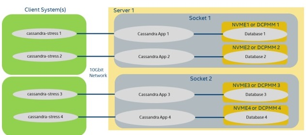
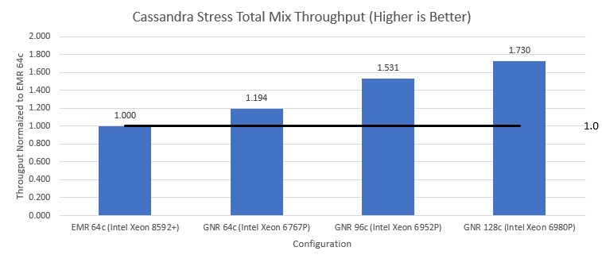

This workload tuning guide describes the best known practices to optimize performance on Intel Xeon CPUs
when running Apache Cassandra. Default configurations may vary across hardware vendors, thus this guide 
helps provide a set of recommended settings for getting the best performance throughput/latency.

# This document is organized with the following topics:

- [Document Nomenclature](#Document-Nomenclature)
- [Hardware Configuration Recommendations](#Hardware-Configuration-Recommendations)  
- [BIOS Setting Recommendations](#BIOS-Configuration-Recommendations)
- [DataStax’s Kernel/Storage/Network Settings](DataStax’s-Kernel/Storage/Network-Settings)
- [Cassandra Settings](#Cassandra-settings)  
- [Cassandra-Stress Testing](#Cassandra-Stress-Testing)
- [Cassandra-Stress Performance Comparisons](#Cassandra-Stress-Performance-Comparisons)
- [Example System Startup Script](#Example-System-Startup-Script)  
- [FAQ](#FAQ)

# Document Nomenclature

This document uses the following distinctions:

- **Client**: Applies only to client systems running the load generator like `cassandra-stress`, NoSQLBench, or other benchmarks  
- **Server**: Applies only to server systems running the Cassandra instances  
- **Cloud**: Where applicable, notes differences between bare-metal and cloud instances  
- **Cass3**: Applies only to Cassandra version 3.x  
- **Cass4**: Applies only to Cassandra version 4.x  
- **Cass5**: Applies only to Cassandra version 5.x  
- **CassStress**: Applies only to the `cassandra-stress` benchmark (not required if using other benchmarks)  
- **PerfTip X%**: Estimated performance throughput improvement expected with this change

# Hardware Configuration Recommendations

## Typical Cassandra Configuration:

| Client system   | < ---- |        Network        | ---- > |    Server System     |<---------->|      Database          |
|-----------------|--------|-----------------------|--------|----------------------|------------|------------------------|
|(Load generator) |        |                       |        | Cassandra Instance(s)|            | Data Location (Storage)|

             

The Apache Cassandra Database or Cassandra instance(s) run on the server system.  
There are minimum hardware requirements for a Cassandra instance.  
The details can be found [here](https://cassandra.apache.org/doc/4.0/cassandra/operating/hardware.html)

In summary, the minimum CPU/DRAM hardware required for a small production Cassandra instance is 8 logical CPU and at least 32GB of DRAM.

For a larger Cassandra instance, we have found there is an upper limit where Cassandra performance does not scale linearly any more by adding more CPU/Memory resources.  
This limit is approximately 48 logical CPU cores per Cassandra instance.  
To avoid this inefficiency, customers typically run multiple Cassandra instances on larger hardware systems to provide the best Cassandra performance on these larger systems.

Below are some typical hardware sizing recommendations.  
Note, your specific schema, request types, replication and other performance requirements may differ and may need to alter these recommendations.

**Table 1: Summary of Hardware Resources for One Cassandra Instance**

| System Size | Number Logical CPUs | Memory  | Storage                      | Networking |
|-------------|----------------------|---------|------------------------------|------------|
| Small       | 8                    | 32 GB   | 1 SATA/SAS SSD               | 10 Gbit    |
| Medium      | 16                   | 64 GB   | 2 SATA/SAS SSD or 1 NVME     | 10 Gbit    |
| Large       | 32                   | 128 GB  | 1 NVME                       | 10-25 Gbit |
| X-Large     | 48                   | 192 GB  | 1-2 NVME                     | 25 Gbit    |


# BIOS Configuration Recommendations

Table 2 describes the BIOS options that impact Cassandra performance.

**Table 2: Summary of BIOS Options for Optimizing Cassandra**

| Parameter Name         | Typical BIOS Default | BIOS Setting Recommended                  | Description                                                                                                                | PerfTip                        |
|------------------------|----------------------|--------------------------------------------|----------------------------------------------------------------------------------------------------------------------------|--------------------------------|
| Hyperthreading/SMT     | Enabled              | Enabled                                    | Enabling hyperthreading or simultaneous multithreading allows for two hardware threads per core on supported Xeon CPUs. Note, Xeons E core CPUs do not support this feature. | up to 22%                      |
| SNC                    | Disabled or SNC1     | Enabled, SNC 2-4 depending on number of Cassandra instances running | When running more than 1 Cassandra instance, enabling Sub-Numa-Clustering gives you a way to isolate compute/memory resources to improve Cassandra running efficiency. See "NUMA Performance Considerations" in this document for more details. | in combination with numactl changes, up to 15% |
| Latency Optimized Mode | Disabled             | Enabled                                    | Some Xeon system BIOS expose this parameter. This setting optimizes for latency vs. power of the memory subsystem, which helps latency-sensitive workloads, like Cassandra. | 2–4%                          |


# DataStax’s Kernel/Storage/Network Settings

[DataStax Link](https://docs.datastax.com/en/dse/6.8/managing/configure/recommended-settings.html)

- For the Linux OS kernel, we follow the kernel settings and disable kernel features settings that impact 
performance specified in the DataStax Link.
- For storage, we follow the "Optimize disk settings" and "Optimize SSDs" recommendations.  
  If your schema and access requests are small (~1KB), random, and mostly read requests on flash media, changing the default `read_ahead_kb` from 128 to 8 can double throughput.
    > !Performance tip: can give you up to 100% speedup

- For networking, we follow the "Networking TCP settings" in the DataStax link.

All these settings (kernel, storage, and networking) are captured in the **“Example System Startup Script”** towards the end of this document.

## Adding Multiple Network IP Addresses to a Network Interface

Each Cassandra instance requires a unique IP address.  
If you plan to support multiple Cassandra instances on one system with one network interface, you can add static network IP addresses to an existing one:

```bash
# Network Alias (one IP address per instance)
ifconfig eth0:0 <new ip addr for Cassandra1> up
ifconfig eth0:1 <new ip addr for Cassandra2> up
...
ifconfig eth0:n <new ip addr for CassandraN> up
```

# Cassandra settings

## Cassandra Directories and Files of Interest:

Server side will have the entire Cassandra directory and files below. If multiple Cassandra instances are 
running on the same server, there will be one CASSANDRA_SERVER_HOME# directory for each Cassandra 
instance. Below are the files of interest that we either run or modify:
```
<CASSANDRA_SERVER_HOME#> 
|
|__bin
| |__cassandra (Cassandra startup script)
| |__nodetool (run to get status and compaction info)
| 
|__ conf
| |__cassandra.yaml # (tuning parameters for Cass3/4/5)
| |__cassandra_latest.yaml (new Cass5 features)
| |__cassandra-env.sh (JMX_PORT setting for multiple instance)
| |__jvm.options (Cass3 all java settings)
| |__jvm-server.options (Cass4/5 java general settings)
| |__jvm8-server.options (Cass4 java 8 specific settings)
| |__jvm11-server.options (Cass4/5 java 11 specific settings)
| |__jvm17-server.options (Cass5 java 17 specific settings)
| |__jvm21-server.options (Cass5 java 21 specific settings)
|
|__tools
| |__cqlstress-insanity-example.yaml (CassStress schema files) 
| |
| |__bin
| |__cassandra-stress (CassStress load generator)
…
```
## Modification to General settings on the Server Side:
- `JAVA_HOME` must be set before launching Cassandra. These 2 lines are required for the Java library you are using:

```bash
export JAVA_HOME=<Path_to_Java_installation_folder>

# For example, with OpenJDK version 17, this would be:
export JAVA_HOME=/usr/lib/jvm/java-17-openjdk-amd64
export PATH=$JAVA_HOME/bin:$PATH
```
## Modification to the Cassandra YAML Configuration File on Server Side:
Most Cassandra parameters/features and settings are in this file:
<CASSANDRA_SERVER_HOME#>/conf/cassandra.yaml. 
All Cassandra versions require the following parameter modifications:
- seeds: <your server's IP>
- listen_address: <your server’s IP>
- rpc_address: <your server’s IP>
- data_file_directories: (example /mnt/nvme1/cass_db)
- commitlog_directory: (example /mnt//nvme1/cass_db/commitlog)
-  cdc_raw_directory: (example /mnt/nvme1/cass_db/cdc_raw)
-  saved_caches_directory: (example /mnt/nvme1/cass_db/saved_caches)
-  concurrent_reads: <#number of threads for reads>, optimal values of this is 3X the number 
of logical CPUs allocated for this Cassandra instance.
    > !Performance tip: can give you up to 15% speedup
-  concurrent_writes: there are negative effects in increasing this value beyond the number of 
CPU (virtual CPU number). The root cause comes from [a known contention software issue](
 https://issues.apache.org/jira/browse/CASSANDRA-13896), a workaround to this 
problem, use the same value as logical CPU for this instance.

**Cass5**, new to this Cassandra version, there are two cassandra*.yaml files included cassandra.yaml and 
cassandra_latest.yaml. 
- The cassandra.yaml file is backward compatible with **Cass4** data format and settings, thus if you 
already have a database created with **Cass4** you can use this file. 
- The cassandra_latest.yaml file has multiple new features added on **Cass5** like Unified Compaction, 
Trie Memtable and BTI SStables. To use all these features, the datasets creation must be done 
with these features enabled. To use this yaml file with **Cass5**, the file cassandra_latest.yaml must 
be renamed to cassandra.yaml before initiating Cassandra. 

There is a performance benefit by using all the new features in Cass5, over not using these
features.
> !Performance tip: can give you up to 27% speedup

## Modification of Java Files

Apply the following to `<CASSANDRA_SERVER_HOME#>/conf/jvm*` file changes according to the Java version supported.  
We recommend using the latest JDK supported by the Cassandra version you are using, as this can improve throughput with JDK change alone.

- **Cass3** only supports **JDK version 8**
- **Cass4** supports **JDK versions 8 through 11**
- **Cass5** supports **JDK versions 11 through 17**
- **Future Cassandra version 5.1** is planned to support **JDK version 21**  
  [Reference](https://issues.apache.org/jira/browse/CASSANDRA-18831)

Add the following changes:

**jvm-server.options**
  > !Performance tip: can give you 3-5% of speedup
```bash
# Throughput advantage when using 2MB vs. the default 4KB memory pages (less compute overhead).
# We also use TransparentHugePage to not have to guess on memory allocation sizes upfront
-XX:+UseLargePages
-XX:+UseTransparentHugePages
```


**jvm<JDKversion>-server.options file**
  > !Performance tip: can give you up to 10% speedup
```bash
# comment out NUMA
# -XX:+UseNUMA
# In Cass3 and Cass4 CMS was the default garbage collector,
# using G1GC gives up to throughput improvement and lower 
# latency vs. CMS, below we are commenting out the CMS garbage

# collector
### CMS Settings
#-XX:+UseParNewGC
#-XX:+UseConcMarkSweepGC
#-XX:+CMSParallelRemarkEnabled
#-XX:SurvivorRatio=8
#-XX:MaxTenuringThreshold=1
#-XX:CMSInitiatingOccupancyFraction=75
#-XX:+UseCMSInitiatingOccupancyOnly
#-XX:CMSWaitDuration=10000
#-XX:+CMSParallelInitialMarkEnabled
#-XX:+CMSEdenChunksRecordAlways
#-XX:+CMSClassUnloadingEnabled
# Cass3 and Cass4 requires to explicitly enable G1GC
# Cass5 G1GC is the default 
-XX:+UseG1GC
#
# This is the Cassandra instance heap size
# NOTE: the total number of CassandraInstances*HeapSize 
# should take between 25-50% of total system memory, we have 
# not seen any performance benefits when setting this higher than
# 64GB heaps with G1GC
 #
# PERFORMANCE NOTE: avoid using heaps between 32GB-38GB, details
# explained here: 
# https://blog.codecentric.de/35gb-heap-less-32gb-java-jvm-memory-oddities
# 
-Xms31G
-Xmx31G
```
## Modification to the Cassandra-env file on the Server Side:
No modifications are needed to this file if running only one Cassandra instance on the server system or 
running Cassandra with a hypervisor. Modifications are required when running more than one Cassandra 
instance on bare metal, each Cassandra instance must have a unique JMX_PORT number, hence the 
following file should be modified: `<CASSANDRA_SERVER_HOME#>/conf/cassandra-env.sh`: 
```bash
JMX_PORT=”7199” # 7199 for instance 1, 
JMX_PORT=”7299” # 7299 for instance 2, etc.
…
```
## Performance Option:
As previously stated in suggest hardware, one Cassandra instance scales well till around 48 logical CPUs, 
hence for large system with >48 CPU and/or multiple CPU sockets, multiple Cassandra instances are 
recommended to use compute and memory resources efficiently. Example below shows Configuration 
Diagram 1 with a dual socket and 128 logical CPUs. In this case each Cassandra Instance will take 32 CPUs 
and its own NVME device.



## NUMA Performance Considerations:

> !Performance tip: can give you up to 15% speedup

Each Cassandra instance above can be pinned to distinct CPU and/or NUMA memory region 
for best performance. For example, in Configuration Diagram 1, if the system supports Sub 
NUMA clustering 2, or 4 NUMA nodes total for the system, each Cassandra instance can be
pinned to its own compute and memory with the numactl command. Below are the changes to 
the cassandra startup script for each Cassandra instance, highlighted are the changes: 
```bash
<CASS_HOME_INST0>/bin/cassandra file compute/memory bind NUMA 0:
…
NUMACTL_ARGS=”” #${NUMACTL_ARGS:-"--interleave=all"}
if which numactl >/dev/null 2>/dev/null && numactl $NUMACTL_ARGS ls / >/dev/null 
2>/dev/null
then
 NUMACTL="numactl -m 0 -N 0 $NUMACTL_ARGS"
else
 NUMACTL=""
fi

<CASS_HOME_INST1>/bin/cassandra file compute/memory bind NUMA 1:
…
NUMACTL_ARGS==”” #${NUMACTL_ARGS:-"--interleave=all"}
if which numactl >/dev/null 2>/dev/null && numactl $NUMACTL_ARGS ls / >/dev/null 
2>/dev/null
then
 NUMACTL="numactl -m 1 -N 1 $NUMACTL_ARGS"
else
 NUMACTL=""
fi

<CASS_HOME_INST2>/bin/cassandra file compute/memory bind NUMA 2:
…
NUMACTL_ARGS==”” #${NUMACTL_ARGS:-"--interleave=all"}
if which numactl >/dev/null 2>/dev/null && numactl $NUMACTL_ARGS ls / >/dev/null 
2>/dev/null
then
 NUMACTL="numactl -m 2 -N 2 $NUMACTL_ARGS"
else
 NUMACTL=""
fi

<CASS_HOME_INST3>/bin/cassandra file compute/memory bind NUMA 3:
…
NUMACTL_ARGS==”” #${NUMACTL_ARGS:-"--interleave=all"}
if which numactl >/dev/null 2>/dev/null && numactl $NUMACTL_ARGS ls / >/dev/null 
2>/dev/null
then
 NUMACTL="numactl -m 3 -N 3 $NUMACTL_ARGS"
else
 NUMACTL=""
fi
```
To find the specific NUMA details of your system run the following command, you may need to change the 
number of nodes supported in the system BIOS settings.
 ```bash
 numactl -H
```
**Cloud**: Cloud providers typically do not let you modify NUMA and may only have one node for the entire 
system hence this NUMA section can be skipped for the cloud.

**Starting a Cassandra Instance on the Server Side**:
```bash
<CASSANDRA_SERVER_HOME#>/bin/cassandra -R
```

**Stopping the Cassandra Instance “gracefully” on the Server Side**:
```bash
<CASSANDRA_SERVER_HOME#>/bin/nodetool flush
<CASSANDRA_SERVER_HOME#>/bin/nodetool drain
<CASSANDRA_SERVER_HOME#>/bin/nodetool stopdaemon
```
**Forcefully Stopping the Cassandra Instance on the Server Side**:
```bash
killall –9 <pid for cassandra>
```

**Forcefully stop all the Cassandra Instances**: 
```bash
killall –9 java
```
# Cassandra-Stress Testing

## Modification to Cassandra Schema File on the Client Side (CassStress):
Cassandra comes with multiple example data layout format files, i.e. schema files. The file that best
represents our customer’s data is typically the insanity schema. This file can be found in 
```<CASSANDRA_CLIENT_HOME>/tools/cql-insanity-example.yaml```. The following modifications are applied to 
this file for the best mixed workload performance on Cassandra-Stress.

The compaction parameter is changed on the schema from default 
‘LeveledCompactionStrategy’ to ‘SizeTieredCompactionStrategy’ for best overall performance
on a mix 80:20 Read:Write workload. Note, the line with compression definition 
does not appear by default on the cql-insanity-example.yaml file, it is here to explicitly show the 
settings for each Cassandra version.
**Cass3**, change the compaction strategy to SizeTieredCompactionStrategy
```bash
…
) WITH compaction = {'class':'SizeTieredCompactionStrategy'}
AND compression = {'class':'LZ4Compressor','chunk_length_in_kb':64}
# defaults on Cass3
AND comment='A table of many types to test wide rows and collections'
```
**Cass4**, change compaction strategy to SizeTieredCompactionStrategy, note that the compressor default is 
different than **Cass3**, as the default changed to 16KB chunk size.
```bash
…
) WITH compaction = {'class':'SizeTieredCompactionStrategy'}
AND compression = {'class':'LZ4Compressor','chunk_length_in_kb':16}
# default on Cass4
AND comment='A table of many types to test wide rows and collections'
```
**Cass5**, change compaction strategy to the new unifiedCompactionStrategy which adjusts automatically 
between Leveled and SizeTiered for best overall performance. 
```bash
…
) WITH compaction = { 'class':'unifiedCompactionStrategy' }
AND compression = { 'class':'LZ4Compressor','chunk_length_in_kb':16}
# default on Cass5 
AND comment='A table of many types to test wide rows and collections'
```

## Cassandra-stress initial table creation (CassStress)
Cassandra requires a dataset on the server to read and write commands and test for performance, hence 
building or copying a dataset is a required step before any performance testing:
To build your own dataset on one Cassandra instance:
```bash
<CASS_HOME>/tools/bin/cassandra-stress \
          user profile=<CASS_HOME>/tools/cql-insanity-example.yaml \
          ops\(insert=1\) no-warmup \
          cl=ONE \
          n=<number of entries in the DB> \
          -mode native cql3 \
          –pop seq=1..<number of entries in DB> \
          -node <your server’s IP> \
          -rate threads=<load>
```
**user profile** Designate the schema YAML file to use with cassandra-stress. 
**no-warmup** Do not warmup the instance, do a cold start.
**cl=ONE – consistency level**. A write must be written to the commit log and MemTable of at least one replica 
node. This is for one node cluster case. If multiple nodes are used in a cluster for example you can make 
multiple copies of the data.
**n=** number of entries in database, typically 670 Bytes per entry
**pop seq=1..<number of entries>** – sequentially distributed entry 
**node** - specify ip address for connecting Cassandra node
**rate threads** – # of outstanding write commands on the server, note having too many creates timeouts and
hence missing entries in database, use a value that is ¼ logical CPUs for instance or 32 whichever is less

Additional tips to have a successful database created. To avoid missing key-value entries while creating 
database, do the following:
- Temporarily set the write timeout to 8 seconds:```<CASS_HOME>/bin/nodetool setwriterequesttimeout 8000 ```
- Temporarily set concurrent compactors to 8 to accelerate the compaction activity: ```<CASS_HOME>/bin/nodetool setconcurrentcompactors 8```
- Temporarily increase the compaction throughput to an NVME devices to 128 MB/sec: ```<CASS_HOME>/bin/nodetool setcompactionthroughput 128```

After the initial table has been created, flush and monitor until all compaction is done before stopping the 
Cassandra instance:
- Flush Cassandra memory buffers to disk: ```<CASS_HOME>/bin/nodetool flush```
- Wait until all compaction jobs are done: ```watch <CASS_HOME>/bin/nodetool compactionstats```
- Once compaction is done (may take hours for large datasets), we want to safely drain and turn off 
Cassandra:
```bash
<CASS_HOME>/bin/nodetool drain
<CASS_HOME>/bin/nodetool stopdaemon
```
At this point you will want to keep a backup copy of the original database. See Cassandra Test Methodology 
below for details.

## Cassandra-Stress Test Methodology:
Given Cassandra is an immutable database, when overwriting entries on the database, this will add an entry 
and not overwrite the original entry until compaction/merge tasks are performed at a later time. These writes 
and compaction tasks change the performance characteristics of the database. Thus, to have consistent and 
reproducible performance results, one must always start with a known state of a database (i.e. use the original
copy) and run the same test load and duration. This minimizes performance variability. Below are best 
practices for performance testing Cassandra. 
- Initialize system environment (see Sample Cassandra settings script below) 
- Before each test run:
  - Stop all running Cassandra instances
  - Clear cache on the system
  - Rebase database on all Cassandra instances (i.e. restart with original copy)
  - Start the Cassandra instances on all nodes
  - Run nodetool status to make sure all databases are up and running with the correct database 
capacity and no background compaction occurring
- During each test run:
  - Set the Cassandra load generator to a fixed load (number of clients and/or threads)
  - Run tests for a fixed amount of time and/or cycles
  - Reach steady state, typically 3 minutes, before collecting telemetry data
  - For lower performance throughput variability run at least another 10 minutes in steady state
- After the test runs:
    - Save the test results and telemetry data

**Cassandra-Stress Benchmark parameters for mix 80/20 (80% read, 20% write) on one node (CassStress
Only):**
```bash
<CASS_HOME>/tools/bin/cassandra-stress user 
profile=<CASS_HOME>/tools/cql-insanity-example.yaml
ops\(insert=20,simple1=80\) no-warmup cl=ONE duration=#s<number of 
seconds> -mode native cql3 –pop dist=uniform\(1..<number of entries in 
DB>\) -node <your server’s IP> -rate threads= number_of_client_threads
````
To change the workload type, for example if only read requests are required, you can remove insert and set 
simple1=1. If only write requests are required, you can remove simple1 and set insert=1.

**Interpreting Cassandra-Stress Results(CassStress Only):**
A good explanation of the Cassandra-Stress output is [here](https://docs.datastax.com/en/dse/5.1/tooling/cassandra-stress-output.html)
If multiple instances are tested together, you want to add the throughputs and average the latencies.

**Optional Tools for Debugging Performance issues:**
- [PerfSpect](https://github.com/intel/PerfSpect) captures configuration details from the system
- [PAT](https://github.com/intel-hadoop/PAT) captures CPU/Memory/Disk/Network performance details using Linux’s performance monitor 
tools
- [Async-profiler](https://github.com/async-profiler/async-profiler) captures flame graphs of where the CPU cycles are being spent

# Cassandra-Stress Performance Comparisons
**Sample Performance Comparisons on Xeons:**


## Details
Testing Date: Performance results are based on testing by Intel as of the date specified for each configuration below (between 2024-12-17 and 2025-01-22) and may not reflect all publicly available security updates.

Cassandra on EMR 64c (Intel Xeon 8592+): 1-node, 2x INTEL(R) XEON(R) PLATINUM 8592+, 64 cores, 350W TDP, HT On, Turbo On, NUMA 4, Total Memory 1024GB (16x64GB DDR5 5600 MT/s [5600 MT/s]), BIOS 2.3, microcode 0x21000283, 2x Ethernet Controller X710 for 10GBASE-T, 1x 447.1G MTFDDAV480TDS, 4x 3.5T KIOXIA KCD8XPUG3T84, Ubuntu 24.04.1 LTS, 6.8.0-49-generic. Test by Intel as of Fri Jan 24 09:10:25 PM UTC 2025, Apache Cassandra 4.1.5, Cassandra-Stress 4.1.5, openjdk version ""11.0.24"" 2024-07-16, OpenJDK Runtime Environment (build 11.0.24+8-post-Ubuntu-1ubuntu324.04.1), OpenJDK 64-Bit Server VM (build 11.0.24+8-post-Ubuntu-1ubuntu324.04.1, mixed mode, sharin

Cassandra on GNR 64c (Intel Xeon 6767P): 1-node, 2x Intel(R) Xeon(R) 6767P, 64 cores, 350W TDP, HT On, Turbo On, NUMA 4, Total Memory 1024GB (16x64GB DDR5 6400 MT/s [6400 MT/s]), BIOS BHSDCRB1.IPC.3544.P22.2411120403, microcode 0x1000341, 1x I210 Gigabit Network Connection, 2x Ethernet Controller X710 for 10GBASE-T, 8x 3.5T KIOXIA KCD8XPUG3T84, 1x 894.3G Micron_7450_MTFDKBG960TFR, Ubuntu 24.04.1 LTS, 6.8.0-49-generic. Test by Intel as of Wed Jan 22 09:47:19 PM UTC 2025, Apache Cassandra 4.1.5, Cassandra-Stress 4.1.5, openjdk version ""11.0.24"" 2024-07-16, OpenJDK Runtime Environment (build 11.0.24+8-post-Ubuntu-1ubuntu324.04.1), OpenJDK 64-Bit Server VM (build 11.0.24+8-post-Ubuntu-1ubuntu324.04.1, mixed mode, sharin

Cassandra on GNR 96c (Intel Xeon 6952P): 1-node, 2x Intel(R) Xeon(R) 6952P, 96 cores, 400W TDP, HT On, Turbo On, NUMA 6, Total Memory 1536GB (24x64GB DDR5 6400 MT/s [6400 MT/s]), BIOS BHSDCRB1.IPC.3544.P15.2410232346, microcode 0x1000341, 1x I210 Gigabit Network Connection, 2x Ethernet Controller 10-Gigabit X540-AT2, 1x 894.3G SAMSUNG MZ1L2960HCJR-00A07, 8x 3.5T KIOXIA KCD8XPUG3T84, Ubuntu 24.04.1 LTS, 6.8.0-49-generic. Test by Intel as of 01/14/25, Apache Cassandra 4.1.5, Cassandra-Stress 4.1.5, openjdk version ""11.0.24"" 2024-07-16, OpenJDK Runtime Environment (build 11.0.24+8-post-Ubuntu-1ubuntu324.04.1), OpenJDK 64-Bit Server VM (build 11.0.24+8-post-Ubuntu-1ubuntu324.04.1, mixed mode, sharin

Cassandra on GNR 128c (Intel Xeon 6980P): 1-node, 2x Intel(R) Xeon(R) 6980P, 128 cores, 500W TDP, HT On, Turbo On, NUMA 6, Total Memory 1536GB (24x64GB DDR5 6400 MT/s [6400 MT/s]), BIOS BHSDCRB1.IPC.3544.P15.2410232346, microcode 0x1000341, 2x Ethernet Controller 10-Gigabit X540-AT2, 1x I210 Gigabit Network Connection, 1x 894.3G SAMSUNG MZ1L2960HCJR-00A07, 8x 3.5T KIOXIA KCD8XPUG3T84, Ubuntu 24.04.1 LTS, 6.8.0-49-generic. Test by Intel as of 12/17/24, Apache Cassandra 4.1.5, Cassandra-Stress 4.1.5, openjdk version ""11.0.24"" 2024-07-16, OpenJDK Runtime Environment (build 11.0.24+8-post-Ubuntu-1ubuntu324.04.1), OpenJDK 64-Bit Server VM (build 11.0.24+8-post-Ubuntu-1ubuntu324.04.1, mixed mode, sharin

Results may vary.

# Example System Startup Script

```bash
############################################
#DataStax recommended kernel settings #
############################################
ulimit -n 1048576
ulimit -l unlimited
ulimit -u 32768
# Disable reclaim mode, disable swap, disable defrag for Transparent 
# Hugepages in accordance with DataStax
echo 0 > /proc/sys/vm/zone_reclaim_mode
swapoff –all
echo never | sudo tee /sys/kernel/mm/transparent_hugepage/defrag
##############################
# Network production settings#
##############################
sysctl -w \
net.ipv4.tcp_keepalive_time=60 \
net.ipv4.tcp_keepalive_probes=3 \
net.ipv4.tcp_keepalive_intvl=10
sysctl -w \
net.core.rmem_max=16777216 \
net.core.wmem_max=16777216 \
net.core.rmem_default=16777216 \
net.core.wmem_default=16777216 \
net.core.optmem_max=40960 \
net.ipv4.tcp_rmem='4096 87380 16777216' \
net.ipv4.tcp_wmem='4096 65536 16777216'
###############################################################
# Neworking adding 3 additional static IP address on the #
# same network interface for my Cassandra instances # 
###############################################################
ifconfig eno1:1 134.134.101.218 up 
ifconfig eno1:2 134.134.101.219 up 
ifconfig eno1:3 134.134.101.220 up 
################################################################
#setting the system to performance mode for best possible perf #
################################################################
for CPUFREQ in /sys/devices/system/cpu/cpu*/cpufreq/scaling_governor
do
 [ -f $CPUFREQ ] || continue
 echo -n performance > $CPUFREQ
done
for CPUFREQ in /sys/devices/system/cpu/cpu*/power/energy_perf_bias
do
 [ -f $CPUFREQ ] || continue
 echo -n performance > $CPUFREQ
done
##################################################################
# Disk Optimizations for storage devices in Database # 
# - changing scheduler to none #
# - rotational to zero # 
# - changing the read ahead buffer # 
##################################################################
touch /var/lock/subsys/local
echo none > /sys/block/nvme1n1/queue/scheduler
echo none > /sys/block/nvme2n1/queue/scheduler
echo none > /sys/block/nvme3n1/queue/scheduler
echo none > /sys/block/nvme4n1/queue/scheduler
echo 0 > /sys/class/block/nvme1n1/queue/rotational
echo 0 > /sys/class/block/nvme2n1/queue/rotational
echo 0 > /sys/class/block/nvme3n1/queue/rotational
echo 0 > /sys/class/block/nvme4n1/queue/rotational
###################################################################### 
# Note this change alone will double Cassandra throughput #
# as the Linux default is 128 read_ahead_kb, this can bottleneck the #
# NVME device bandwidth when you have small random requests, like #
# those on cassandra-stress #
######################################################################
echo 8 > /sys/class/block/nvme1n1/queue/read_ahead_kb
echo 8 > /sys/class/block/nvme2n1/queue/read_ahead_kb
echo 8 > /sys/class/block/nvme3n1/queue/read_ahead_kb
echo 8 > /sys/class/block/nvme4n1/queue/read_ahead_kb

```
# FAQ

### Where can I download Cassandra?
As of mid-2025, the latest official release version is 5.0.4.  Download binaries and source code from [here](http://archive.apache.org/dist/cassandra/  )  
[GitHub](https://github.com/apache/cassandra) is also a good resource, but you will need to build from source.

### How often do I need to change/update Cassandra?
Stick with the latest that works for you and/or your customers.  Recommend changing to a new major release when available for development as each newer version has better performance.  
Most customers wait 1 year before using a new major version in production.

### What should I use as heap size?
We are following DataStax (key contributor to Cassandra) recommendations.  Best performance has been seen with total system heap of 25–50% DRAM.

### What are storage requirements?
In general, the faster the storage, the better the throughput/latency.  
The storage size needs to be appropriate for your datasets.  
In our setup, we are using NVME devices for the dataset.  
Cassandra is IO intensive and a Cassandra instance will be IO bound when multiple Cassandra instances are using the same NVME device.

### Do I need to rebuild the dataset when I change configuration?
No. After creating the original working dataset, save a copy as reference.  
Note: major Cassandra version datasets are not compatible with each other.  
For example, a dataset created in Cass3 is not compatible with Cass4 or Cass5.  
Cass5 dataset is backward compatible with Cass4 dataset if you use the default `cassandra.yaml` file.

### Can I have clients and servers on the same machine?
Yes. Your data packages will not be transferred over the network—just across the memory bus between the CPUs.

### What should my database size be?
Our customers typically run servers where the database storage capacity is at least 2 times larger than the server DRAM.  
This can be difficult to simulate in efficient performance testing, as building/compacting/moving/copying large amounts of data takes lots of time and hardware resources.  
As a rule of thumb, we typically have larger total database capacity for all instances in the system to be larger than the system DRAM.  
This ensures we exercise both DRAM and storage.

### How big will my database be for a given amount of entries?
Using CassStress and the recommended `cqlstress-insanity-example.yaml` file to create your dataset will result in files of approximately 670 bytes per entry on compressed partition on disk. 
For example:  600 million partitions will create ~400GB compressed dataset on disk.
