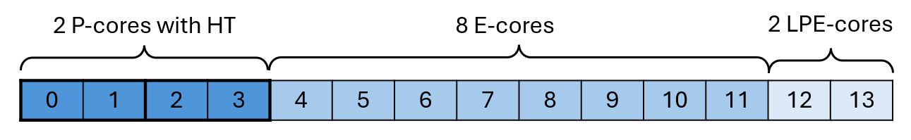

# Introduction

Here are the common recommendations about your system configuration that are beneficial for getting maximum performance from the workloads.

# Contents

- [Energy Performance Bias](#energy-performance-bias-epb-and-energy-performance-preference-epp)
- [CPU Frequency Scaling](#cpu-frequency-scaling)
- [Hyper-threading](#hyper-threading-ht)
- [Low Power Efficient Cores](#low-power-efficient-cores-lpe-cores)

## Energy Performance Bias (EPB) and Energy Performance Preference (EPP)

Energy Performance Bias (EPB) is a CPU power and performance control available on many Intel processors; lower values generally favor performance. On Windows, a closely related knob is exposed as Energy Performance Preference (EPP) via `powercfg`.

### On Windows

Run the following command in `cmd` to set EPP to `0` (best performance):

```
powercfg -setacvalueindex scheme_current sub_processor PERFEPP 0
```

The changes to Energy Performance Preference apply system-wide and are premanent. The changes will persist even after the system restart until the next EPP update.

[More info about `powercfg`](https://learn.microsoft.com/en-us/windows-hardware/customize/power-settings/options-for-perf-state-engine-perfenergypreference).

### On Linux

To check the current value of EPB, run:
```
sudo cpupower info
```

To set EPB to Performance mode:
```
sudo cpupower set -b 0
```

The changes to Energy Performance Bias apply system-wide and remain until the next system reboot or the next EPB update.

## CPU Frequency Scaling

CPU Frequency Scaling is a technique that dynamically adjusts the processor clock speed based on workload demands. It lowers CPU core frequencies during idle periods to reduce power consumption. For better performance, it is recommended to set the clock speed to a higher frequency.

### On Windows 11

Select **Start** > **Settings** > **System** > **Power & battery**.

Under [**Power**](https://support.microsoft.com/en-us/windows/change-the-power-mode-for-your-windows-pc-c2aff038-22c9-f46d-5ca0-78696fdf2de8#category=windows_11) mode, choose the **Best performance** option for **Plugged in** or **On battery**.

### On Linux

Use the CPU scaling governor:

```
sudo cpupower frequency-set --governor performance
sudo x86_energy_perf_policy -c all performance
```

**Note:** If the maximum CPU frequency cannot be achieved, check the [BIOS limitations](https://wiki.archlinux.org/title/CPU_frequency_scaling#BIOS_frequency_limitation).

## Hyper-threading (HT)

Hyper-threading (HT) is Intel's simultaneous multithreading implementation that can improve the parallelization of computations. When HT is enabled, for each processor core that is physically present, the operating system addresses two logical cores and shares the workload between them when possible. In this case, the logical cores located on a single physical core share the same resources. For resource-demanding workloads, it is recommended to disable HT either in BIOS settings or by modifying the affinity settings of the process.

### On Windows

Hyper-threading can be detected by running **Task Manager**. Then navigate to **Performance** > **CPU** tab.

The number of physical and logical cores is listed in the bottom right corner of the tab. In case the number of logical cores is greater, HT is enabled:


According to this picture, hyper-threading is enabled on two P-cores. Here is an illustration of the locations of the bits corresponding to those P-cores in the affinity mask of the system:


To disable hyper-threading for a process, the affinity mask in binary format should look like:


Which is equivalent to `2BFF` in hexadecimal format for the example system above. Replace `2BFF` with the mask computed for your CPU topology, then run the following command to disable HT on Windows:

```
start /affinity 2BFF cmd /c <workload.exe>
```

### On Linux

Hyper-threading can be detected by running `lscpu` utility as follows: `lscpu -e=cpu,core`. Here is the example output for Intel® Core™ Ultra 7 165U:

```
CPU  CORE
0    0
1    0
2    1
3    1
4    2
5    3
6    4
7    5
8    6
9    7
10   8
11   9
12   10
13   11
```

From the output we can see that 4 logical processors (0, 1, 2, 3) are running on two physical cores (0, 1).
Replace `0,2,4-13` with the CPU list computed for your CPU topology, then use one of the following commands to run the process on physical cores only:

```
numactl -C 0,2,4-13 <workload>
```
or
```
taskset -c 0,2,4-13 <workload>
```

The required list of logical processors can be formed programmatically in Bash. In this case, the command sequence looks like:

```bash
cpus=$(lscpu -e=cpu,core | tail -n +2 | awk '!seen[$2]++ {printf sep $1; sep=","}')
numactl -C "$cpus" <workload>
```

## Low Power Efficient Cores (LPE cores)

Low Power Efficient Cores (LPE cores) are a type of core available on modern Intel Core processors, designed to manage lightweight background processes independently. This allows the main compute tiles to be powered down, saving battery life on mobile devices.

For the best performance, it is recommended to exclude LPE cores from the list of CPU cores on which the workload is running. The affinity settings of the process have to be modified to achieve this.

### On Windows

Check the CPU specification on the Intel [products page](https://www.intel.com/content/www/us/en/products/overview.html). Here is an example for the Intel® Core™ Ultra 7 165U processor:


The location of the LPE cores in the system affinity mask in this case would be:



For the example system above, the recommended affinity mask that disables both hyper-threading and LPE cores is `2BFC`:


Run the following command to disable HT and LPE cores on Windows:

```
start /affinity 2BFC cmd /c <workload>
```

### On Linux

LPE cores can be detected by running the `lscpu -e=cpu,core,maxmhz` command.  Here is the example output:

```
CPU  CORE  MAXMHZ
0    0     4900.0000
1    0     4900.0000
2    1     4900.0000
3    1     4900.0000
4    2     3800.0000
5    3     3800.0000
6    4     3800.0000
7    5     3800.0000
8    6     3800.0000
9    7     3800.0000
10   8     3800.0000
11   9     3800.0000
12   10    2100.0000
13   11    2100.0000
```

The logical processors with the lowest maximum frequency (12, 13) are running on LPE cores.

For the example system above, the recommended processor list that does not contain both hyper-threaded and LPE cores is `0,2,4-11`.
Run the following command to disable HT and LPE cores on Linux:

```
numactl -C 0,2,4-11 <workload>
```

Or use the following Bash command sequence to disable HT and filter out the cores with the maximal frequency lower than 3000 MHz:

```bash
export MIN_MHZ=3000
cpus=$(lscpu -e=cpu,core,maxmhz | tail -n +2 | awk -v min="$MIN_MHZ" '$3 >= min && !seen[$2]++ {printf sep $1; sep=","}')
numactl -C "$cpus" <workload>
```
