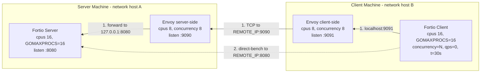

# Envoy + Fortio Benchmarking: Spin Lock Overhead & Optimization Guide

## Overview

This tuning guide describes best known practices to optimize Fortio + Envoy performance. It evaluates Envoy running as a TCP proxy in front of Fortio, which acts as the backend load generator. The benchmark focuses on proxy-path performance and behavior under load, measuring metrics such as QPS and latency. Both server-side and client-side components are used to generate traffic and collect results, with Envoy and Fortio running in Docker containers based on the images listed below:

- **Fortio**: `fortio/fortio:1.71.1`
- **Envoy**: `envoyproxy/envoy:v1.31.10`


A client machine drives load using:

```bash
# Plain HTTP through Envoy
sudo GOMAXPROCS=16 CONCURRENCY=1000 ./client.sh <server-ip>

# Secure mesh direct mode (no Envoy sidecars, raw application performance)
sudo GOMAXPROCS=16 SECURE_MESH=true CONCURRENCY=1000 ./client.sh <server-ip> direct-bench
```

---

## What Fortio Does

[Fortio](https://github.com/fortio/fortio) is a fast, multi-protocol load testing tool and echo server written in Go.

- **Server mode**: Listens on a port and echoes HTTP requests back. Minimal business logic - it is purely a throughput target.
- **Client mode**: Sends a configurable number of concurrent connections at a target QPS, collecting per-request latency histograms (p50, p90, p99, p99.9).
- **Why it matters here**: Fortio saturates Envoy so we can observe how the proxy performs under real concurrency.

---

## What Envoy Does

[Envoy](https://www.envoyproxy.io/) is a high-performance, C++ L4/L7 proxy used as the data plane in service meshes.

- **Event-driven, non-blocking I/O**: Each worker thread runs an independent libevent loop.
- **`--concurrency N`**: Spawns N worker threads. Each thread owns its own listener socket and connection pool, so there is near-zero cross-thread coordination for established connections.
- **TCP proxy mode** (used here): Envoy accepts a TCP connection on port 9090, opens a connection to Fortio on 8080, and shuttles bytes between them. No L7 parsing overhead.

---

## Topology / Setup



> **1.** Default proxy mode - traffic traverses both Envoy proxies.  
> **2.** `direct-bench(secure mesh)` mode - both Envoys (side cars) are bypassed. Fortio client hits Fortio server directly.  
> **3.** Server and Client are run on different machines & Client side measures QPS/latencies.  
> **4.** Setup: Used a high core count machine such as Intel Xeon 6 (Granite Rapids)-- 6980P (128C/256T) for both server & Client

---

## Scripts Overview

### server.sh

Starts two Docker containers on the server machine using host networking:

1. **Fortio server** — echo HTTP server, accepts traffic on `:8080`
2. **Envoy server-side** — TCP proxy, listens on `:9090` and forwards to `127.0.0.1:8080`

Key configs:

| Parameter | Fortio | Envoy |
|---|---|---|
| `--cpus` | 16 | 8 |
| `GOMAXPROCS` | optional, via env | N/A |
| listen port | 8080 | 9090 |
| `--concurrency` | N/A | 8 |
| circuit breaker | N/A | max_connections=20000 |

```bash
# Run on the server machine
./server.sh
```

---

### client.sh

Starts containers on the client machine and drives load toward the server. Supports two modes:

**Default Proxy mode** — spins up a client-side Envoy that proxies to the server, then runs Fortio through it:

1. Writes `envoy_client.yaml` pointing to `REMOTE_IP:9090`
2. Starts **Envoy client-side** listening on `localhost:9091`
3. Runs **Fortio client** sending load to `localhost:9091`

**direct-bench mode** — skips both Envoys and sends Fortio traffic directly to `REMOTE_IP:8080`. Optionally sets secure mesh labels (`UBER_NET_CLASSID`, `com.uber.secure_service_mesh`) if `SECURE_MESH=true`.

Key configs:

| Parameter | Fortio client | Envoy client-side |
|---|---|---|
| `--cpus` | 16 | 8 |
| `GOMAXPROCS` | optional, via env | N/A |
| `-c` (concurrency) | `CONCURRENCY` env (default 2000) | N/A |
| `-t` (duration) | 30s | N/A |
| `--payload-size` | 5000 bytes | N/A |
| `-qps` | 0 (max throughput) | N/A |
| listen port | N/A | 9091 |
| `--concurrency` | N/A | 8 |
| circuit breaker | N/A | max_connections=20000 |

```bash
# Default mode: Fortio -> client Envoy :9091 -> server Envoy :9090 -> Fortio server :8080
GOMAXPROCS=16 CONCURRENCY=1000 ./client.sh <server-ip>

# Direct-bench mode: Fortio -> Fortio server :8080 (no Envoy)
GOMAXPROCS=16 SECURE_MESH=true CONCURRENCY=1000 ./client.sh <server-ip> direct-bench
```

---

## CPU Utilization and CPU Quota (baseline/problem)

The script applies Docker CPU quotas (`--cpus 16` for Fortio, `--cpus 8` for Envoy). On a high core-count server (eg., 128 cores/256Threads), Docker enforces these quotas via cgroup CPU BW control. The OS spreads threads across all cores but throttles aggregate CPU time, resulting in roughly **6 - 7% per-core utilization** across all server cores - not saturation. The CPU quota is the binding constraint, not the workload.

---

## Spin Lock Overhead on High Core Count Machines (baseline/problem)

### What happens

On a high core-count server, running Fortio without concurrency limits causes significant `native_queued_spin_lock_slowpath` overhead. This behavior is observed with the fortio/fortio:1.71.1 image, which does not confine execution to a small number of CPU cores. Newer Fortio releases built with updated Go versions generally show reduced spin-lock overhead, as they tend to use fewer cores by default, hence better OOB QPS/latencies:

1. **Go runtime (Fortio)**: By default, Go sets `GOMAXPROCS` to the number of logical CPUs visible to the process. On a 128-core/256Threads machine, Go spawns up to 128 OS threads. The Go scheduler uses spin loops - a thread that finds its run queue empty will busy-spin for a short window before parking. With many threads occasionally spinning, aggregate spin overhead becomes significant.

2. **Cache coherency traffic**: Spin locks and atomic CAS operations on shared scheduler state cause cache line bouncing across all sockets. On a multi-socket NUMA system, cross-socket coherency traffic adds latency to every lock acquisition and scales with core count.

3. **Kernel paths involved** (from `perf report` — see [Perf Report](#perf-report-baseline) below):
   - Futex contention: `runtime.lock()` -> `futex()` -> `native_queued_spin_lock_slowpath`
   - Go GC work-stealing: `gcAssistAlloc`, `gcDrainN`, `lfstack.pop`
   - TCP send/recv paths: `tcp_sendmsg`, `tcp_recvmsg`
   - Netpoll: `runtime.netpoll`, `netpollblock`

4. **Envoy `--concurrency` and NUMA**: If Envoy threads are allowed to migrate across NUMA nodes, each worker incurs NUMA-remote memory accesses and LLC  thrashing.

### Symptom

Latency p99/p99.9 climbs, throughput plateaus below the theoretical limit, and `perf` shows high `native_queued_spin_lock_slowpath`, `context-switches`. Spin lock overhead in perf traces is markedly higher in secure-mesh mode than proxy mode due to the additional TLS workload.

---

## Perf Report (Baseline-problem: When all cores are used on high core count system(96C or higher)) <a name="perf-report-baseline"></a>

`perf report` output from a baseline run (no optimizations applied), 112K samples of `cycles:P`:

```
# Samples: 112K of event 'cycles:P'
# Event count (approx.): 1869921275007
#
# Overhead  Command          Shared Object            Symbol
# ........  ...............  .......................  .........................................................................................................
#
    29.50%  fortio           fortio                   [.] runtime.(*lfstack).pop
    17.38%  fortio           [kernel.kallsyms]        [k] native_queued_spin_lock_slowpath
     4.41%  fortio           fortio                   [.] runtime.(*lfstack).push
     2.56%  fortio           fortio                   [.] runtime.gcDrain
     1.53%  swapper          [kernel.kallsyms]        [k] intel_idle_xstate
     1.31%  fortio           fortio                   [.] internal/runtime/atomic.(*Uint32).CompareAndSwap
     1.14%  fortio           fortio                   [.] runtime.gcDrainN
     1.07%  fortio           [kernel.kallsyms]        [k] update_sg_lb_stats
     1.04%  fortio           fortio                   [.] runtime.procyield.abi0
     0.86%  fortio           fortio                   [.] runtime.lock2
     0.73%  fortio           fortio                   [.] runtime.getempty
     0.73%  swapper          [kernel.kallsyms]        [k] intel_idle
     0.67%  fortio           fortio                   [.] runtime.stealWork
     0.56%  fortio           fortio                   [.] runtime.markBits.setMarked
     0.55%  fortio           fortio                   [.] internal/runtime/atomic.(*Uint64).CompareAndSwap
     0.53%  fortio           fortio                   [.] runtime.(*gcBits).bytep
     0.51%  fortio           fortio                   [.] runtime.(*activeSweep).begin
     0.47%  fortio           fortio                   [.] runtime.(*activeSweep).end
     0.47%  fortio           fortio                   [.] internal/runtime/atomic.(*Uint64).Load
     0.44%  fortio           fortio                   [.] internal/runtime/atomic.(*Uint64).Add
     0.41%  fortio           fortio                   [.] runtime.(*atomicHeadTailIndex).load
     0.40%  fortio           fortio                   [.] runtime.(*sweepClass).load
     0.37%  fortio           [kernel.kallsyms]        [k] idle_cpu
     0.35%  fortio           fortio                   [.] runtime.pMask.read
     0.34%  fortio           [kernel.kallsyms]        [k] _raw_spin_lock
     0.33%  fortio           [kernel.kallsyms]        [k] osq_lock
     0.30%  fortio           fortio                   [.] runtime.(*mSpanStateBox).get
     0.29%  fortio           fortio                   [.] runtime.runqgrab
     0.25%  fortio           fortio                   [.] internal/runtime/atomic.(*Uint32).Load
     0.24%  fortio           fortio                   [.] runtime.(*spanSet).pop
     0.23%  swapper          [kernel.kallsyms]        [k] menu_select
     0.23%  fortio           fortio                   [.] internal/runtime/atomic.(*Bool).Load
     0.23%  fortio           fortio                   [.] runtime.spanOf
     0.19%  fortio           fortio                   [.] runtime.(*lfstack).empty
     0.19%  swapper          [kernel.kallsyms]        [k] switch_mm_irqs_off
     0.18%  fortio           fortio                   [.] sync.(*Pool).getSlow
     0.18%  fortio           [kernel.kallsyms]        [k] nohz_balance_exit_idle
     0.17%  fortio           fortio                   [.] internal/runtime/atomic.(*Int64).Add
     0.16%  fortio           fortio                   [.] runtime.scanobject
     0.15%  fortio           fortio                   [.] runtime.greyobject
     0.15%  fortio           fortio                   [.] runtime.findObject
     0.15%  swapper          [kernel.kallsyms]        [k] cpuidle_enter_state
     0.15%  fortio           [kernel.kallsyms]        [k] kick_ilb
     0.14%  fortio           fortio                   [.] sync.(*Mutex).Lock
     0.14%  fortio           fortio                   [.] runtime.(*timers).wakeTime
     0.13%  fortio           [kernel.kallsyms]        [k] _find_next_and_bit
     0.13%  fortio           [kernel.kallsyms]        [k] nohz_balancer_kick
     0.13%  fortio           fortio                   [.] runtime.unlock2
     0.13%  fortio           fortio                   [.] internal/runtime/atomic.(*Int64).Load
     0.13%  fortio           [kernel.kallsyms]        [k] update_cfs_group
     0.13%  fortio           fortio                   [.] sync.(*poolChain).popTail
```

Key observations:
- **`runtime.(*lfstack).pop` (29.5%) + `push` (4.4%)** — Go's lock-free stack used for GC work queues and `sync.Pool`; dominant cost here is cache-line contention across many threads
- **`native_queued_spin_lock_slowpath` (17.4%)** — cross-NUMA kernel spin lock contention driven by too many Go OS threads spread across sockets
- **`gcDrain` (2.56%) + `gcDrainN` (1.14%) + GC atomics** — GC scanning overhead; high allocation rate from concurrent Fortio requests forces frequent GC cycles
- **`procyield` (1.04%) + `lock2` (0.86%) + `stealWork` (0.67%)** — Go scheduler spin-waiting and work-stealing across processors, worsened by high `GOMAXPROCS`

---

## Optimizations

### 1. NUMA Pinning (Most Impactful)

Pin both Fortio and Envoy to a single NUMA node on server side. This is the single most impactful optimization - it substantially reduces `native_queued_spin_lock_slowpath` overhead by keeping all memory allocations, thread migrations, and NIC interrupts on the same socket.

```bash
# Pin both containers to NUMA node 0
sudo docker run ... --cpuset-cpus "<numa0 CPU range based on the SKU>" --cpuset-mems "N" --cpus "N" fortio/fortio:1.71.1 ...
sudo docker run ... --cpuset-cpus "<numa0 CPU range based on the SKU>" --cpuset-mems "N" --cpus "N" envoyproxy/envoy:v1.31.10 ...
```

Or on the host directly:

```bash
numactl --cpunodebind=0 --membind=0 -- envoy -c envoy.yaml --concurrency 16
```

**Why it helps**: Cross-socket coherency traffic is the dominant cause of `native_queued_spin_lock_slowpath` overhead on high core-count systems. Confining the workload to NUMA node 0 eliminates this entirely.

---

### 2. Tune CPU Quota for Both Containers

With NUMA pinning in place, tuning the CPU quota for both Fortio and Envoy containers further reduces scheduling delays and spin lock overhead. The numbers are just examples. Tune this based on the SKU/cores used.

```bash
# Example: Fortio --cpus 32, Envoy --cpus 16, both pinned to NUMA node 0
# --cpus and --cpuset-cpus count must always match (see opt #5)
sudo docker run ... --cpus 32 --cpuset-cpus "<32 physical cores from NUMA node 0>" --cpuset-mems 0 -e GOMAXPROCS=32 fortio/fortio:1.71.1 ...
sudo docker run ... --cpus 16 --cpuset-cpus "<16 physical cores from NUMA node 0>" --cpuset-mems 0 envoyproxy/envoy:v1.31.10 -c /etc/envoy/envoy.yaml --concurrency 16
```

Always apply NUMA pinning first; Tuning quota without NUMA pinning gives diminishing returns on high core-count machines.

---

### 3. Limit GOMAXPROCS (Fortio)

Set `GOMAXPROCS` to match the Docker `--cpus` allocation so the Go scheduler does not create more OS threads than there are physical CPUs available. The numbers are just examples. Tune this based on the SKU/cores used.

```bash
sudo docker run ... --cpus 16 -e GOMAXPROCS=16 fortio/fortio:1.71.1 ...
```

**Go &le; 1.24**: `GOMAXPROCS` must be set manually as shown above.  
**Go 1.25+**: Go reads the cgroup v2 CPU quota and automatically sets `GOMAXPROCS` without any env var.

---

### 4. GC Overhead Reduction - Go's GreenTea GC

Fortio's load generator creates large numbers of short-lived objects (request/response structs, buffers, timers). The default Go GC (tricolor mark-and-sweep) scans the object graph one object at a time, causing poor spatial locality, high contention on global queues, and significant cycles spent in the scan loop.

**GreenTea GC** (prototype in Go 1.24, available in Go 1.25.1 (as experimental feature)) is a span-centric generational collector. Should be enabled by default in Go 1.26:

- Scans in aligned 8 KB spans rather than individual objects -> better cache behavior and less evictions.
- Reduces overhead from `gcDrain`, `trygetfull`, and `lfstack` paths observed in perf traces.
- New span operations (`tryDeferToSpanScan`, `localSpanQueue.stealFrom`) distribute GC work more evenly across processors.
- Results in less time spent in GC and more CPU available for the application.

To use GreenTea GC, build Fortio with Go 1.25.1 and the GreenTea flag enabled or use 1.26 where it's enabled by default.


---
### 5. Match CPU quota to pinned cores — always set `--cpus` = `--cpuset-cpus` count

The CPU quota must match the number of pinned cores. `--cpus` sets the usage quota. `--cpuset-cpus` is the hard CPU pin. They must be equal:

```bash
docker run --cpus 11 --cpuset-cpus "0-10" --cpuset-mems 0 ...
```

`--cpus` alone (no `--cpuset-cpus`) lets the OS spread threads across all NUMA nodes and merely throttles aggregate time i.e there is no NUMA confinement. A quota larger than the cpuset allows the container to borrow time from other cores on the node. A quota smaller than the cpuset throttles it below what the pinned cores can deliver.

---
### 6. Other Envoy Tuning -- which can be explored

#### Worker and socket tuning
- **`SO_REUSEPORT`**: Already used by Envoy by default. Verify it is not disabled by any sysctls - it distributes `accept()` load evenly across worker threads without a shared accept mutex.
- **`--concurrency`**: set --concurrency equal to --cpus. Over-provisioning causes false sharing, under-provisioning wastes hardware.

#### Huge pages (TLB pressure)
Envoy's memory allocator (`tcmalloc` / `jemalloc`) benefits from 2 MB huge pages, which reduce TLB miss rates when proxying many concurrent flows:

```bash
echo 512 > /proc/sys/vm/nr_hugepages
```

#### CPU frequency governor & BIOS/OS settings
Disable dynamic frequency scaling to eliminate governor-induced latency spikes:

```bash
cpupower frequency-set -g performance
```
Ensure you have configured the following as default in BIOS or from the OS(using perfspect tool) on Granite Rapids (Xeon6) or later systems

1. `Efficiency Latency Control`: Latency Optimized
2. `Energy Performance Bias`: Performance (0)
3. `Energy Performance Preference`:  Performance (0)


---

## Core / CPU-Quota Allocation Across SKUs

Envoy + Fortio together are a single combined workload. Size them from the "thread counts you actually need", then verify the total fits within one NUMA node. Do not start from available HW capacity and fill it up — that leads to over-subscription and spin lock overhead.

`CONCURRENCY=1000` is goroutines in flight, not OS threads. `GOMAXPROCS` caps the OS thread count, which is what actually consumes CPU cores. You need far fewer cores than concurrent connections.

### Step 1 — Identify your NUMA topology

```bash
numactl --hardware
```

Look at `node 0 cpus:`. On a typical HT-enabled machine, `node 0 cpus: 0-42 128-170` means 43 physical cores — the first range (`0-42`) are physical cores, `128-170` are their HT siblings. **Use only physical cores** — two threads on the same physical core compete for the same execution units and degrade under load.

> On dual-socket BM or single-socket with SNC2/SNC3 enabled, `numactl` shows multiple nodes. Pick **one node (preferably NUMA node 0)** and stay within it.

### Step 2 — Size from thread counts, verify against NUMA node

**Decide Envoy workers first.** Envoy is I/O-bound; each `--concurrency` worker is one event loop thread needing one physical core. 8 workers is enough for most TCP proxy benchmarks; 16 is a reasonable upper bound before returns diminish.

**Fortio OS threads = 2 × Envoy workers.** Fortio is CPU-bound (Go runtime + GC). It needs roughly twice the compute of Envoy for the same load level. Set `GOMAXPROCS` to this value — Go spawns exactly that many OS threads, one per physical core.

**Verify it fits on one NUMA node:**

```
Envoy workers  +  Fortio GOMAXPROCS  <=  physical cores in chosen NUMA node
```

If it does not fit, reduce Envoy workers (and Fortio follows at 2×) until it does. Never spill into a second NUMA node.

**eg — 256 vCPU dual-socket BM (64 physical cores per NUMA node):**
- Choose Envoy workers = 16 -> Fortio GOMAXPROCS = 32 -> total = 48 &le; 64
- `--cpus 16 --cpuset-cpus "0-15" --cpuset-mems 0 --concurrency 16` for Envoy
- `--cpus 32 --cpuset-cpus "16-47" --cpuset-mems 0 -e GOMAXPROCS=32` for Fortio

**eg — 16 vCPU VM (8 physical cores, 1 NUMA node):**
- Choose Envoy workers = 2 -> Fortio GOMAXPROCS = 4 -> total = 6 ≤ 8
- `--cpus 2 --cpuset-cpus "0-1" --cpuset-mems 0 --concurrency 2` for Envoy
- `--cpus 4 --cpuset-cpus "2-5" --cpuset-mems 0 -e GOMAXPROCS=4` for Fortio

Three settings must be consistent on each container, or spin locks return:

- `--cpuset-cpus` and `--cpus` must cover the **same** cores — `--cpus` is a quota and `--cpuset-cpus` is the hard pin. They must match
- `--cpuset-mems` must be set to the **same NUMA node id** — without it the kernel allocates memory on a remote socket even when CPUs are pinned
- Envoy `--concurrency` must equal its `--cpus` value, and Fortio `GOMAXPROCS` must equal its `--cpus` value — extra threads beyond available cores spin on empty queues causing `native_queued_spin_lock_slowpath`

### Reference — Envoy workers and NUMA fit check across SKUs

| SKU | Physical cores / NUMA node | Envoy workers (`--concurrency` / `--cpus`) | Fortio (`GOMAXPROCS` / `--cpus`) | Total cores used |
|---|---|---|---|---|
| 16 vCPU VM | 8 | 2 | 4 | 6 of 8 |
| 32 vCPU VM | 16 | 4 | 8 | 12 of 16 |
| 64 vCPU BM | 32 | 8 | 16 | 24 of 32 |
| 96 vCPU BM, dual socket | 24 | 6 | 12 | 18 of 24 |
| 128 vCPU BM (SNC2 or dual socket) | 32 | 8 | 16 | 24 of 32 |
| 256 vCPU BM, dual socket | 64 | 16 | 32 | 48 of 64 |
| 256 vCPU BM, single socket SNC3  | 43 | 14 | 28 | 42 of 43 |

If QPS/latency is not saturated at these worker counts, increase Envoy workers by 2 and Fortio by 4 (keeping the 1:2 ratio) and rerun — but verify the new total still fits within the NUMA node's physical core count.


---

## Quick Diagnosis Checklist

| Symptom | Likely cause | Fix |
|---|---|---|
| High `native_queued_spin_lock_slowpath` in perf | Cross-NUMA memory access | Pin both containers to NUMA node 0 |
| High TLB in perf or spinlocks | Cross-NUMA memory access | Ensure Huge Pages are enabled |
| High `native_queued_spin_lock_slowpath` from Go threads | Too many Go OS threads | Set `GOMAXPROCS` = `--cpus` value |
| High LLC-load-misses in `perf stat` | Cross-NUMA memory access | Pin to single NUMA node |
| GC overhead in perf traces (`gcDrain`, `trygetfull`) | High allocation rate with default GC | Build Fortio with GreenTea GC (Go 1.25.1); or Go 1.26 (enabled by default) |
| Envoy CPU bottlenecked in TLS | mTLS handshake overhead | Enable TLS session resumption. Make TLS communication/handshake Async |
| Latency spikes every few seconds | CPU frequency scaling | Set `performance` governor |
| Throughput limited despite headroom | CPU quota too low | Increase `--cpus` for both containers together with `--concurrency`, --cpuset-cpus"  |
