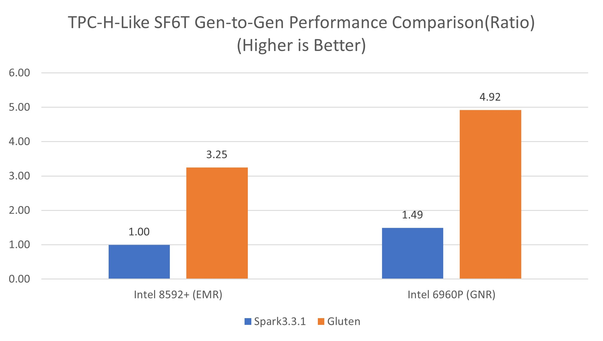
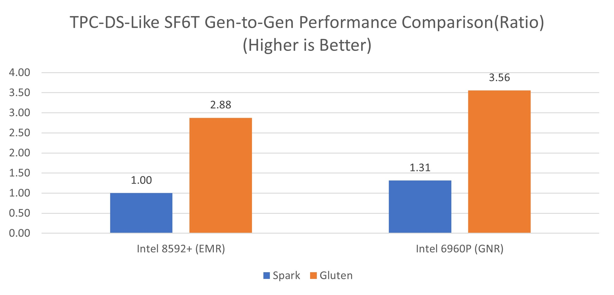
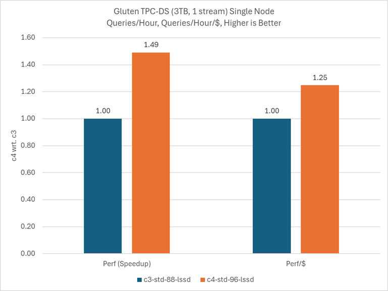
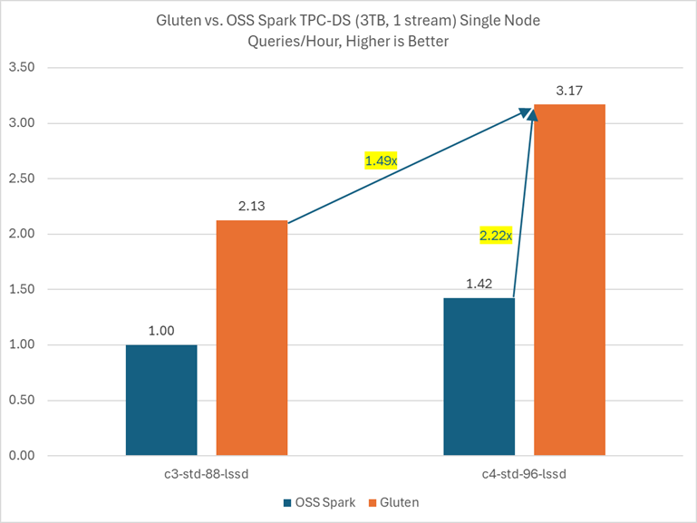
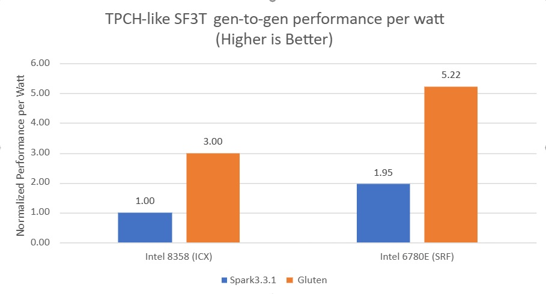
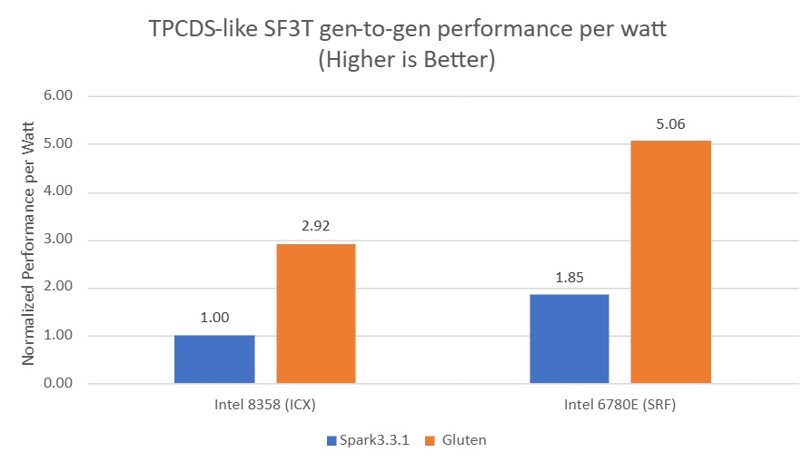

# Apache Gluten (Incubating): A Middle Layer for Offloading JVM-based SQL Engines' Execution to Native Engines

Apache Gluten is an open-source project designed to accelerate Apache Spark SQL by enabling native, vectorized query execution using high-performance C++ backends. Developed by Intel, Gluten decouples Spark’s execution engine from the JVM and integrates with native engines like Velox or ClickHouse, allowing Spark to leverage modern CPU features such as SIMD (Single Instruction, Multiple Data) and cache-efficient memory layouts. This results in significant performance improvements, especially for analytical workloads. Gluten is fully compatible with Spark APIs, making it easy to adopt without changing existing Spark applications, and is particularly well-suited for cloud-native OLAP and large-scale data processing environments.

Gluten currently supports multiple backends, including Velox and ClickHouse. Each backend has its own characteristics—for example, ClickHouse tends to deliver better performance for smaller queries, while Velox excels in handling longer or more complex queries. Intel® recommends using the Velox backend for running ETL workloads.

Click to learn more about [Gluten](https://github.com/apache/incubator-gluten) and [Velox](https://github.com/facebookincubator/velox).

# Contents

- [Parameter Tuning](#gluten-related-Parameter-Tuning)  
- [Intel® Optimizations](#intel-optimizations)  
- [Performance Results](#performance-results)


# Gluten related Parameter Tuning

| Parameters | Description | Recommended Setting |
| ---------- | ----------- | ----------------- |
| spark.executor.instances | |Depends on total cores per host and related to cores setting |
| spark.executor.cores | | Recommend to allocate 4 to 8 cores per executor. Please note that using an odd number of cores is not advised on systems with Simultaneous Multithreading(SMT) enabled|
| spark.executor.memory | | Recommend to allocate at least 0.5GB-1GB per core. Please note too small heap memory size could trigger GC and hurt the performance.|
| spark.executor.memoryOverhead | | Keep a few memory size for memoryOverhead |
| spark.memory.offHeap.enabled | Gluten uses offHeap memory for the native engine. | true  |
| spark.memory.offHeap.size | Set up offHeap memory size | In fully offload cases, please allocate as much memory as possible for offHeap. |
| spark.executorEnv.LD_PRELOAD | Set the location of pre-installed libjemalloc.so. Using jemalloc improved performance up to 10% in our testing. | /usr/lib/x86_64-linux-gnu/libjemalloc.so.2 |
| spark.gluten.sql.columnar.backend.velox.memoryCapRatio | Gluten v1.0.0 use memoryCapRatio to set up how much memory to be used in offHeap. Please see the <u>Spill</u> section in the [Velox](https://github.com/apache/incubator-gluten/blob/branch-1.0/docs/get-started/Velox.md#spill-experimental) Getting Started Guide. | 0.75 |
| spark.gluten.sql.columnar.forceshuffledhashjoin | Recommend using **SHJ** instead of **SMJ**, native **SHJ** can provide better performance; current native **SMJ** still has some performance issues. | true |
| spark.gluten.sql.columnar.maxBatchSize | | 4096 |
| spark.sql.files.maxPartitionBytes | This parameter can impact the number of tasks in Scan stage. To set up 2GB or more to get better performance for native scan. | At least 2GB |
| spark.sql.shuffle.partitions | We usually set 2x total cores for better performance, if you are facing OOM issue, please set it to 3x or higher. For example, in our environment there are 144 total cores, we set 144 x2 = 288 as shuffle partitions. | 2x total cores |
| spark.gluten.sql.columnar.wholeStage.fallback.threshold| | Gluten disables this setting by default. However, if your workload includes many unsupported fallback operators, we recommend setting it to 1 or 2.|
| spark.gluten.sql.columnar.query.fallback.threshold | This parameter can only work when AQE is disabled | |
| spark.sql.optimizer.runtime.bloomFilter.applicationSideScanSizeThreshold | | 0 |
| spark.sql.optimizer.runtime.bloomFilter.enabled | | true |
| spark.gluten.sql.columnar.joinOptimizationLevel | | 18. Intend to fallback to JVM engine when consequent join happen like q72 in TPC-DS. |
| spark.gluten.sql.columnar.logicalJoinOptimizationLevel | | 19. Intend to fallback to JVM engine when consequent join happen like q72 in TPC-DS. |
| spark.gluten.sql.columnar.logicalJoinOptimizeEnable | | true. Intend to fallback to JVM engine when consequent join happen like q72 in TPC-DS. |
| spark.gluten.sql.columnar.physicalJoinOptimizationLevel | | 18. Intend to fallback to JVM engine when consequent join happen like q72 in TPC-DS. |
| spark.gluten.sql.columnar.physicalJoinOptimizeEnable | | true |
| spark.gluten.sql.columnar.numaBinding | | Set true for bare metal and false for Cloud environment. |
| spark.gluten.sql.columnar.coreRange | | This parameter only works when numaBinding is enabled. Please use numactl tool to find the detailed NUMA topology then set the number to align with the NUMA topology in the Intel® processor. |

## Differences between Spark and Gluten in the Memory setting
In Spark, the total executor memory is calculated as:
```
total executor memory = executor.memory + executor.memoryOverhead + offHeap.size.
```
Spark workloads typically rely on executor.memory settings to achieve better performance and avoid out-of-memory (OOM) issues.

In Gluten, the native backend requires more off-heap memory, so we recommend configuring a larger spark.memory.offHeap.size to improve performance and reduce the risk of OOM errors.

## Other Performance Considerations
In addition to optimizing the Spark and Gluten configuration, it is crucial to monitor CPU utilization. CPU utilization may reach 80-90% if I/O is not the limiting factor.

In cloud environments using Gluten, I/O can easily become the performance bottleneck. If we observe low CPU utilization (e.g., 50-60%), I/O may be the bottleneck. In this case, we recommend increasing the storage and/or network bandwidth to improve performance.

For our bare metal testing, we utilized 6 NVMe disks and a 100Gb network to ensure that I/O was not a bottleneck. This setup allowed us to achieve a 2.71x speedup in TPC-H and a 2.29x speedup in TPC-DS benchmarks with Gluten v1.0.0.

# Intel® Optimizations
Apache Gluten has been enabled with Intel-specific features for improved performance.

## AVX
For details about SIMD in Velox, please refer to [Velox SIMD](https://facebookincubator.github.io/velox/develop/simd.html).
AVX-512 support is limited across operators in Velox. However in some scenarios, AVX-512 can provide performance gains.

## JSON
Velox uses AVX-512 for JSON parsing Velox through [SIMDJSON](https://github.com/simdjson/simdjson) to achieve better performance.

## Columnar Shuffle
Gluten leverages AVX-512 to implement Columnar Shuffle. Users can also choose a compression codec with AVX-512 optimizations to get better performance or a higher compression ratio during the shuffle phase.

## Intel® QuickAssist Technology (Intel® QAT)
Please refer to [Gluten QAT](https://apache.github.io/incubator-gluten/get-started/VeloxQAT.html#build-gluten-with-qat).
QAT-zip or QAT-zstd codecs are used to accelerate the compression and decompression in Columnar Shuffle.
In our testing environment, we found that Intel® QAT can provide up to a 20% performance gain. The performance gain achieved will vary and has a dependency on the number of cores and the number of QAT devices per socket.
We use 16-32 vcores per instance with 2 QAT devices in our testing. Using more vcores may cause some tasks to queue while waiting for a QAT device to become available and result in performance degradation.

## Intel® In-Memory Analytics Accelerator (Intel® IAA)
Please refer to [Velox IAA](https://apache.github.io/incubator-gluten/get-started/VeloxIAA.html).
Intel® IAA is also supported for compression and decompression, but we have not yet observed performance gains in our testing environment.

## High Bandwidth Memory (HBM)
Please refer to [Velox HBM](https://apache.github.io/incubator-gluten/get-started/VeloxHBM.html).

# Performance Results

## Performance Results for Intel® Xeon® 6 with Performance Cores

- [6th Generation Intel® Xeon® 6960P vs. 5th Generation Intel® Xeon® 8592+](#6th-generation-intel-xeon-6960p-vs-5th-generation-intel-xeon-8592)
- [6th Generation Intel® Xeon® 6985P-C vs. 4th Generation Intel® Xeon® Platinum 8481C In Google Cloud](#6th-generation-intel-xeon-6985p-c-vs-4th-generation-intel-xeon-platinum-8481c-in-google-cloud)

## 6th Generation Intel® Xeon® 6960P vs. 5th Generation Intel® Xeon® 8592+




### 6th Generation Xeon® compared to 5th Generation Xeon® with Spark 3.3.1 (without Gluten and Velox)
- **1.49×** speedup for **TPCH**-Like SF6TB
- **1.31×** speedup for **TPCDS**-Like SF6TB

### Gluten + Velox
- **1.52×** speedup for **TPCH**-Like SF6TB
- **1.24×** speedup for **TPCDS**-Like SF6TB

### Gluten + Velox vs. Spark 3.3.1 on Intel® Xeon® 6960P
- **3.3×** speedup for **TPCH**-Like SF6TB
- **2.71×** speedup **TPCDS**-Like SF6TB

### Details
Testing Date: Performance results are based on testing by Intel as of 2024-10-10 and may not reflect all publicly available security updates.

Spark on EMR (Baseline): 1-node, 2x INTEL(R) XEON(R) PLATINUM 8592+, 64 cores, HT On, Turbo On, NUMA 4, Integrated Accelerators Available [used]: DLB 2 [0], DSA 2 [0], IAA 2 [0], QAT 2 [0], Total Memory 1024GB (16x64GB DDR5 4800 MT/s [4800 MT/s]), BIOS 3B08.TEL3P1, microcode 0x21000240, 2x Ethernet Controller X710 for 10GBASE-T, 7x 3.5T INTEL SSDPF2KX038TZ, Ubuntu 22.04.4 LTS, 5.15.0-105-generic, TPC-H Like SF6T/ TPC-DS Like SF6T, JDK 1.8, GCC 11, Spark 3.3.1, Hadoop 3.2.4, score=TPC-H Like SF6T 6186 sec/TPC-DS Like SF6T 5982 sec.

Spark on GNR: 1-node, 2x Intel(R) Xeon(R) 6960P, 72 cores, HT On, Turbo On, NUMA 6, Integrated Accelerators Available [used]: DLB 8 [0], DSA 8 [0], IAA 8 [0], QAT 8 [0], Total Memory 1536GB (24x64GB DDR5 6400 MT/s [6400 MT/s]), BIOS 1.0, microcode 0x10002f0, 2x Ethernet Controller 10G X550T, 8x 3.5T INTEL SSDPF2KX038TZ, 1x 894.3G SAMSUNG MZ1L2960HCJR-00A07, Ubuntu 22.04.5 LTS, 5.15.0-124-generic, TPC-H Like SF6T/ TPC-DS Like SF6T, JDK 1.8, GCC 11, Spark 3.3.1, Hadoop 3.2.4, score=TPC-H Like SF6T 4144 sec/TPC-DS Like SF6T 4577 sec.

Gluten on EMR: 1-node, 2x INTEL(R) XEON(R) PLATINUM 8592+, 64 cores, HT On, Turbo On, NUMA 4, Integrated Accelerators Available [used]: DLB 2 [0], DSA 2 [0], IAA 2 [0], QAT 2 [0], Total Memory 1024GB (16x64GB DDR5 4800 MT/s [4800 MT/s]), BIOS 3B08.TEL3P1, microcode 0x21000240, 2x Ethernet Controller X710 for 10GBASE-T, 7x 3.5T INTEL SSDPF2KX038TZ, Ubuntu 22.04.4 LTS, 5.15.0-105-generic, TPC-H Like SF6T/ TPC-DS Like SF6T, JDK 1.8, GCC 11, Spark 3.3.1, Hadoop 3.2.4, score=TPC-H Like SF6T 1905 sec/TPC-DS Like SF6T 2079 sec.

Gluten on GNR: 1-node, 2x Intel(R) Xeon(R) 6960P, 72 cores, HT On, Turbo On, NUMA 6, Integrated Accelerators Available [used]: DLB 8 [0], DSA 8 [0], IAA 8 [0], QAT 8 [0], Total Memory 1536GB (24x64GB DDR5 6400 MT/s [6400 MT/s]), BIOS 1.0, microcode 0x10002f0, 2x Ethernet Controller 10G X550T, 8x 3.5T INTEL SSDPF2KX038TZ, 1x 894.3G SAMSUNG MZ1L2960HCJR-00A07, Ubuntu 22.04.5 LTS, 5.15.0-124-generic, TPC-H Like SF6T/ TPC-DS Like SF6T, JDK 1.8, GCC 11, Spark 3.3.1, Hadoop 3.2.4, score=TPC-H Like SF6T 1257 sec/TPC-DS Like SF6T 1682 sec.

Results may vary.

## 6th Generation Intel® Xeon® 6985P-C vs. 4th Generation Intel® Xeon® Platinum 8481C In Google Cloud



### 6th Generation Xeon® compared to 4th Generation Xeon® with Gluten + Velox In Google Cloud
- **1.49×** speedup for **TPCDS**-Like SF3TB
- **1.25×** perf/$ improvement for **TPCDS**-Like SF3TB



### Gluten + Velox vs. Spark 3.5.2 In Google Cloud
- **2.13×** speedup for **TPCDS**-Like SF3TB on 4th Generation Intel® Xeon® Platinum 8481C in Google Cloud (c3-standard-88-lssd)
- **2.22×** speedup **TPCDS**-Like SF3TB on 6th Generation Intel® Xeon® 6985P-C in Google Cloud (c4-standard-96-lssd)

### Details
Testing Date: Performance results are based on testing by Intel as of 1 Aug 2025 and may not reflect all publicly available security updates.

Gluten on SPR: 1-node, 1x Intel(R) Xeon(R) Platinum 8481C CPU @ 2.70GHz, 44 cores, c3-standard-88-lssd VM, HT On, Turbo Off, NUMA 1, Total Memory 352GB, BIOS Google, 1x Compute Engine Virtual Ethernet [gVNIC], 1x 375G nvme_card10, 1x 375G nvme_card8, 1x 375G nvme_card12, 1x 512G nvme_card-pd, 1x 375G nvme_card2, 1x 375G nvme_card5, 1x 375G nvme_card11, 1x 375G nvme_card15, 1x 375G nvme_card14, 1x 375G nvme_card0, 1x 375G nvme_card3, 1x 375G nvme_card13, 1x 375G nvme_card1, 1x 375G nvme_card4, 1x 375G nvme_card7, 1x 375G nvme_card9, 1x 375G nvme_card6, Ubuntu 24.04.2 LTS, 6.14.0-1011-gcp, TPC-DS Like SF3T, JDK 1.8, GCC 11, Spark 3.5.2, Hadoop 3.3.5, score=TPC-DS Like SF3T 2786 sec

Gluten on GNR: 1-node, 1x Intel(R) Xeon(R) 6985P-C CPU @ 2.30GHz, 48 cores, c4-standard-96-lssd VM, HT On, Turbo Off, NUMA 2, Total Memory 360GB, BIOS Google, 1x Compute Engine Virtual Ethernet [gVNIC], 1x 375G nvme_card14, 1x 375G nvme_card1, 1x 375G nvme_card3, 1x 375G nvme_card0, 1x 375G nvme_card4, 1x 375G nvme_card8, 1x 375G nvme_card15, 1x 512G nvme_card-pd, 1x 375G nvme_card2, 1x 375G nvme_card5, 1x 375G nvme_card9, 1x 375G nvme_card11, 1x 375G nvme_card6, 1x 375G nvme_card7, 1x 375G nvme_card10, 1x 375G nvme_card12, 1x 375G nvme_card13, Ubuntu 24.04.2 LTS, 6.14.0-1012-gcp, TPC-DS Like SF3T, JDK 1.8, GCC 11, Spark 3.5.2, Hadoop 3.3.5, score=TPC-DS Like SF3T 1871 sec

OSS Spark on SPR: 1-node, 1x Intel(R) Xeon(R) Platinum 8481C CPU @ 2.70GHz, 44 cores, c3-standard-88-lssd VM, HT On, Turbo Off, NUMA 1, Total Memory 352GB, BIOS Google, 1x Compute Engine Virtual Ethernet [gVNIC], 1x 375G nvme_card10, 1x 375G nvme_card8, 1x 375G nvme_card12, 1x 512G nvme_card-pd, 1x 375G nvme_card2, 1x 375G nvme_card5, 1x 375G nvme_card11, 1x 375G nvme_card15, 1x 375G nvme_card14, 1x 375G nvme_card0, 1x 375G nvme_card3, 1x 375G nvme_card13, 1x 375G nvme_card1, 1x 375G nvme_card4, 1x 375G nvme_card7, 1x 375G nvme_card9, 1x 375G nvme_card6, Ubuntu 24.04.2 LTS, 6.14.0-1011-gcp, TPC-DS Like SF3T, JDK 1.8, GCC 11, Spark 3.5.2, Hadoop 3.3.5, score=TPC-DS Like SF3T 5926 sec

OSS Spark on GNR: 1-node, 1x Intel(R) Xeon(R) 6985P-C CPU @ 2.30GHz, 48 cores, c4-standard-96-lssd VM, HT On, Turbo Off, NUMA 2, Total Memory 360GB, BIOS Google, 1x Compute Engine Virtual Ethernet [gVNIC], 1x 375G nvme_card14, 1x 375G nvme_card1, 1x 375G nvme_card3, 1x 375G nvme_card0, 1x 375G nvme_card4, 1x 375G nvme_card8, 1x 375G nvme_card15, 1x 512G nvme_card-pd, 1x 375G nvme_card2, 1x 375G nvme_card5, 1x 375G nvme_card9, 1x 375G nvme_card11, 1x 375G nvme_card6, 1x 375G nvme_card7, 1x 375G nvme_card10, 1x 375G nvme_card12, 1x 375G nvme_card13, Ubuntu 24.04.2 LTS, 6.14.0-1012-gcp, TPC-DS Like SF3T, JDK 1.8, GCC 11, Spark 3.5.2, Hadoop 3.3.5, score=TPC-DS Like SF3T 4162 sec

Results may vary.

### Intel® Xeon® 6 with Performance Cores Summary
The combination of **Intel® Xeon® 6 with Performance Cores** and **Gluten + Velox** demonstrates consistent performance advantages making it a strong candidate for high-performance data processing workloads.

## Performance Results for Intel® Xeon® 6 with Efficiency Cores
- [6th Generation Intel® Xeon® 6780E vs. 3rd Generation Intel® Xeon®](#6th-generation-intel-xeon-6780e-vs-3rd-generation-intel-xeon)

### 6th Generation Intel® Xeon® 6780E vs. 3rd Generation Intel® Xeon®




### Spark 3.3.1
- **1.95×** performance per watt for **TPCH**-Like SF3TB
- **1.85×** performance per watt for **TPCDS**-Like SF3TB

### Gluten + Velox
- **1.74×** performance per watt for **TPCH**-Like SF3TB
- **1.73×** performance per watt for **TPCDS**-Like SF3TB

### Gluten + Velox vs. Spark 3.3.1 on Intel® Xeon® 6780E

- **2.68×** performance per watt **TPCH**-Like SF3TB
- **2.74×** performance per watt **TPCDS**-Like SF3TB

### Details
Testing Date: Performance results are based on testing by Intel as of 2024-05-30 and may not reflect all publicly available security updates.

ICX (Baseline): 1-node, 2x Intel(R) Xeon(R) Platinum 8358 CPU @ 2.60GHz, 32 cores, HT On, Turbo On, NUMA 2, Integrated Accelerators Available [used]: DLB 0 [0], DSA 0 [0], IAA 0 [0], QAT 0 [0], Total Memory 1024GB (32x32GB DDR4 3200 MT/s [3200 MT/s]), BIOS 05.00.02, microcode 0xd0003d1, 2x Ethernet Controller E810-C for QSFP, 2x I350 Gigabit Network Connection, 8x 3.5T INTEL SSDPF2KX038TZ, 1x 372.6G INTEL SSDSC2BA40, Ubuntu 22.04 LTS, 5.15.0-107-generic, TPC-H Like SF3T/ TPC-DS Like SF3T, JDK 1.8, GCC 11, Spark 3.3.1, Hadoop 3.2.4.

SRF: 1-node, 2x Intel(R) Xeon(R) 6780E, 144 cores, HT Off, Turbo On, NUMA 2, Integrated Accelerators Available [used]: DLB 4 [0], DSA 4 [0], IAA 4 [0], QAT 4 [0], Total Memory 1024GB (16x64GB DDR5 6400 MT/s [6400 MT/s]), BIOS BHSDCRB1.IPC.3085.P21.2404160628, microcode 0x13000162, 2x Ethernet Controller XXV710 for 25GbE SFP28, 1x I210 Gigabit Network Connection, 2x BCM57416 NetXtreme-E Dual-Media 10G RDMA Ethernet Controller, 1x 894.3G Micron_7450_MTFDKBG960TFR, 8x 3.5T INTEL SSDPF2KX038TZ, Ubuntu 22.04.4 LTS, 5.15.0-107-generic,  TPC-H Like SF3T/ TPC-DS Like SF3T, JDK 1.8, GCC 11, Spark 3.3.1, Hadoop 3.2.4.

Results may vary.

### Intel® Xeon® 6 with Efficiency Cores Summary
Both **Gluten** and **Spark 3.3.1** show significant performance-per-watt improvements on the **Intel® Xeon® 6780E** compared to the **Intel® Xeon® 8358**. Additionally, **Gluten consistently outperforms Spark 3.3.1** on the same hardware, making it a compelling choice for energy-efficient data processing workloads.