# MySQL & PostgreSQL Tuning Guide <!-- omit in toc -->

This guide provides detailed tuning recommendations for MySQL and PostgreSQL databases running on Intel® Xeon® 6 Processors. It covers hardware and software optimizations.

**Revision Record**
| Date | Rev. | Description |
|------|------|-------------|
| 07/09/2025 | 1.0 | Initial Release |

# Table of Contents <!-- omit in toc -->

- [Introduction](#introduction)
- [Intel® Xeon® 6 Processors](#intel-xeon-6-processors)
- [Hardware Tuning](#hardware-tuning)
  - [BIOS](#bios)
  - [Manufacturer Defaults](#manufacturer-defaults)
  - [Recommended BIOS Settings](#recommended-bios-settings)
    - [Latency Optimized Mode - Enabled](#latency-optimized-mode---enabled)
    - [SNC (Sub NUMA Cluster) - Enabled](#snc-sub-numa-cluster---enabled)
- [NIC configuration](#nic-configuration)
- [Disk Configuration](#disk-configuration)
- [SKU Recommendations](#sku-recommendations)
- [Software Tuning](#software-tuning)
  - [Linux Optimizations](#linux-optimizations)
    - [Kernel version recommendation](#kernel-version-recommendation)
    - [CPU performance mode](#cpu-performance-mode)
    - [Hugepage Configuration](#hugepage-configuration)
    - [NUMA Binding](#numa-binding)
- [MySQL Tuning](#mysql-tuning)
- [PostgreSQL Tuning](#postgresql-tuning)
- [Optimizations in the Public Cloud](#optimizations-in-the-public-cloud)
- [Performance Evaluation](#performance-evaluation)
- [Summary](#summary)
- [Appendix A – Running HammerDB 4.0 with MySQL](#appendix-a--running-hammerdb-40-with-mysql)
- [Appendix B – Running HammerDB with PostgreSQL](#appendix-b--running-hammerdb-with-postgresql)
- [Appendix C - MySQL Monitoring Tools](#appendix-c---mysql-monitoring-tools)
- [Appendix D - PostgreSQL Performance Monitoring](#appendix-d---postgresql-performance-monitoring)


# Introduction

Relational database management system (RDBMS) provides some of the most important foundational components in enterprise software architecture. Based on the relational model of data, the database software uses the industry standard SQL (Structured Query Language) to define and query the data stored within the relations. Relational databases have proved the most popular format for data storage and retrieval for over 40 years and the RDS (Relational Database Service) continues to be the fastest growing service offered by cloud service providers.

The DB-Engines ranking <https://db-engines.com> lists the most popular databases with relational databases making 74% of the total ranking. Relational database workloads are divided into two general categories, OLTP (Online Transaction Processing) and OLAP (Online Analytical Processing) with both workloads having considerably different characteristics.

In this guide, we focus upon tuning for OLTP workloads. Application developers and database administrators may benefit from this guide to deploy MySQL or PostgreSQL as their backend database on Intel® Xeon® 6 Processors based platform. This guide assumes that the audience has a general working knowledge of the Linux Operating System and either MySQL or PostgreSQL. Our intent is to help the reader get the best database performance on Intel® Xeon® 6 Processor based platforms. However, please note that we rely on the users to carefully consider these settings for their specific scenarios, since databases can be deployed in multiple ways.

# Intel® Xeon® 6 Processors

Intel Xeon 6 offer both great per core performance and twice as many cores per socket as the previous generation. By providing more cores, double memory bandwidth, and AI acceleration in every core, Intel Xeon 6 provide twice the performance for the widest range of workloads, including AI, HPC and database workloads. In addition, Intel Xeon 6 processors are great for public cloud workloads because they offer improved performance per vCPU for floating point operations, transactional databases, and HPC workloads. Please refer to the [Intel® Xeon® 6 Performance page](https://edc.intel.com/content/www/us/en/products/performance/benchmarks/intel-xeon-6/) for wide range workload performance on Intel Xeon 6 processor platforms.

Some key Xeon 6 P-cores processor features:

- [Up to 128 cores and 504 MB last level cache per socket]((https://www.intel.com/content/www/us/en/content-details/845771/intel-xeon-6-processor-family-product-brief.html))
- [Improved memory performance, up to 12 memory channels, supporting DDR5(6400MHz)/MRDIMM(8800MHz)](https://newsroom.intel.com/data-center/new-ultrafast-memory-boosts-intel-data-center-chips)
- [Enhance AI acceleration with Intel® Advanced Matrix Extensions (Intel® AMX)](https://www.intel.com/content/www/us/en/products/docs/accelerator-engines/advanced-matrix-extensions/overview.html)
- [Enhance privacy and control over your data with increased confidentiality at the virtual machine (VM) level with Intel® Trust Domain Extensions (Intel® TDX) technology.](https://www.intel.com/content/www/us/en/developer/tools/trust-domain-extensions/overview.html)
- [Offer up to 96 PCIe lanes per socket and high I/O performance, making these processors ideal for use with storage sensitive workloads like databases.](https://www.intel.com/content/www/us/en/products/details/processors/xeon/xeon6-p-cores.html)

## Additional Intel Xeon 6 Links <!-- omit in toc -->

- [Intel® Xeon® 6 Processors Platform](https://www.intel.com/content/www/us/en/products/details/processors/xeon.html)
- [Intel® Xeon® 6 Processors Family Brief](https://www.intel.com/content/www/us/en/content-details/845771/intel-xeon-6-processor-family-product-brief.html)
- [Intel® Xeon® 6 Processors with Performance P-Cores](https://www.intel.com/content/www/us/en/products/details/processors/xeon/xeon6-p-cores.html)

# Hardware Tuning

## BIOS

## Manufacturer Defaults

**NOTE:** We suggest keeping most settings as the **Manufacturer Defaults** since they have been fully tested and validated for day-to-day operations. However, some BIOS settings that can be tuned to improve Database performance.

The following table lists the recommended BIOS settings for Intel Xeon 6 processors with P-cores.

## Recommended BIOS Settings

| Configuration Item     | Recommended Value | Default  |
| ---------------------- | ----------------- | -------- |
| Latency Optimized Mode | Enabled           | Disabled |
| SNC                    | Enabled           | Disabled |
| C State                | Disable C6        |          |
| All other settings     | Defaults          | Defaults |

### Latency Optimized Mode - Enabled

On Intel Xeon 6 platforms, Intel added a Latency Optimized Mode in the BIOS and is “disabled” by default. For best performance, enable this feature. By enabling this feature, the system will favor better performance over saving power. For database workloads, this option will give the highest database throughput and fastest query response time.

### SNC (Sub NUMA Cluster) - Enabled

Intel Xeon 6 processors with P-cores provide up to 128 cores, which is 2x than previous generation. Each processor (socket) can contain up to 3 compute die, with each compute die having up to 44 cores, and two IO dies stacked on top of each other as illustrated in Figure 1. Each compute die has its own the last-level-cache and memory controllers.

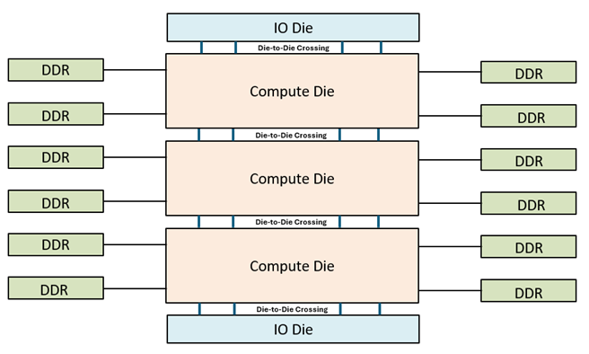

*Figure 1. SoC Construction of Intel® Xeon® 6900P-Series Processor*


Intel® Xeon® 6900P-Series Processor supports two main memory models, Six-way Uniform Memory Access (UMA6) -- also called “hex” mode -- and Sub-Numa Clustering (SNC) with 3 sub-numa domains (SNC3) – one domain for each compute die. The benefit of hex mode is that it does not require any software optimization to be NUMA aware. Instead, the entire address space of all the memory attached to the socket are mapped to the monolithic shared LLC. The round trip for a load memory request may incur 0, 2, or 4 die crossings, up to 2 die crossings each way. Figure 2 show a Xeon® 6900P-Series Processor with 3 compute dies configured in Hex Mode.

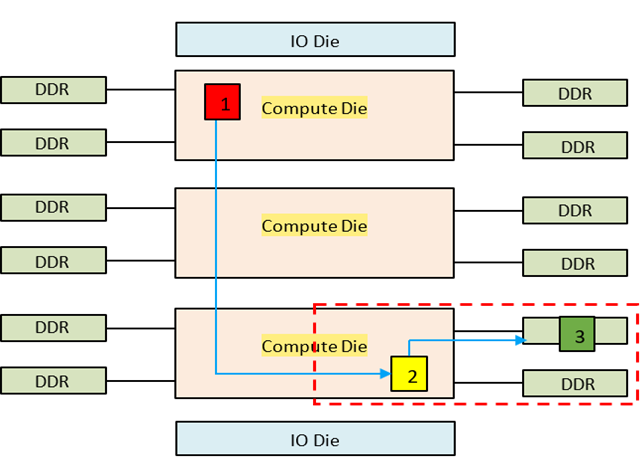

*Figure 2. UMA6 (Hex) Mode*

To get consistent and lower memory access latency, Sub-Numa Clustering (SNC) with 3 sub-numa domains (SNC3) – one domain for each compute die – is recommended. This is the default BIOS setting. Figure 3 show a Xeon® 6900P-Series Processor with 3 compute dies configured in SNC3 Mode.

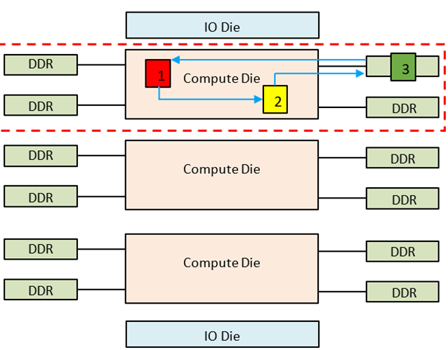

*Figure 3. SNC3 Mode*

Similarly, Intel® Xeon® 6700P-Series Processor supports up to 2 sub-numa domains (SNC2).

SNC3 or SNC2 mode is best for software that are NUMA aware or software require a smaller number of CPU cores. Any application that requires more cores than one compute die, then it best to use Hex Mode or optimize the software to be NUMA aware.

MySQL and PostgreSQL production deployment generally will fit within one compute die. In fact, we have observed that most MySQL and PostgreSQL deployment used 16 cores or less, but deployed many smaller databases per system. Therefore we recommend deploying MySQL or PostgreSQL inside a SNC which can benefit from lower LLC cache latency and memory latency. Users may use numactl tool to display NUMA topology of the system and bind MySQL or PostgreSQL on specified cores of a sub NUMA node. As alternatives, users may also use virtualization or docker technologies to deploy multiple MySQL or PostgreSQL instances on Intel Xeon 6 processors-based platforms.

# NIC configuration

To deploy multiple MySQL or PostgreSQL instances in a multi-socket system, we recommend installing multiple NICs (network interface card) on the system, with at least one NIC installed per socket. When deploying MySQL instances, each MySQL or PostgreSQL instance runs on an SNC belongs to a specific socket. Additionally, ensure that the IP address used by each MySQL or PostgreSQL instance corresponds to the IP address of the NIC installed on its associated socket. In the later example, we will demonstrate how to configure such binding.

To display all cpu cores and numa node and socket of each cpu core belongs to:

```bash
lscpu -e
```

Here is example of output:

```plaintext
# lscpu -e
CPU NODE SOCKET CORE L1d:L1i:L2:L3 ONLINE MAXMHZ MINMHZ MHZ
0 0 0 0 0:0:0:0 yes 3900.0000 800.0000 2279.0149
1 0 0 1 1:1:1:0 yes 3900.0000 800.0000 800.0000
2 0 0 2 2:2:2:0 yes 3900.0000 800.0000 800.0000
3 0 0 3 3:3:3:0 yes 3900.0000 800.0000 800.0000
4 0 0 4 4:4:4:0 yes 3900.0000 800.0000 800.0000
5 0 0 5 5:5:5:0 yes 3900.0000 800.0000 800.0000
6 0 0 6 6:6:6:0 yes 3900.0000 800.0000 800.0000
7 0 0 7 7:7:7:0 yes 3900.0000 800.0000 800.0000
8 0 0 8 8:8:8:0 yes 3900.0000 800.0000 800.0000
9 0 0 9 9:9:9:0 yes 3900.0000 800.0000 800.0000
10 0 0 10 10:10:10:0 yes 3900.0000 800.0000 800.0000
11 0 0 11 11:11:11:0 yes 3900.0000 800.0000 800.0000
```

CPU column: logical CPU ID

NODE column: numa node of the CPU belongs to.

SOCKET column: socket of the CPU belongs to.

CORE column: physical core of the CPU.


To display all NIC and numa node the NIC installed:

```bash
for i in $(lspci |grep -i eth| cut -d' ' -f 1);do lspci -v -s $i|head -n 5;done
```

Here is example of the output:

```plaintext
8a:00.0 Ethernet controller: Broadcom Inc. and subsidiaries BCM57416 NetXtreme-E Dual-Media 10G RDMA Ethernet Controller (rev 01)
    Subsystem: Broadcom Inc. and subsidiaries NetXtreme-E Dual-port 10GBASE-T Ethernet OCP 3.0 Adapter (BCM957416N4160C)
    Physical Slot: 7
    Flags: bus master, fast devsel, latency 0, IRQ 16, NUMA node 0
    Memory at 25ffffe10000 (64-bit, prefetchable) [size=64K]

8a:00.1 Ethernet controller: Broadcom Inc. and subsidiaries BCM57416 NetXtreme-E Dual-Media 10G RDMA Ethernet Controller (rev 01)
    Subsystem: Broadcom Inc. and subsidiaries NetXtreme-E Dual-port 10GBASE-T Ethernet OCP 3.0 Adapter (BCM957416N4160C)
    Physical Slot: 7
    Flags: bus master, fast devsel, latency 0, IRQ 17, NUMA node 0
    Memory at 25ffffe00000 (64-bit, prefetchable) [size=64K]
```

8a:00.0 is BDF address of NIC device (Bus:Device.Function), according to the output, the NIC is installed on NUMA node 0.

# Disk Configuration

For multiple instance test, an NVMe SSD drive is suggested to store no more than 8 database instances for I/O performance considerations, and it is an option to use technologies like LVM or RAID to group all drives for simplicity.

# SKU Recommendations

It is critical to select the optimal size of computing resources to meet business needs, from the number of CPU cores to the speed and capacity of the memory and storage. Intel Xeon 6 processors with P-core support up to 128 cores. Table 1 below shows some of the available CPU SKU. In general, the more CPU cores in your system, the more concurrent database users your system can support. CPU frequency is another crucial factor to consider. The faster the frequency, the shorter time it takes to execute a typical operation. There are 3 core frequencies in CPU spec, they are meaningful to Database performance in different use cases.

- **Max Turbo Frequency:** the maximum single-core frequency at which the processor is capable of operating using Intel® Turbo Boost Technology. Higher max turbo frequency is meaningful to transaction latency in small database concurrency.
- **All Core Turbo Frequency:** is the frequency at which the processor is capable of operating all its available cores concurrently. Higher all core turbo frequency is meaningful to database performance in peak hours.
- **Processor Base Frequency:** describes the rate at which the processor's transistors open and close. The processor base frequency is the operating point where TDP is defined. Higher base frequency is meaningful to database performance even when the whole system is in very high utilization.

|  |  |  |  |  |  |  |  |
| --- | --- | --- | --- | --- | --- | --- | --- |
| **Processor SKU** | **Cores Count per Socket** | **Total Last Level Cache per Socket (MB)** | **Base Frequency (GHz)** | **Max Turbo Frequency (GHz)** | **All Core Turbo Frequency (GHz)** | **Thermal Design Power (TDP) (W)** | **Usage Case** |
| Intel® Xeon® 6737P | 32 | 144 | 2.9 | 4.0 | 4.0 | 270 | Less DB instances while high performance per DB instance |
| Intel® Xeon® 6747P | 48 | 288 | 2.7 | 3.9 | 3.8 | 330 | Balance of DB instances and DB performance scalability. |
| Intel® Xeon® 6767P | 64 | 336 | 2.4 | 3.9 | 3.6 | 350 | High DB instance density |
| Intel® Xeon® 6972P | 96 | 480 | 2.4 | 3.9 | 3.5 | 350 | High DB instance density, rich IO channels |

*Table 1. Processor SKU*

If business just requires to deploy small number of MySQL/PostgreSQL instances on a server, but pursue the performance of an instance, Intel Xeon 6737P will be good candidate. It has quite high base, max turbo and all core turbo frequency which will boost performance of MySQL/PostgreSQL instances.

# Software Tuning

Software configuration tuning is essential. From the Operating System to MySQL and PostgreSQL configuration settings, they are all designed for general purpose applications and default settings are almost never tuned for best performance.

## Linux Optimizations

### Kernel version recommendation

- For Linux kernel 5.x, 5.14 or later is recommended.
- For Linux kernel 6.x, 6.13 or later is recommended.

### CPU performance mode

The CPU governor needs to be set to performance mode to ensure CPU boosts to the maximum frequency. This has been covered in the BIOS setting section, but in case you want to set it in the OS if you leave the BIOS setting as default, use the following command:

```bash
# Set the CPU governor to performance mode
cpupower frequency-set --governor=performance

# Use this command to check
cpupower frequency-info

# Output like this indicates that performance mode has been set successfully
current policy: frequency should be within 800 MHz and 3.90 GHz.
    The governor "performance" may decide which speed to use
```

### Hugepage Configuration

Another thing that could be considered is the Huge Pages enablement, which could benefit some transactional databases like Oracle and PostgreSQL for approximately 10% performance improvement (from experience MySQL does not benefit from this). But enabling Hugepage can lead to risks since HugePages are statically allocated at boot time (unless using Transparent HugePages (THP)), and it can be inflexible for mixed workloads memory allocation and even worse it may cause failure at boot if the configured Hugepage size exceeds the system memory accidentally. So it is a trade-off and you own the choice of whether to turn on this feature.

To enable the Huge Pages, you can either configure ‘vm.nr_hugepages’ in /etc/sysctl.conf, or directly overwrite to /proc/sys/vm/nr_hugepages_mempolicy.

For example, we are going to create 10GB of buffers later, so we create 12GB (a little extra) of hugepage area. The first way is to add the following vm.nr_hugepages line:

```bash
# Edit the sysctl.conf file
vm.nr_hugepages = 6000

# Run the following to take effect
sysctl -p

# Alternatively, overwrite the following file directly and it takes effective immediately
echo 6000 > /proc/sys/vm/nr_hugepages_mempolicy
```

**Note: You need to make sure it has enough memory available in the configured NUMA nodes for hugepages and the created hugepage area needs to be larger than database buffers and does not go beyond the limit of the locked memory.**

Additionally, for database like PostgreSQL, the use of 1GB hugepage size could provide slightly better performance compared to the default 2MB huge page size configuration.

To configure the hugepage size to 1GB instead of the default 2MB you can add ‘hugepagesz=1G hugepagesz=1G’ to the boot parameters. As an example:

```bash
sudo vi /etc/default/grub
GRUB_CMDLINE_LINUX="rhgb default_hugepagesz=1G hugepagesz=1G"
sudo grub2-mkconfig -o /boot/efi/EFI/ubuntu/grub.cfg
```

A system reboot is required. Check the hugepage size in meminfo after the power cycle.

```bash
# After reboot, you can check the hugepage size by running
sudo cat /proc/meminfou8
    Hugepagesize: 1048576 kB
```

 There are cases that you might only want to run the database instances within a certain number of cores or a few NUMA nodes, and hence Huge Pages need to be enabled with NUMA affinity instead of at the whole system level.

The following command allows you to implement this. Here is an example that allocates 12GB to only the first NUMA (Note: It is suggested to release all memory in desired NUMAs and clear the page cache otherwise it might lead to failure or incorrection)

```bash
echo 2000 > /sys/devices/system/node/node0/hugepages/hugepages-2048kB/nr_hugepages
```

To check whether it is configured successfully, you can run the following and check “HugePages_Total” in each NUMA nodes

```bash
numastat -m
```

### NUMA Binding

As mentioned earlier, it is suggested to enable SNC (Sub-NUMA-Clustering) and keep a database instance in a NUMA node to avoid performance penalty of cross-NUMA latency. On a high core-count system, multiple database instances with each in a NUMA node is recommended instead of a single database instance crossing NUMA nodes for better performance scaling.

On a Xeon 6-6900P system, there are 6 NUMA nodes with SNC3 enabled. Run the following command to check the core and memory topology.

```bash
numactl -H
```

Here is an output example on a Xeon 6 96-core system with 1.5TB memory.

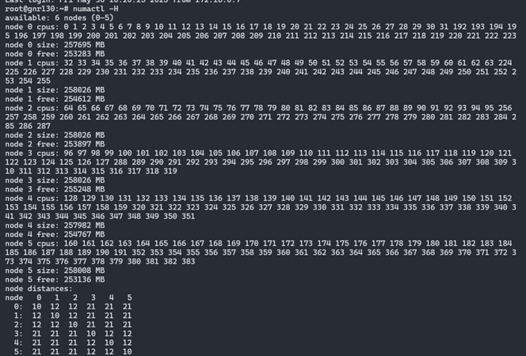

And the following shows how to bind the MySQL instance to the cores and memory in the NUMA node 0.

```bash
numactl -N 0 -m 0 /usr/local/mysql/bin/mysqld_safe --defaults-file=/etc/my.cnf –user=mysql &
```

If MySQLis installed using RPM/DEB package, modify the ‘ExecStart=..’ line in /lib/systemd/system/mysql.service that controls MySQL start service.

```bash
ExecStart=numactl -N 0 -m 0 /usr/sbin/mysqld
```

# MySQL Tuning

MySQL has many tunables to meet different application characteristic. Below are some MySQL parameters which have a big impact on performance.

|  |  |  |  |
| --- | --- | --- | --- |
| Parameter Variable | Description | Consideration | Recommended Value |
| Innodb_buffer_pool_size | The size in bytes of the memory area where InnoDB caches data | 50% – 75% of your total RAM;  No larger than capacity which can hold whole database; | For multi-instance benchmark, total buffer pool of all the DB instances should be 50%-75% of server total memory. |
| skip-log-bin | Disable binary logging of MySQL | binlog allows for the restoration of data that was lost | If no fast disk to handle binlog writing, recommend to enable this to stress CPU for benchmark scenario. |
| innodb_flush_log_at_trx_commit | Controls the balance between strict ACID compliance for commit operations and higher performance that is possible when commit-related I/O operations are rearranged and done in batches. | “1” gives the most durability.  “0” or “2” will give more performance, but less durability. | If no fast disk to handle log flush, recommend to set this to “0” or “2” to stress CPU for benchmark scenario. |
| innodb_flush_method | Defines the method used to flush data to InnoDB data files and log files, which can affect I/O Throughput | “O_DIRECT” will avoid a performance penalty from double buffering (buffer bool and os cache); “O_DIRECT_NO_FSYNC” will have a better performance compared with “O_ DIRECT” due to it avoids expensive `fsync` calls to flush redo logs. | Recommend to set this to “O_DIRECT_NO_FSYNC” to stress CPU for benchmark scenario |

# PostgreSQL Tuning

**Write-ahead log (WAL)** can have a big impact on performance. PostgreSQL by default uses 16MB WAL segment size.
For best performance, we recommend increasing this size to 1GB.

```bash
# Set the WAL segment size to 1GB
initdb -D ./data --wal-segsize=1024

# To check you can go to pg_wal directory and list the size of wal files.
du -hcs pg_wal/\* |more

1.0G 0000000100000A0400000002
1.0G 0000000100000A0400000003
1.0G 0000000100000A0500000000
1.0G 0000000100000A0500000001
1.0G 0000000100000A0500000002
1.0G 0000000100000A0500000003
1.0G 0000000100000A0600000000
```

PostgreSQL has many other parameters that impact performance. Below are some PostgreSQL parameters which have a big impact to performance.

|  |  |  |  |
| --- | --- | --- | --- |
| Parameter Variable | Description | Consideration | Recommended Value |
| shared_buffers | Sets the amount of memory PostgreSQL uses for shared memory buffers to cache database blocks | a reasonable starting value for shared_buffers is 25% of the memory in your system; No larger than capacity which can hold whole database; | For multi-instance benchmark, total buffer pool of all the DB instances should start from ~25% of server total memory. |
| synchronous_commit | Controls the synchronization level for transaction commits, determining how WAL (Write-Ahead Logging) records are flushed to disk | “on” for production, “off/local” etc. Values for performance benchmark | If no fast disk to handle WAL log writing, recommend to set this to “off/local” to stress CPU for benchmark scenario. |
| huge_pages | Whether use huge_pages for main shared memory area i.e. shared buffer pool | “on” for better performance;  “off” for mixed workloads or memory management simplicity | Set this to “on” to gain performance benefit for benchmark scenario |
| wal_level | Determines how much detail is written to WAL (Write-Ahead Logging). Affects replication, backups, and logical decoding | “minimal” logging for crash recovery only; "replica” for WAL archiving, streaming replication, and point-in-time recovery; “local” for logical decoding | Set this to “minimal” to gain performance benefit for benchmark scenario |

PostgreSQL user guide suggests a reasonable starting value for shared_buffers to be 25% of the memory in your system. Make sure to enable hugepage and Operating System memory limits accordingly. We also recommend enabling autovacuum to avoid performance dips at very high transaction rate.

It’s worth noting that ‘synchronous commit’ specifies whether transaction commit will wait for WAL records to be written to disk before responding back to the client. In production database environments synchronous commit should be enabled. However, when assessing CPU performance, as opposed to I/O performance, you will want to disable ‘synchronous commit’ to remove I/O performance from being the bottleneck.

# Optimizations in the Public Cloud


Cloud Instances Recommendations:

| Cloud Provider           | Instance Type | Link |
| ------------- | ----------------------------------- | ---------------------------------------------------------------------------------------------- |
| GCP           | n2-standard-8                       | [GCP](https://cloud.google.com/compute/docs/general-purpose-machines#c4_series)   |
| Alibaba Cloud | ECS g9i                             | [Ali](https://www.alibabacloud.com/help/en/ecs/user-guide/general-purpose-instance-families#g9i)       |
| AWS           | EC2 m7i-flex/m7i/c7i/r7i/I7ie       | [AWS](https://aws.amazon.com/ec2/instance-types/m7i/)      |
| Azure         | Dsv6/Ddsv6/Dlsv6/Dldsv6 Series     | [Azure](https://learn.microsoft.com/en-us/azure/virtual-machines/sizes/general-purpose/ddsv6-series?tabs=sizebasic)    |

Intel Xeon 6 processors based cloud instances are widely available on CSPs (public cloud provider) . For example, GCP C4 and Ali Cloud g9i instances are powered by Intel Xeon 6 processors. 

Unlike bare metal deployment, CSP has pre-configured in certain levels including firmware and Operating System etc., things that users can control are limited. Despite this fact, there are still things you can do to ensure better performance.

For example, the selection of cloud storages that provisions high IOPS is quite important for running transactional database in the cloud, I/O status should be monitored to make sure disk IOPS does not hit limit and iowait is very low, and please upgrade the cloud storage in time if this is not the case. It is worth noting that the I/O performance of cloud storage is typically determined by the volume type and the volume size, so make sure to choose a storage of appropriate volume type with size that meets the database requirements.

Let’s use Alibaba cloud as an example. [Page](https://www.alibabacloud.com/help/en/ecs/user-guide/elastic-block-storage-devices) lists 2 categories of block storage devices: cloud disks and native disks. Cloud disks use a distributed triplicate mechanism to achieve extremely high durability. Local disks provide local storage. For Local non-volatile memory express (NVMe) SSD, it can provide high storage I/O performance and low latency compared to cloud disks.

The [page](https://www.alibabacloud.com/help/en/ecs/user-guide/elastic-block-storage-devices) also lists multiple categories by performance in cloud disk. For MySQL/PostgreSQL, [https://www.alibabacloud.com/help/en/ecs/user-guide/essds](https://www.alibabacloud.com/help/en/ecs/user-guide/essds#concept-727754) ESSD is recommended for its high IOPS and low latency.

# Performance Evaluation

HammerDB and Sysbench are two good benchmarks for the transactional database workload performance evaluation. HammerDB simulates complex transactional workloads of banks and e-commerce, and Sysbench offers a simpler design and stands for workloads in Internet companies. Each benchmark has its own strength/weakness and provide unique insight. Therefore it can be a good idea to evaluate both HammerDB and Sysbench to get the maximum insight on the platform performance.

As Intel Xeon 6 have more CPU cores than the prior generation, one single MySQL or PostgreSQL database instance usually cannot consume all CPU cores of one socket. Deploying multiple instances on one Xeon 6 processor socket is more reasonable and cost effective to end users.

Here multi-instance test methodology for each has been provided for reference.

Docker deployment is a convenient way for multi-instance scenario but in case you might deploy on bare meatal system, here is the reference.

Here we do a concise summary of MySQL multi-instances benchmark, end users can use it as a reference and modify it based on their own business needs.

Benchmark design is as below:

- MySQL DB instances on socket 0, HammerDB instances on socket 1
- 8 vCPUs per MySQLdatabase instance
- CPU core bindings are done for each database instance
- 8 DB instances share a NVMe SSD to avoid disk IO bottleneck

The following illustrates a test topology of the MySQL multiple-instance deployment.

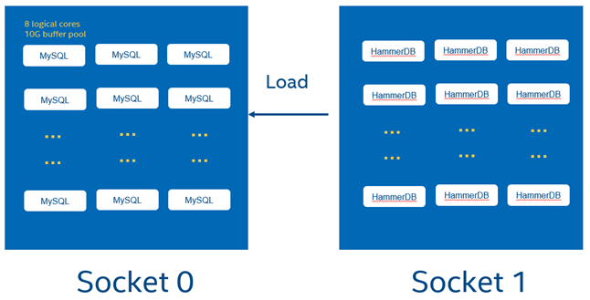

As an example, for a2-socket Xeon 6 6972P system, 96 cores per socket, total 192 physical cores for whole system, when hyperthreading is enabled, total 384 cores are available for whole system.

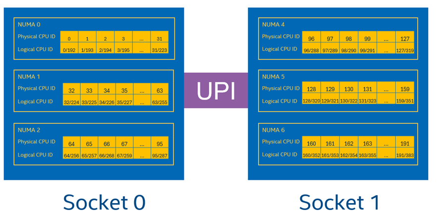

In our benchmark, MySQL/PostgreSQL instance 0 will be pinned to the 8 cores listed in socket0, HammerDB instances will be pinned to all cores listed in socket 1. Follow the same rule to bind other DB and HammerDB instances.

Install MySQL 8 above server on Linux system (i.e. Ubuntu 24.04) following this guide and configure user/password for MySQL: <https://dev.mysql.com/doc/mysql-installation-excerpt/8.0/en/linux-installation.html>

End users can download MySQL product archives from link <https://downloads.mysql.com/archives/community/>

For test simplicity, A base MySQL instance is initialized and started with HammerDB prepared data (schema building details can refer to appendix A)Before this, a MySQL data directory “data/mysql” is created in advance.

```bash
chown -R mysql:mysql /data/mysql
mysqld –initialize --defaults-file=/etc/my.cnf --datadir=/data/mysql –user=mysql 

# Initialization
mysqld --defaults-file=/etc/my.cnf --datadir=/data/mysql –user=mysql 
./hammerdbcli auto schemabuild.tcl

# And password needs to be changed and client access need to be granted
mysql -u root -p

mysql> ALTER USER 'root'@'localhost' IDENTIFIED BY 'MyNewPass4!’;
mysql>use mysql
mysql>update user set host='%' where host='localhost' and user='root';
mysql>grant all privileges on \*.\* to root@'%';
mysql>select user, host from user;
mysql>FLUSH PRIVILEGES;
```

Assume 3 NVMe SSD disks are mounted under “/mnt/data” directory to eliminate I/O bottleneck, via LVM or RAID commands beforehand. Use the script below to copy this folder to the data directory of each database instance, and replace MySQL parameters with new values in MySQL configuration file my.cnf and HammerDB test script ‘mysqlrun.tcl’ (refer to appendix A).

```bash
su – mysql
BASE_FOLDER=/mnt/data
for i in {0..23}; do cp -r /data/mysql ${BASE_FOLDER}/mysql-data-inst${i}; done
for i in {0..23}; do cp ./my.cnf ${BASE_FOLDER}/conf/my-inst${i}.cnf; done
for i in {0..23}; do sed -i "s#/data01/mysql-data#${BASE_FOLDER}/mysql-data-inst${i}#g" ${BASE_FOLDER}/conf/my-inst${i}.cnf; done
for i in {0..23}; do sed -i "s#/home/mysql/mysql.sock#${BASE_FOLDER}/sockets/mysql-inst${i}.sock#g" ${BASE_FOLDER}/conf/my-inst${i}.cnf; done
for i in {0..23}; do sed -i "s#/home/mysql/mysqld.log#${BASE_FOLDER}/logs/mysql-inst${i}.log#g" ${BASE_FOLDER}/conf/my-inst${i}.cnf; done
for i in {0..23}; do sed -i "s#/home/mysql/mysqld.pid#${BASE_FOLDER}/pids/mysql-inst${i}.pid#g" ${BASE_FOLDER}/conf/my-inst${i}.cnf; done
PORT_BASE=3306
for i in {0..23}; do sed -i "s#3306#$((${i}+${PORT_BASE}))#g" ${BASE_FOLDER}/conf/my-inst${i}.cnf; done
for i in {0..23}; do cp ./mysqlrun.tcl ${BASE_FOLDER}/conf/mysqlrun_${i}.tcl; done
for i in {0..23}; do sed -i "s#3306#$((${i}+${PORT_BASE))#g" mysqlrun_${i}.tcl; done
```

Run script below to start up MySQL instances with each binding to 8 threads (4 physical cores and 4 corresponding logical cores) on the first CPU socket.

```bash
su – mysql

for i in {0..7}; do
echo "starting instance${i}"
numactl -C $((${i}\*4))-$((${i}\*4+3)),$((${i}\*4+192))-$((${i}\*4+192+3)) -m 0 mysqld_safe --defaults-file=/mnt/data/conf/my-inst${i}.cnf &
done

for i in {8..15}; do
echo "starting instance${i}"
numactl -C $((${i}\*4))-$((${i}\*4+3)),$((${i}\*4+192))-$((${i}\*4+192+3)) -m 1 mysqld_safe --defaults-file=/mnt/data/conf/my-inst${i}.cnf &
done
for i in {16..23}; do
echo "starting instance${i}"
numactl -C $((${i}\*4))-$((${i}\*4+3)),$((${i}\*4+192))-$((${i}\*4+192+3)) -m 2 mysqld_safe --defaults-file=/mnt/data/conf/my-inst${i}.cnf &
done
```

Run benchmark using hammerDB

```bash
for i in {0..23}; do
numactl -N 3-5 -m 3-5 -${HammerDB-HOME}/hammerdbcli auto ${CUR_FOLDER}/mysqlrun_${i}.tcl > ${CUR_FOLDER}/result-${i}.log 2>&1 &
done
```

Collect NOPM data from all result-${i}.log files, calculate performance data.

For PostgreSQL, the overall processes are same with MySQL benchmark. Some changes compared with MySQL benchmark are:

Install PostgreSQL following this guide: <https://www.postgresql.org/docs/current/install-binaries.html.End> users can download PostgreSQL binaries from link <https://www.postgresql.org/download/linux/ubuntu/>

Run script below to start up base PostgreSQL instances.

```bash
${PG_HOME}/bin/initdb -D /data/pgbase --wal-segsize=1024 &
${PG_HOME}/bin/pg_ctl start -D /data/pgbase -l logfile &
```

Follow appendix B to build schema.

Then simulate MySQL tutorials depicted above to copy base data to each PostgreSQL data folder, tune DB configuration file (Replace port number with each instance port number), start 24 PostgreSQL instances. After DB instances are all up, start 24 HammerDB instances similar to MySQL instructions to kick off the benchmark.

Sysbench (Emily)

For MySQL, the graph below elaborates the topology of multi-instance deployment similar to HammerDB test. On a 2-socket 6972P (96 cores) system, 24 MySQL instances with 8 logical cores runs on Socket 0 and Sysbench runs on Socket 1.

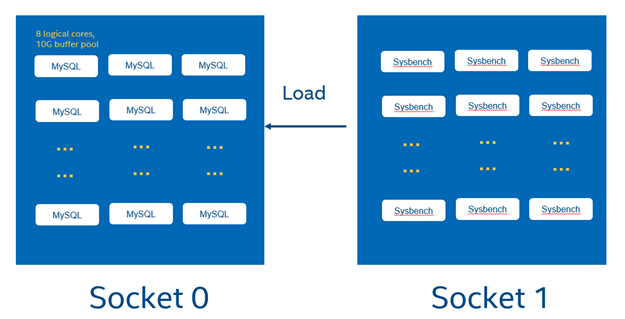

The following steps aligh with HammerDB configurations, so details are omitted here.

For test simplicity, A MySQL data directory has been created in advance with Sysbench prepared data (30 tables with 1000000 rows, roughly 8GB data). Copy this folder to the data directory of each database instance.

```bash
sysbench /usr/local/share/sysbench/oltp_read_write.lua --tables=30 --threads=100 --table-size=1000000 --mysql-db=sbtest --mysql-user=root --mysql-password=MyNewPass4! --db-driver=mysql --mysql-host=localhost --mysql_storage_engine=innodb prepare
```

- Then create a dedicated my.cnf, for each MySQL instance with the location of socket file, log file and pid file, and port number updated
- Start all 24 MySQL instances with each binding to 8 threads (4 physical cores and 4 corresponding logical cores) on the first CPU socket

Run all sysbench process on the other socket

```bash
numactl -N 3-5 -m 3-5 sysbench oltp_read_write --tables=32 --threads=${threads} --table-size=1000000 --mysql-host=127.0.0.1 --mysql-db=sbtest --mysql-user=intel --db-driver=mysql --mysql_storage_engine=innodb --report-interval=60 --time=180 --mysql-port=13300,13301,13302,13303,13304,13305,13306,13307,13308,13309,13310,13311,13312,13313,13314 --mysql-password=XXX --warmup-time=60 run
```

In the other way, you can press all instances with a loop in the case that Sysbench does not support multiple ports like this:

```bash
for i in {0..23}; do numactl -N 3-5 -m 3-5 sysbench /usr/local/share/sysbench/oltp_read_write.lua --tables=32 --threads=${threads} --table-size=1000000 --mysql-host=127.0.0.1 --mysql-db=sbtest --mysql-user=intel --db-driver=mysql --mysql_storage_engine=innodb --report-interval=60 --time=180 --pgsql-port=$((${i}+15430)) --mysql-password=XXX --warmup-time=60 run > sysbench-${threads}threads-${i}.txt 2>&1 & done

sleep 250
```

Afterwards add all collected throughput numbers in each sysbench log of 24 instances and the total throughput.can be calculated.

# Summary

We understand every application is unique. We shared many of our experiences with MySQL and PostgreSQL hoping that some of our learnings could be applied to your specific application. Both database management systems have been well tested on Intel platforms. With Intel® Xeon® 6 processor, Intel takes it even further by optimizing the platform as a whole -- CPU, memory, storage, and networking working together for the best user experience.

# Appendix A – Running HammerDB 4.0 with MySQL

- To run the workload, we first need to build schema using schemabuild.tcl script. This script will take some minutes to create the database depending upon the system and drives you are using.

```bash
./hammerdbcli auto schemabuild.tcl
```

Example schemabuild.tcl

```bash
# schemabuild.tcl
puts "SETTING CONFIGURATION"
dbset db mysql
dbset bm TPC-C
diset connection mysql_host localhost
diset connection mysql_port 3306
diset tpcc mysql_user root
diset tpcc mysql_pass MyNewPass4!
diset tpcc mysql_count_ware 100
diset tpcc mysql_partition false
diset tpcc mysql_num_vu 8
diset tpcc mysql_storage_engine innodb
print dict
vuset logtotemp 1
vuset unique 1
buildschema
waittocomplete
```

- To do a test, run the mysqlrun.tcl script. Each test should take about 7 to 8 minutes.

```bash
./hammerdbcli auto mysqlrun.tcl
```

Example mysqlrun.tcl

```bash
# mysqlrun.tcl
puts "SETTING CONFIGURATION"
dbset db mysql
diset connection mysql_host localhost
diset connection mysql_port 3306
diset tpcc mysql_user root
diset tpcc mysql_pass MyNewPass4!
diset tpcc mysql_driver timed
diset tpcc mysql_prepared false
diset tpcc mysql_rampup 2
diset tpcc mysql_duration 5
diset tpcc mysql_timeprofile true
diset tpcc mysql_allwarehouse true
vuset logtotemp 1
vuset unique 1
loadscript
puts "TEST STARTED"
vuset vu 64
vucreate
vurun
runtimer 500
vudestroy
puts "TEST COMPLETE"
```

In the above example, we are simulating 64 concurrent users accessing the database. You need to adjust the vuset vu value to represent the database size that you are testing.

The results can be found at end of the script and are also logged in /tmp/hammerdb_\*.log with a unique name.

# Appendix B – Running HammerDB with PostgreSQL

To run the workload, we first need to build schema using pgbuild.tcl script. In this example this would take some minutes depending on your system configuration.

```bash
./hammerdbcli auto pgbuild.tcl
```

Example of the pgbuild.tcl schema build script:

```bash
#pgbuild.tcl
dbset db pg
dbset bm TPC-C
diset connection pg_host localhost
diset conection pg_port 5432
diset tpcc pg_count_ware 100
diset tpcc pg_num_vu 8
diset tpcc pg_superuser intel
diset tpcc pg_superuserpass postgres
diset tpcc pg_storedprocs false
diset tpcc pg_raiseerror true
vuset logtotemp 1
vuset unique 1
buildschema
waittocomplete
```

To run a test with a single number of virtual users, run the pgtest.tcl script.

```bash
./hammerdbcli auto pgtest.tcl
```

Example of the pgtest.tcl test script:

```bash
# pgtest.tcl
puts "SETTING CONFIGURATION"
dbset db pg
diset connection pg_host localhost
diset connection pg_port 5432
diset tpcc pg_superuser intel
diset tpcc pg_superuserpass postgres
diset tpcc pg_vacuum true
diset tpcc pg_driver timed
diset tpcc pg_rampup 2
diset tpcc pg_duration 5
diset tpcc pg_storedprocs false
diset tpcc pg_count_ware 100
diset tpcc pg_raiseerror true
vuset logtotemp 1
vuset unique 1
loadscript
puts "TEST STARTED"
vuset vu 64
vucreate
vurun
runtimer 300
vudestroy
puts "TEST COMPLETE"
```

The results can be found at end of the script and are also logged in /tmp/hammerdb_\*.log with a unique name.

```bash
Vuser 1:64 Active Virtual Users configured
Vuser 1:TEST RESULT : System achieved 1483849 NOPM from 3515684 PostgreSQL TPM
```

# Appendix C - MySQL Monitoring Tools

For the basic performance monitoring and troubleshooting, ‘top’ and ‘perf top’ are useful. But if you want to do database level performance analysis, innotop is a good real time monitoring tool that gives us ample information about where MySQL server is spending its time.

Useful links:

<http://manpages.ubuntu.com/manpages/focal/man1/innotop.1.html>

<https://github.com/innotop/innotop>

Quick steps to install:

1. Install dependencies

```bash
sudo apt install libterm-readkey-perl libclass-dbi-perl libclass-dbi-mysql-perl`

# Grab the latest source code from GitHub
wget <https://github.com/innotop/innotop/archive/master.zip>
mkdir innotop
mv master.zip innotop
cd innotop
unzip master.zip
cd innotop-master/
```

Compile and install

```bash
sudo perl Makefile.PL
sudo make install
sudo innotop --version
```

Example of using innotop

```bash
sudo innotop
```

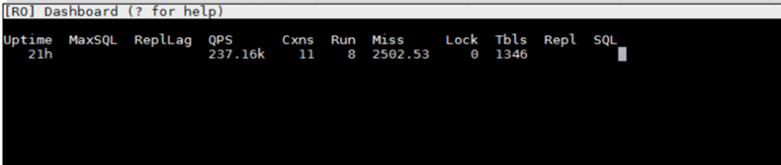

Enter “?” for Help
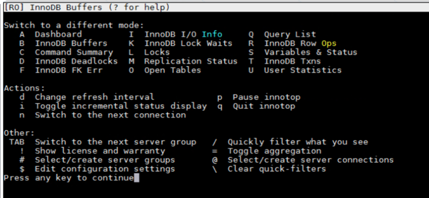

Enter “Q” for Query list
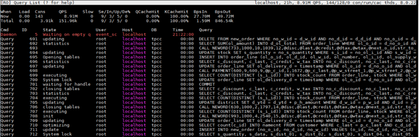

Enter “B” for Innodb Buffers
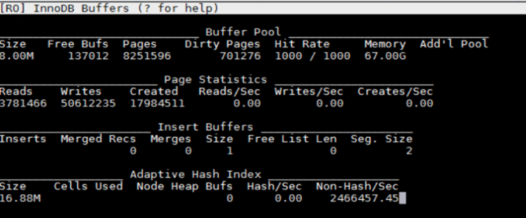

# Appendix D - PostgreSQL Performance Monitoring

For the basic performance monitoring and troubleshooting, ‘top’ and ‘perf top’ are useful. But if you need analysis at the database level, pg_stat_statements and pg_sentinel are more advanced PostgreSQL tools to use.

Useful links:

<https://www.postgresql.org/docs/9.4/pgstatstatements.html>

<https://github.com/pgsentinel/pgsentinel>

Quick steps to install:

1. Install pg_stat_statements

```bash
cd postgresql-13.0/contrib
sudo make
cd postgresql-13.0/contrib/pg_stat_statements
sudo make
sudo make install
```

2. Install pgsentinel

```bash
export PATH=$PATH:/usr/local/pgsql/bin
git clone <https://github.com/pgsentinel/pgsentinel.git>
cd pgsentinel/src
sudo make
sudo make install
```

3. Configuration

Add the following to postgres.conf, a database restart is needed.

```bash
shared_preload_libraries = 'pg_stat_statements,pgsentinel'
# Increase the max size of the query strings Postgres records
track_activity_query_size = 2048
# Track statements generated by stored procedures as well
pg_stat_statements.track = all
```

4. Create extensions

```sql
postgres=# create extension pg_stat_statements;
CREATE EXTENSION
postgres=# create extension pgsentinel ;
CREATE EXTENSION
postgres=# \dx
```

List of installed extensions

```bash
Name | Version | Schema | Description
-----+---------+--------+--------------------------------------------
pg_stat_statements | 1.6 | public | track execution statistics of all SQL statements executed

pgsentinel | 1.0b | public | active session history

plpgsql | 1.0 | pg_catalog | PL/pgSQL procedural language
```

5. Right after a HammerDB test, run the following example statement.

```sql
postgres=#
with ash as (
select \*,ceil(extract(epoch from max(ash_time)over()-min(ash_time)over()))::numeric samples
from pg_active_session_history where ash_time>=current_timestamp - interval '2 minutes'
) select round(100\*count(\*)/sum(count(\*)) over(), 0) as "%", round(count(\*)::numeric/samples,2) as "AAS",
    backend_type,wait_event_type,wait_event
from ash
group by samples,
    backend_type,wait_event_type,wait_event
order by 1 desc fetch first 20 rows only
;
```

It outputs the captured wait events like this:

```bash
% | AAS | backend_type | wait_event_type | wait_event

----+-------+----------------+-----------------+----------------------

48 | 28.00 | client backend | CPU | CPU

12 | 6.82 | client backend | LWLock | XactSLRU

11 | 6.18 | client backend | LWLock | WALInsert

9 | 5.41 | client backend | IPC | ProcArrayGroupUpdate

6 | 3.71 | client backend | Client | ClientRead

6 | 3.65 | client backend | IPC | XactGroupUpdate

5 | 2.82 | client backend | Lock | extend

2 | 0.94 | client backend | LWLock | ProcArray

1 | 0.35 | client backend | IPC | CheckpointDone
```


[def]: #mysql--postgresql-tuning-guide