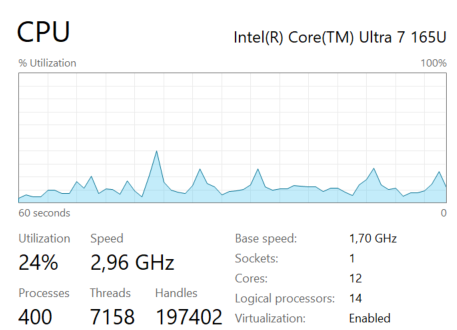
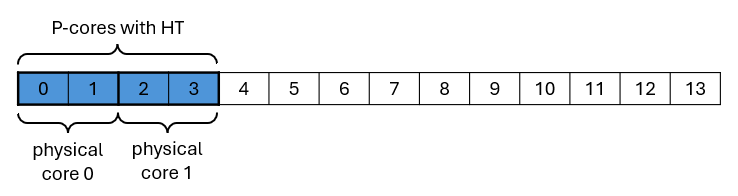
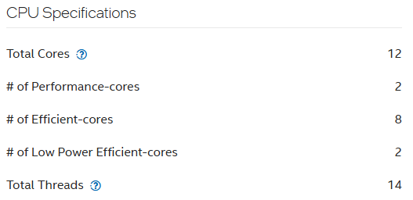

This chapter contains information about the practices that lead to better performance of scikit-learn-intelex on Intel CPUs.

Before you read the information below, it is recommended to read the [common recommendations](../common/README.md) about the system configuration.

## Hyper-threading (HT)

Hyper-threading (HT) is Intel's simultaneous multithreading implementation that can improve the parallelization of computations. When HT is enabled, for each processor core that is physically present, the operating system addresses two logical cores and shares the workload between them when possible. In this case, the logical cores located on a single physical core share the same resources. For resource-demanding workloads like scikit-learn-intelex, it is recommended to disable HT either in BIOS settings or by modifying the affinity settings of the process.

### On Windows

Hyper-threading can be deteched by running **Task Manager**. Then navigate to **Performance** > **CPU** tab.

The number of physical and logical cores is listed in the bottom right corner of the tab. In case the number of logical cores is greater, HT is enabled:



According to this picture, hyper-threading is enabled on two P-cores. Here is an illustration of the locations of the bits corresponding to those P-cores in the affinity mask of the system:



To disable hyper-threading for a process, the affinity mask in binary format should look like:


Which is equivalent to `2BFF` in hexadecimal format. Run following command to disable HT on Windows:

```
start /affinity 2BFF cmd /c python <workload.py>
```

### On Linux

Hyper-threading can be detected by running `lscpu` utility as follows: `lscpu -e=cpu,core`. Here is the example output for Intel® Core™ Ultra 7 165U:

```
CPU  CORE
0    0
1    0
2    1
3    1
4    2
5    3
6    4
7    5
8    6
9    7
10   8
11   9
12   10
13   11
```

From the output we can see that 4 logical processors (0, 1, 2, 3) are running on two physical cores (0, 1).
To run the process on physical cores only, use one of the following commands:

```
numactl -C 0,2,4-13 python <workload.py>
```
or
```
taskset -c 0,2,4-13 python <workload.py>
```

## Low Power Efficient Cores (LPE cores)

Low Power Efficient Cores (LPE cores) are a type of core available on modern Intel Core processors, designed to manage lightweight background processes independently. This allows the main compute tiles to be powered down, saving battery life on mobile devices.

For the best performance, it is recommended to exclude LPE cores from the list of CPU cores on which the workload is running. The affinity settings of the process have to be modified to achieve this.

### On Windows

Check the CPU specification on the Intel [products page](https://www.intel.com/content/www/us/en/products/overview.html). Here is an example for the Intel® Core™ Ultra 7 165U processor:



The location of the LPE cores in the system affinity mask in this case would be:


The recommended affinity mask that disables both hyper-threading and LPE cores would be `2BFC`:


Run the following command to disable HT and LPE cores on Windows:

```
start /affinity 2BFC cmd /c python <workload.py>
```

### On Linux

LPE cores can be detected by running the `lscpu -e=cpu,core,maxmhz` command.  Here is the example output:

```
CPU  CORE  MAXMHZ
0    0     4900.0000
1    0     4900.0000
2    1     4900.0000
3    1     4900.0000
4    2     3800.0000
5    3     3800.0000
6    4     3800.0000
7    5     3800.0000
8    6     3800.0000
9    7     3800.0000
10   8     3800.0000
11   9     3800.0000
12   10    2100.0000
13   11    2100.0000
```

The logical processors with the lowest maximum frequency (12, 13) are running on LPE cores.

Run the following command to disable HT and LPE cores on Linux:

```
numactl -C 0,2,4-11 python <workload.py>
```

