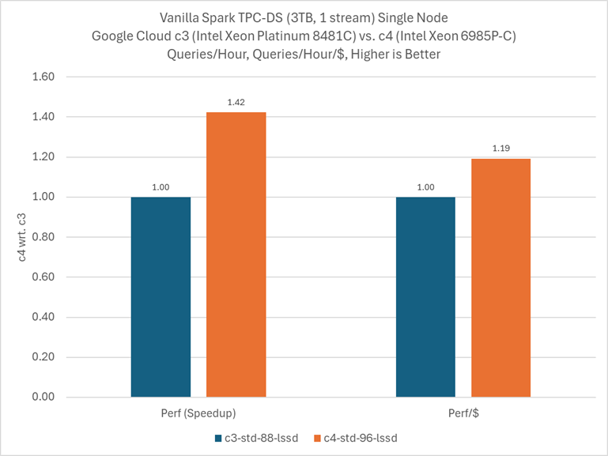

# Introduction
This guide is designed for users who already have a familiarity with Apache
Spark*. It offers recommendations and system settings for both hardware and
software to achieve optimal performance in most scenarios on Intel Xeon platforms. 
However, it is important for users to carefully evaluate these settings in the 
context of their specific use cases, as Spark can be deployed in various ways, 
and this guide serves as a reference for one such deployment.

For assessing Spark SQL performance, we suggest utilizing the 
TPC Decision Support (TPC-DS) benchmark, which includes a variety of 
query categories that represent different business use cases. The 
optimizations captured in this guide are generic - for optimizations 
focused on TPC-DS, please reference 
[our guide](../../workloads/tpc-ds/README.md).

# Contents

- [References](#references)
- [Hardware Tuning](#hardware-tuning)
  - [Memory Configuration](#memory-configuration)
  - [Storage Configuration](#storage-configuration)
  - [Network Configuration](#network-configuration)
- [Software Tuning](#software-tuning)
  - [Linux Kernel Optimization Settings](#linux-kernel-optimization-settings)
    - [Configure `ulimit`](#configure-ulimit)
    - [Configure Transparent Huge Pages](#configure-transparent-huge-pages)
  - [Spark Parameter Tuning](#spark-parameter-tuning)
    - [Memory Tuning](#memory-tuning)

# References

- [Spark Tuning Guide on 3rd Generation Intel® Xeon® Scalable Processors Based Platform](https://www.intel.com/content/www/us/en/developer/articles/guide/spark-tuning-guide-on-xeon-based-systems.html)

# Hardware Tuning

## Memory Configuration
Some Spark workloads are memory capacity and bandwidth sensitive. 5GB 
(or more) memory per thread is usually recommended. To take full 
advantage of all memory channels, it is recommended that at least 1 
DIMM per memory channel needs to be populated. If possible, use the 
maximum DDR frequency DIMMs available and supported by your platform.

For help determining the memory technologies supported by your platform, 
enter your Intel processor model number into 
https://www.intel.com/content/www/us/en/products/overview.html.

## Storage Configuration
Spark workloads usually trigger I/O read and write for some phases. 
The I/O device characteristic becomes dominant for performance for 
those phases. It is recommended to use SSDs to replace rotation-based 
hard drives. PCIe based SSD is preferred.

## Network Configuration
It is recommended to use at least 10gbps network when deploying a 
Spark cluster in order to alleviate inter-node communication 
bottlenecks. Faster network may be necessary if network is fully utilized 
at 10G.

# Software Tuning

## Linux Optimization Settings

### Configure `limits.conf`
Modifying `/etc/security/limits.conf` allows you to configure system 
resource limits for processes. The following settings are particularly 
important for Spark workloads:

- **memlock**: Controls the maximum amount of memory that 
can be locked into RAM, preventing it from being swapped to disk. 
Setting this to unlimited ensures Spark can lock memory as needed for 
performance-critical operations.
- **nproc**: Limits the maximum number of processes a 
user can run. Setting this to unlimited prevents issues when Spark 
needs to spawn multiple executor processes or threads.
- **nofile**: Sets the maximum number of file descriptors 
a process can have open simultaneously. Spark applications often need 
to read from many files concurrently, especially when processing large 
datasets with many partitions. We suggest a value of 655360 which is
sufficiently higher than the default (1024) but should be well within 
typical system limits. To find the maximum limit of per-process file 
descriptors, you can check `cat /proc/sys/fs/nr_open`.

Before applying the changes detailed below, make sure that `$USER` 
reflects the user that is responsible for running your Spark jobs.

```
echo "$USER soft memlock unlimited" | sudo tee -a /etc/security/limits.conf
echo "$USER hard memlock unlimited" | sudo tee -a /etc/security/limits.conf

echo "$USER soft nproc unlimited" | sudo tee -a /etc/security/limits.conf
echo "$USER hard nproc unlimited" | sudo tee -a /etc/security/limits.conf

echo "$USER soft nofile 655360" | sudo tee -a /etc/security/limits.conf
echo "$USER hard nofile 655360" | sudo tee -a /etc/security/limits.conf
```

### Configure Huge Pages
Spark workloads usually benefit from configuring huge pages. 
Transparent Huge Pages (THP) can be a convenient way to use
huge pages, especially when the memory usage pattern varies 
significantly or is not yet known. THP can be configured with
the following commands:

```
echo always > /sys/kernel/mm/transparent_hugepage/defrag
echo always > /sys/kernel/mm/transparent_hugepage/enabled
```

If the memory usage pattern is well understood, manually 
configuring huge pages offers the same benefits of THP (reduced
page faults, improved translation lookaside buffer efficiency) 
with less overhead. For more information on manually configuring
huge pages, please see [this reference from Red Hat](https://docs.redhat.com/en/documentation/red_hat_enterprise_linux/8/html/monitoring_and_managing_system_status_and_performance/configuring-huge-pages_monitoring-and-managing-system-status-and-performance) 
and this [reference from the Linux documentation](https://docs.kernel.org/admin-guide/mm/transhuge.html).

## Spark Parameter Tuning

Spark is extremely configurable and provides a variety of 
tuning knobs. This section captures some best practices 
for achieving optimal Spark performance. These knobs have 
shown improved performance for some test cases and can be 
good candidates for experimentation in your deployment.

For information on these knobs, please review the 
[Spark documentation](https://spark.apache.org/docs/latest/configuration.html).

| Parameters | Description & Recommend Setting |
|:-------|:--------------------------------|
| spark.executor.cores | The number of cores to use on each executor.<br><br>**Recommended:** Recommend to allocate 4 to 8 cores per executor. Please note that using an odd number of cores is not advised on systems with Simultaneous Multithreading (SMT) enabled |
| spark.executor.instances | The number of executors to launch for this session.<br><br>**Recommended:** Divide the output of `nproc` by the number of cores per executor (`spark.executor.cores`) |
| spark.executor.extraJavaOptions | Extra Java options to pass to executors.<br><br>**Recommended:** "-XX:+UseBiasedLocking -XX:BiasedLockingStartupDelay=0" |
| spark.driver.maxResultSize | Limit of total size of serialized results of all partitions for each Spark action.<br><br>**Recommended:** 4g |
| spark.driver.memory | Amount of memory to use for the driver process.<br><br>**Recommended:** 20g |
| spark.sql.adaptive.enabled | When true, enable adaptive query execution, which re-optimizes the query plan in the middle of query execution, based on accurate runtime statistics.<br><br>**Recommended:** true |
| spark.sql.files.maxPartitionBytes | The maximum number of bytes to pack into a single partition when reading files.<br><br>**Recommended:** At least 2g |
| spark.sql.shuffle.partitions | The number of partitions to use when shuffling data for joins or aggregations.<br><br>**Recommended:** This may require experimentation, but general guidance is to multiply the number of CPU threads in your environment by 2-4x. E.g. running on a single node with 32C/64T means 64 CPU threads, so the guidance is 128-256 partitions |
| spark.sql.optimizer.runtime.bloomFilter.applicationSideScanSizeThreshold | The threshold for the size of the table to enable Bloom filter on the application side for join.<br><br>**Recommended:** 0 |
| spark.sql.optimizer.runtime.bloomFilter.enabled | When true and if one side of a shuffle join has a selective predicate, we attempt to insert a bloom filter in the other side to reduce the amount of shuffle data.<br><br>**Recommended:** true |
| spark.sql.broadcastTimeout | Timeout in seconds for the broadcast wait time in broadcast joins.<br><br>**Recommended:** 4800 |
| spark.sql.execution.arrow.maxRecordsPerBatch | Maximum number of records to write to a single Arrow batch when using Apache Arrow.<br><br>**Recommended:** 20480 |
| spark.sql.parquet.columnarReaderBatchSize | The number of rows to read for each batch in Parquet columnar reader.<br><br>**Recommended:** 20480 |
| spark.sql.inMemoryColumnarStorage.batchSize | Controls the size of batches for columnar caching. Larger batch sizes can improve memory utilization and compression, but risk OOMs when caching data.<br><br>**Recommended:** 20480 |
| spark.sql.autoBroadcastJoinThreshold | Configures the maximum size in bytes for a table that will be broadcast to all worker nodes when performing a join.<br><br>**Recommended:** 10m |
| spark.sql.optimizer.dynamicPartitionPruning.enabled | When true, we will generate predicate for partition column when it's used as join key<br><br>**Recommended:** true |
| spark.task.cpus | Number of cores to allocate for each task.<br><br>**Recommended:** 1 |
| spark.serializer | Class to use for serializing objects that will be sent over the network or need to be cached in serialized form.<br><br>**Recommended:** org.apache.spark.serializer.KryoSerializer |
| spark.kryoserializer.buffer.max | Maximum allowable size of Kryo serialization buffer.<br><br>**Recommended:** 512m |
| spark.cleaner.periodicGC.interval | Interval between each periodic GC invocation by Spark cleaner.<br><br>**Recommended:** 10s |

### Memory Tuning

This section provides some extra details for sizing various memory 
attributes. These settings serve as a starting point and may require 
some experimentation.

For information on these knobs, please review the 
[Spark documentation](https://spark.apache.org/docs/latest/configuration.html).

| Parameters | Description & Recommend Setting |
|:-----------|:--------------------------------|
| spark.executor.memoryOverhead | Memory that accounts for things like VM overheads, interned strings, other native overheads, etc.<br><br>**Recommended:** 1g |
| spark.executor.memory | Amount of memory to use per executor process<br><br>**Recommended:** 35% of total memory, divided by number of executors |
| spark.memory.offHeap.enabled | Determines if Spark will use off-heap memory for certain operations<br><br>**Recommended:** true |
| spark.memory.offHeap.size | The absolute amount of memory which can be used for off-heap allocation<br><br>**Recommended:** 45% of total memory, divided by number of executors |

# Performance Results

## Performance Results for Intel® Xeon® 6 with Performance Cores

## 6th Generation Intel® Xeon® 6985P-C vs. 4th Generation Intel® Xeon® Platinum 8481C In Google Cloud



### 6th Generation Xeon® compared to 4th Generation Xeon® with Spark 3.5.2 In Google Cloud
- **1.42×** speedup for **TPCDS**-Like SF3TB
- **1.19×** perf/$ improvement for **TPCDS**-Like SF3TB
- For performance with Apache Gluten, reference the [Gluten article](../gluten/README.md#6th-generation-intel-xeon-6985p-c-vs-4th-generation-intel-xeon-platinum-8481c-in-google-cloud) in Optimization Zone.

### Details
Testing Date: Performance results are based on testing by Intel as of 1 Aug 2025 and may not reflect all publicly available security updates.

OSS Spark on SPR: 1-node, 1x Intel(R) Xeon(R) Platinum 8481C CPU @ 2.70GHz, 44 cores, c3-standard-88-lssd VM, HT On, Turbo Off, NUMA 1, Total Memory 352GB, BIOS Google, 1x Compute Engine Virtual Ethernet [gVNIC], 1x 375G nvme_card10, 1x 375G nvme_card8, 1x 375G nvme_card12, 1x 512G nvme_card-pd, 1x 375G nvme_card2, 1x 375G nvme_card5, 1x 375G nvme_card11, 1x 375G nvme_card15, 1x 375G nvme_card14, 1x 375G nvme_card0, 1x 375G nvme_card3, 1x 375G nvme_card13, 1x 375G nvme_card1, 1x 375G nvme_card4, 1x 375G nvme_card7, 1x 375G nvme_card9, 1x 375G nvme_card6, Ubuntu 24.04.2 LTS, 6.14.0-1011-gcp, TPC-DS Like SF3T, JDK 1.8, GCC 11, Spark 3.5.2, Hadoop 3.3.5, score=TPC-DS Like SF3T 5926 sec

OSS Spark on GNR: 1-node, 1x Intel(R) Xeon(R) 6985P-C CPU @ 2.30GHz, 48 cores, c4-standard-96-lssd VM, HT On, Turbo Off, NUMA 2, Total Memory 360GB, BIOS Google, 1x Compute Engine Virtual Ethernet [gVNIC], 1x 375G nvme_card14, 1x 375G nvme_card1, 1x 375G nvme_card3, 1x 375G nvme_card0, 1x 375G nvme_card4, 1x 375G nvme_card8, 1x 375G nvme_card15, 1x 512G nvme_card-pd, 1x 375G nvme_card2, 1x 375G nvme_card5, 1x 375G nvme_card9, 1x 375G nvme_card11, 1x 375G nvme_card6, 1x 375G nvme_card7, 1x 375G nvme_card10, 1x 375G nvme_card12, 1x 375G nvme_card13, Ubuntu 24.04.2 LTS, 6.14.0-1012-gcp, TPC-DS Like SF3T, JDK 1.8, GCC 11, Spark 3.5.2, Hadoop 3.3.5, score=TPC-DS Like SF3T 4162 sec

Results may vary.