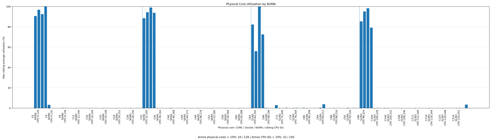
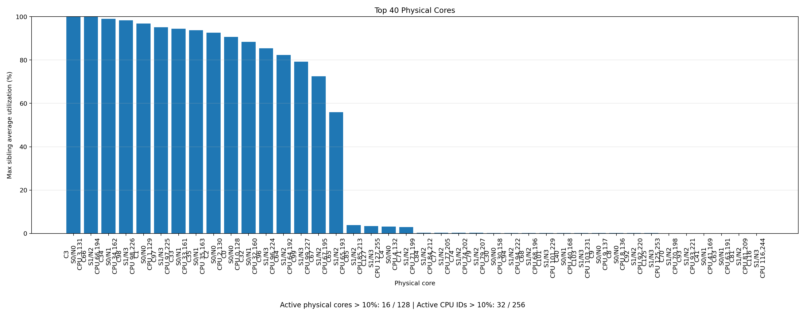
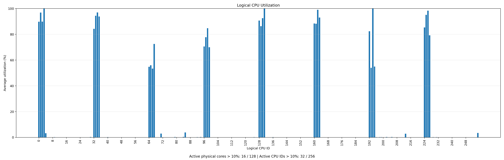
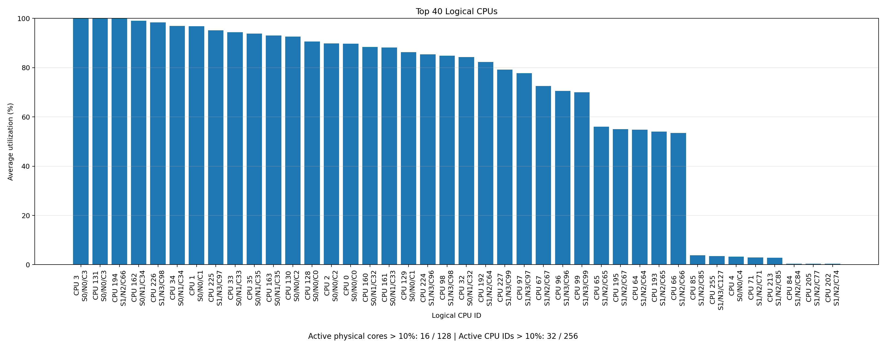

# PerfSpect CPU/Core Analysis Tool

This tool parses an Intel® PerfSpect telemetry JSON report and generates CPU utilization summaries and diagrams.

The tool summarizes both logical CPU ID utilization and physical CPU core utilization.

---

## 1. Collect PerfSpect telemetry

Run PerfSpect telemetry collection while your workload is running.

```bash
perfspect telemetry --duration 180
```

For this analysis tool, you only need the generated PerfSpect JSON file.

---

## 2. Install dependencies

Install the required Python package:

```bash
pip install -r requirements.txt
```

---

## 3. Run the analysis tool

Set the PerfSpect JSON file path as an environment variable:

```bash
export PERF_RAW=sys-822gs-nbrt-01_telem.raw
```

Run the tool:

```bash
python3 perfspect_cpu_core_analysis.py "$PERF_RAW"
```

Recommended usage:

```bash
export PERF_RAW=sys-822gs-nbrt-01_telem.raw

python3 perfspect_cpu_core_analysis.py "$PERF_RAW" \
  --out-dir perfspect_cpu_core_output \
  --top-n 40 \
  --active-threshold 10
```

Arguments:

| Argument | Default | Description |
|---|---:|---|
| `raw_file` | Required | PerfSpect RAW report file |
| `--out-dir` | `perfspect_cpu_core_output` | Output directory for charts and CSVs |
| `--top-n` | `40` | Number of top CPUs/cores to show in top charts |
| `--active-threshold` | `10.0` | CPU/core is active if average utilization is greater than this threshold |

The active threshold uses:

```text
Avg utilization > threshold
```

For example, with `--active-threshold 10`, a CPU/core is counted as active only if its average utilization is greater than 10%.

---

## 4. Output files

The tool generates CSV files and PNG diagrams in the output directory.

Example output directory:

```text
perfspect_cpu_core_output/
```

Generated files:

| File | Description |
|---|---|
| `logical_cpu_utilization_summary.csv` | Per-logical-CPU utilization summary |
| `physical_core_utilization_summary.csv` | Per-physical-core summary deduplicated by `(SOCK,NODE,CORE)` |
| `numa_core_summary.csv` | Socket/NUMA-level summary |
| `logical_cpu_utilization.png` | Bar chart of all logical CPU IDs |
| `top40_logical_cpus.png` | Bar chart of top logical CPU IDs |
| `physical_core_utilization_by_numa.png` | Bar chart of physical cores grouped by NUMA |
| `top40_physical_cores.png` | Bar chart of top physical cores |

---

## 5. Console summary

The tool prints a compact summary like this:

```text
CPU/core summary:
  Threshold: > 10% average utilization
  Logical CPU IDs: 256
  Physical cores: 128 (deduped by SOCK,NODE,CORE)
  Active logical CPU IDs > 10%: 32
  Active physical cores > 10%: 16
  Effective CPU equivalents: 26.99 (ceil 27)

By Socket/NUMA:
 SOCK  NODE  CPU IDs    Cores  ActiveCPU  ActiveCore  CPUEquiv
    0     0       64       32          8           4      7.51
    0     1       64       32          8           4      7.40
    1     2       64       32          8           4      5.42
    1     3       64       32          8           4      6.67
```

Key fields:

| Field | Meaning |
|---|---|
| `Logical CPU IDs` | OS-visible CPU IDs |
| `Physical cores` | Unique physical cores deduplicated by `(SOCK,NODE,CORE)` |
| `Active logical CPU IDs` | Logical CPU IDs with average utilization greater than threshold |
| `Active physical cores` | Physical cores with at least one sibling CPU ID greater than threshold |
| `Effective CPU equivalents` | `sum(Avg_Util_% across all logical CPU IDs) / 100` |

---

## 6. Read the diagrams and interpret the results

Start with the console summary, then review the diagrams in this order.

### a. `physical_core_utilization_by_numa.png`



Use this first to understand physical-core placement.

It shows physical-core utilization after deduplicating sibling CPU IDs. Each physical core is counted once using:

```text
(SOCK, NODE, CORE)
```

Use it to answer:

- How many physical cores are active?
- Which NUMA node contains active cores?
- Is the workload balanced across NUMA nodes?
- Are sibling hyperthreads counted correctly as one physical core?

The chart footer shows the total active counts:

```text
Active physical cores > 10%: X / total cores | Active CPU IDs > 10%: Y / total CPU IDs
```

### b. `top40_physical_cores.png`



Use this to find the hottest physical cores and their sibling logical CPU IDs.

Label format:

```text
C<core>
S<socket>/N<numa>
CPU <sibling_cpu_ids>
```

Example:

```text
C0
S0/N0
CPU 0,128
```

This means CPU IDs `0` and `128` are sibling hardware threads on the same physical core.

### c. `logical_cpu_utilization.png`



Use this to see the average utilization of every OS-visible logical CPU ID.

This helps identify whether the workload is spread across many CPU IDs or concentrated on a few.

### d. `top40_logical_cpus.png`



Use this to quickly identify the busiest logical CPU IDs.

Label format:

```text
CPU <id>
S<socket>/N<numa>/C<core>
```

Example:

```text
CPU 128
S0/N0/C0
```

This means CPU ID `128` is on socket 0, NUMA node 0, physical core 0.

---

## 7. Compare multiple PerfSpect runs

Run the tool once per report:

```bash
export PERF_JSON=run1_telem.json
python3 perfspect_cpu_core_analysis.py "$PERF_JSON" --out-dir run1_cpu_core

export PERF_JSON=run2_telem.json
python3 perfspect_cpu_core_analysis.py "$PERF_JSON" --out-dir run2_cpu_core

export PERF_JSON=run3_telem.json
python3 perfspect_cpu_core_analysis.py "$PERF_JSON" --out-dir run3_cpu_core
```

Compare these files:

```text
run1_cpu_core/numa_core_summary.csv
run2_cpu_core/numa_core_summary.csv
run3_cpu_core/numa_core_summary.csv
```

Useful comparison metrics:

- Active logical CPU IDs
- Active physical cores
- Effective CPU equivalents
- NUMA balance
- Hottest physical cores

---

## 8. Notes and assumptions

- The script assumes the PerfSpect JSON contains `CPU Utilization Telemetry`.
- Physical-core deduplication depends on PerfSpect fields: `SOCK`, `NODE`, and `CORE`.
- The CPU-to-core topology is assumed stable throughout one PerfSpect capture.
- The default active threshold is `> 10%` average utilization.
- You can adjust the threshold with `--active-threshold`.

Example:

```bash
export PERF_JSON=sys-822gs-nbrt-01_telem.json

python3 perfspect_cpu_core_analysis.py "$PERF_JSON" \
  --active-threshold 20
```

This counts only CPU IDs and physical cores with average utilization greater than 20%.
